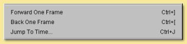
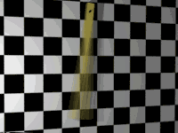
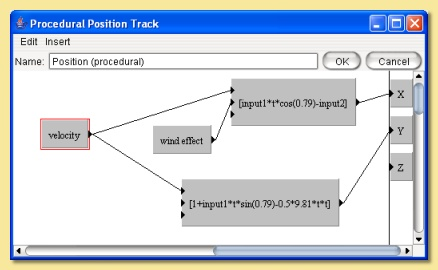
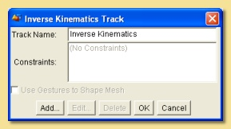
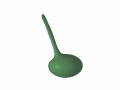
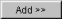

.. _animation:

Animation
#########

This chapter explores the ways that Art of Illusion allows the creation of animations. The tools available are flexible
enough to allow high quality 3D animations to be created in an efficient way.

Please note that the example animations are only simple examples of what Art of Illusion is capable of to demonstrate
specific aspects. Also note that in order to keep the file to a reasonable size, animations have had to be highly
compressed to gif images and thus their quality is far lower than that actually achieved with Art of Illusion.

.. _score:

The Score
*********

Like many other 3D animation programs, Art of Illusion handles animations through a score or timeline on which various
actions can be defined. Each object can have a range of different tracks which run along the score and which control
various parameters such as position, orientation, scaling as well as more complex controls using skeletons. These will
be looked at in detail in the next few sections.

.. _score_layout:

The Score Layout
================

Let's look at the layout of the score in more detail:

This is what the score looks like. It can be viewed by selecting **Animation -> Show Score** from the top menu bar, or
by grabbing the drag bar at the very bottom of the window and moving it up. The scale along the top shows the time in
seconds. Down the left hand side is a list of currently selected objects together with their animation tracks, if any.
In this example, there is an object called 'hand' which has position and rotation tracks.

The vertical green line shows the time position currently viewed in the view windows. As this is dragged along, the
objects in the scene are updated to reflect their actual position in the animation sequence. The position in the
animation can also be controlled from the block of commands in the **Animation** menu:  

The diamond symbols shown on the tracks indicate that a particular position or orientation has been defined at this
point in time. Such positions are called 'keyframes' and details are given in the next section.

Apart from the score itself, there are 5 other buttons on the right hand side of the screen as shown below:

The top button gives the view we have just looked at. The next 2 buttons present the information in a different way;
using curves showing the change in the various parameters such as position, rotation etc. For the example above,
clicking on the upper of the curve views and selecting the 'position' track gives the following display:

.. figure:: animation/anim_score_curve.jpg

Here, the position of the object in the x, y, and z axes is plotted against time. For this particular example, x changes
from about 0.75 to -0.3 units as the time goes from 0 to 1 second.

If more than one track is selected, then the curves are drawn on the same set of axes in this mode. If the second plot
mode is selected with the |animation/anim_mult_curve.jpg| button, however, then curves from each track would be
displayed on separate graphs. This is more sensible if different types of track are selected as the values are likely to
be very different, e.g. position values may be a few units as opposed to rotation values which are likely to be at least
tens of degrees.

The bottom two buttons from this group are for switching between an editing mode and a mode for altering the vertical
and horizontal scales on the score.

The upper button |animation/anim_edit_button.jpg| is the editing mode which allows keyframes or curve points to be
selected and moved. Simply click on any point to select it and drag to move it. Multiple points are selected by pressing
while clicking on each point. The selected group can then be moved.

The lower button |animation/anim_scale_button.jpg| allows the score axes to be scaled and moved. When selected, dragging
left and right with the mouse LMB moves the horizontal axes and dragging up and down moves the vertical axes. The axes
are scaled by holding and dragging left and right or up and down. These controls can also be affected without clicking
this button; holding the right mouse button while dragging left/right on the score allows the score to be moved and if
is held down as well, the score can be scaled. The mouse wheel can also be used to move the score along left and right.

.. _keyframes:

Keyframes
=========

Animation in Art of Illusion works by defining certain key actions, e.g. moving an object to a certain position,
defining a particular skeleton pose etc., at specific points in time. These points are called keyframes. Having defined
these, the program will calculate the positions, poses etc. in between the keyframes automatically by interpolation.

Keyframes are generally set by moving the green time marker to the appropriate time, changing the particular property of
the object, e.g. its position, orientation etc., and then selecting **Animation -> Keyframe Modified Tracks of Selected
Objects**. Alternatively, a keyframe can be produced at any time position for a particular track by selecting the track(s)
and clicking on **Animation -> Keyframe Selected Tracks**.

Once a keyframe has been created, it can be selected by clicking on it and edited through this block in the
**Animation** menu:  

**Edit Keyframe** allows various parameters relating to the keyframe to be altered. The actual options depend on the
type of track so more details are given in the various track sections later in this chapter.

**Delete Selected Keyframes** removes all currently selected keyframes.

**Bulk Edit Keyframes** allows the editing of a group of keyframes as follows:

**Move..** allows a block of keyframes to be moved to another point in time. The dialogue on the left is displayed. The
operation can be applied to **All Tracks**, **All Tracks of Selected Objects** or **All Selected Tracks**.

You can then specify the time points between which you want keyframes to be moved from and the time you want to move
them to. Note: any existing keyframes in the region that is copied to, will be overwritten.

**Copy ..** is similar to **Move ..** but the original keyframes are retained as well as new ones created at the copy to
position.

.. figure:: animation/anim_resize_keyframes.jpg

**Rescale..** allows keyframes between a specified range to be rescaled in respect of time. In this example, the
keyframes between 0.4 and 1.0 seconds are rescaled by a factor of 0.5 which compresses the keyframes so that they
happen in half the time.

**Loop..** allows keyframes between a specified range to be repeated a defined number of times. The dialogue allows
entry of the range and the number of loops. The new keyframes are then added to the end of the range specified as in
the example below:

**Delete..** simply deletes the range of keyframes that you specify.

Keyframes can be edited by double-clicking them on the score or by selecting the keyframe from the Pose track and
clicking on **Animation -> Edit Keyframe**. This will display a dialogue which depends on the object being controlled by the
track.

.. _tracks:

Adding and Editing Tracks
*************************

This section looks in detail at the types of track that can be set up for each object in the scene. To add a new track
to an object, select it and click on **Animation -> Add Track to Selected Objects**. This enables a range of different
tracks to be added:

The order of the tracks for each object is important as the effect of each track on the object is calculated from the
bottom up. Tracks can be moved within the list by clicking and dragging in the same way as objects can be moved in the
:ref:`Object List<object_list>`.

.. _track weight:

Each object can have several tracks of the same type. In this case, a **Weight** can be defined for each track to define
its relative influence. This weight can itself vary with time by setting values at specific keyframes. The **Weight**
track is found by clicking on the |animation/right_arrow.jpg| to the left on the appropriate track name in the list.

Once created, tracks can be edited, deleted, duplicated and temporarily enabled/disabled either by clicking the right
mouse button over the relevant track in the list on the score or via the bottom section of the animation menu.

.. _rigid_tracks:

6.2.1 Basic Rigid Transformation Tracks

This refers to tracks that alter the object's position and orientation without any geometric distortion of the object,
i.e. **Position** and **Rotation** tracks.

.. _pos_track:

**POSITION TRACKS**

To set up a basic Position Track, select the object and choose **Position -> XYZ (One Track)** from the :ref:`list of
tracks<tracks>` in the **Animation** Menu. At the most basic level, all you need to do is to move the green time marker
on the score to the relevant point in time, move the object to the position you want it in at that time and then select
**Animation -> Keyframe Modified Tracks of Selected Objects**. This will produce a diamond keyframe at the required
position on the score. Repeat this process for other points in time as required.

This is a simple example of a cube being translated in the z-axis with only 2 keyframes defined as shown in the keyframe
and plot views below right resulting in the animation below:

.. figure:: animation/anim_pos_ex.jpg

.. figure:: animation/box_position.gif

.. _pos_track_op:

POSITION TRACK OPTIONS

There are some options available for Position tracks. To bring up the Track Options dialogue, either double-click on the
track name on the score or select the track and click on **Animation -> Edit Track**. This will display a dialogue box
similar to that below:

.. figure:: animation/position_track_opt.jpg

At the top is the **Track Name** which can be altered to anything you like.

Next is the **Smoothing Method**. To understand this better, let's add another keyframe to the above animation. Move the
time marker to 0.5 secs, select the position track and click on **Animation -> Keyframe Selected Tracks**. Note that in
this situation, **Keyframe Modified Tracks of Existing Objects** wouldn't have worked because the position of the box at
this point is no different than it was before. Having created the keyframe, we can go to the plot view in edit mode and
move the new point as shown below:

As can be seen, the curve through the points is smooth and passes through all the points. That is because the default
smoothing method is 'interpolating'. The other choices for the **Smoothing Method** are:

The other **Smoothing Methods** produce the following curves:

.. figure:: animation/anim_smooth_methods.jpg

In terms of the effect on the animation, **Interpolating** and **Approximating** produce a gradual deceleration of the
box. With **Approximating** method, both velocity and acceleration are continuous whereas the acceleration changes
discontinuously with **Interpolating**. This results in a smoother animation for the **Approximating** method.

**Discontinuous** produces a sudden change in position.

**Linear** produces a box moving at constant speed up to the second keyframe, then a slower constant speed to the final
position.

All have their uses in different situations.

**Track Mode** is either **Absolute** or **Relative**. Absolute means that the object position is calculated as
displacements from the origin (0,0,0). Relative mode is where the values are displacementsfrom the result of the tracks
beneath it in the list.

For example, we can add a Position track to the animation above and select **Relative** Mode for it. We need to make
sure it sits above the Absolute position track because transformations get applied from the bottom up.

We could then use the Relative track to add displacements to the main motion of the cube, e.g. make it shake as it
moves. In this example, the Relative track was keyframed every 0.2 secs using **Animation -> Keyframe Selected Tracks**.
The x and y coordinates of the resulting keyframes were then moved to 'random' positions in the plot view. The effect is
that the Absolute position on the cube is initially determined from the Absolute track; then the Relative track
displaces the x and y positions by the coordinates specified.

.. figure:: animation/anim_pos_rel.jpg

.. _apply:

**Apply To** determines which part of the object is controlled by the track and is either the **Object Origin** or one
of the joints in the :ref:`skeleton<skeletons>`.

For instance, in this example of a pendulum, a single bone joint has been placed at the pivot position and used as the
part of the object to which the position track applies. The rotation track is applied to the object's centre and the
position track then acts to reposition the object so that the 'pivot' is fixed at the keyframed position:

.. figure:: animation/pivot.jpg

**Coordinate System** is the set of axes under which the transformations are applied, i.e. where the origin is and how
the axes are oriented. There are either 3 or 4 possible options for this, depending on which Track Mode is set:

The **World** coordinate system is the main coordinate system that Art of Illusion works in.

The **Parent** option is for objects that are 'children' of other objects. In most cases, you will want the children to
move, rotate etc. with their parent objects. In this case, give the children objects position tracks and set the
Coordinate System to **Parent**. Keyframe at least one time position, e.g. at time 0, to set up this relationship and
the children objects will then follow their parents.

**Other Object..** is similar to the **Parent** option except that any object can be made to follow any other object.
Selecting this option, makes the |animation/anim_coord_set.jpg| button become available. Pressing this allows the
selection of the object, or of any bone of any object with a defined skeleton, to be followed.

**Local** is only available for **Relative** mode tracks and allows transformations to be made relative to the object's
own co-ordinate system which is defined via the object layout.

**Track Affects** allows the ability to restrict the motion to certain axes only.

.. _pos_key_edit:

EDITING POSITION KEYFRAMES

Keyframes can be edited by double-clicking them on the score or by selecting a keyframe from the Position track and
clicking on **Animation -> Edit Keyframe**. This displays the following dialogue:

The first 3 entries allow the alteration of the objects position in each of the 3 axes in the defined coordinate system.
This is a way of more accurately specifying positions as opposed to editing on the plot view.

The next entry is for **Time** allowing you to specify explicitly the time position of the keyframe.

The lower half of the dialogue allows further refinement of the **Smoothing Method**. For **Interpolating** and
**Approximating** smoothing methods, the curve can be given a **Smoothness** value which determines how smooth the curve
is. In addition, the part of the curve to the left of the keyframe (i.e. the time period before the keyframe) can be set
to a different **Smoothness** than the curve to the right of the keyframe (i.e. the time period after the keyframe).

It is also possible to set up separate position tracks to allow independent control of movements in the X, Y and Z
directions. This can be done automatically by selecting **Animation -> Add Track to Selected Objects -> Position -> XYZ (3
Tracks)**. In this instance 3 tracks are produced each with **Track Affects** set to one of X, Y or Z.

**ROTATION TRACKS**

Basic rotation tracks are again created by selecting **Animation -> Add Track to Selected Objects -> Rotation -> XYZ (One
Track)**. The basic method of setting up a track is similar to Position Tracks; move to the appropriate time, rotate the
object to the orientation (in degrees) required at that time, and keyframe it. Below is a simple example with a cube
rotating in the x and z axes set up with 2 keyframes:

.. figure:: animation/box_rot.gif

**ROTATION TRACK OPTIONS**

The options dialogue for Rotations is displayed by double-clicking the track name and looks as follows:

Most of the settings are identical to the Position Track options. See :ref:`this section<pos_track>` for details.

Note that with Rotations, a child object or an object set to another object's coordinate system will need to have both
Position and Rotation tracks in place and set to the appropriate coordinate setting in order to work properly.

The only difference, in fact is the **Isotropic (Quaternion) Rotations** option. Switching this on means that the end
point of the rotation is more important that the process of rotations involved in getting there. The program does not
necessarily follow the specified rotation values in each axes but gets to the endpoint by the shortest path possible.
For example, if you set a rotation of 270 degrees in the z-axis, Art of Illusion actually treats this as -90 degrees if
quaternion rotations are turned on. Therefore, if you need to set a rotation greater than 180 degrees in any axes, you
need to switch this option off. Bear in mind, however, that if you do this, that the x, y, and z rotations are then
performed independently in this order: z, x, y and the animation might not do what you expect. In this situation it is
best to rotate only one axis at a time and use parent-child coordinate systems to carry out more complicated rotations.

.. _rot_key_edit:

EDITING ROTATION KEYFRAMES

Keyframes can be edited by double-clicking them on the score or by selecting a keyframe from the Position track and
clicking on **Animation -> Edit Keyframe**. This displays the following dialogue:

.. figure:: animation/edit_rot_keyframe.jpg

The first 3 entries allow the alteration of the objects orientation in each of the 3 axes in the defined coordinate
system at the point in time of the keyframe.

As with the keyframes in the Position Tracks, the smoothness of the orientation vs time curves before and after the
keyframe can be set.

As with Position tracks, there is a way of automatically setting up certain types of track through the **Animation ->
Add Track to Selected Objects -> Rotation** menu. From here, you can choose to have separate tracks for X, Y and Z and
Quaternion rotations tracks set up automatically.

**SET PATH FROM CURVE**

This is a special method of setting Position and Rotation Tracks for an object using an existing curve created with
either of the :ref:`curve drawing tools<curves>`.

To perform this, select the object and the curve from the Object List and click on **Animation -> Set Curve from Path**.
This will display a dialogue similar to that below:

Here you can select the object and curve (if more than one were selected initially) to use.

You can also specify whether the orientation of the object should follow the curve or remain fixed. In the latter case,
no Rotation Track will be produced.

There are 3 options for **Keyframe Spacing**: **Uniform Spacing**, **Uniform Speed** or **Uniform Acceleration**.
Depending on which you set, there are then additional parameters that can be specified:

**Start Time** and **End Time** define how quickly the object moves along the curve. If **Uniform Speed** or **Uniform
Acceleration** is selected, then these values will depend on speed and/or acceleration which can be specified in the
remaining dialogue boxes.

The example below is a simple example. The curve was drawn as the path followed by a bouncing ball. The path of the
sphere was then set to that of the curve with constant speed (not physically realistic, or course). The result is the
automatically created Position Track and the animation shown.

.. figure:: animation/set_path_setup.jpg

.. figure:: animation/ball.gif

.. _proc_tracks:

6.2.2 Procedural Rigid Transformation Tracks

Procedural animation tracks allow the position and orientation of any object to be controlled explicitly using
mathematical equations. This is useful, for instance, in the simulation of real-life physics.

To add a procedural animation track, select the object and click on **Animation -> Add Track to Selected Objects** and
choose either **Position -> Procedural** or **Rotation -> Procedural**. Double-click the track name on the score or select
it and click on **Animation -> Edit Track**. This will display the procedure editor which is virtually identical to that
used for procedural textures/materials. The obvious difference is that the output modules are X, Y and Z. In the case of
a positional track, these are the x,y and z positions and, in the case of a rotation track, these will be the
orientation around each axis.

The **Insert** menu allows various value and function modules to be added to the procedure. See :ref:`Procedural
Textures<proc_tex>` for more details of the available modules.

The **Properties** menu item allows the definition of the type of smoothing and the coordinate system as with the
:ref:`simple position track<pos_track_op>`.

Consider the example of a ball being thrown into the air upwards (y-axis) and along the x-axis. The physical equations
describing this projectile motion tell us that the distance in the x-direction is given by *x* = *u t* cos *a* where *u* is
the velocity (which we'll assume for the moment is constant) *t* is the time and *a* is the angle from the horizontal as
shown on the figure on the right:

The distance along the y-axis is given by *y* = *h* + *u t* sin *a* - 0.5 *g t*\ :sup:`2` where *h* is the initial height and *g* is
the acceleration due to gravity (= 9.81 m/s\ :sup:`2`)

We're controlling the *position* of the ball so we need to put these equations into a procedural position track. One
possibility, shown below, is to use the **Expression** module and feed the outputs into the relevant X and Y output
modules. In this example, the velocity of projection is set through a parameter so that different projections could be
set up easily. This could also be done with the other variables, such as initial height (which is 1.0 in this example)
and angle of projection which was set at 0.79 radians (45 degrees) in this example.

.. figure:: animation/projectile.gif

In procedural animation tracks, it is also possible to keyframe any parameters that form part of the procedure. For
example, if we amend the procedure above to add a wind effect as follows:

Here, I have introduced the new parameter *wind effect* which is Input2 to the expression controlling the x
displacement. The expression has been slightly modified to add a subtraction of the wind effect from the x position.
This is a very simplistic simulation that will enable us to specify how far the wind is pushing back the ball.

Now, we can keyframe this parameter by moving the time marker to a certain time point and selecting **Animation ->
Keyframe Selected Tracks**. This produces a keyframe at the current time position on the score. Double-clicking the
keyframe displays a dialogue box that allows the value of the keyframe to be specified as shown below:

.. figure:: animation/proc_param_key.jpg

Here, the value of the parameter can be set for the particular point in time. The value of the parameter at any point in
time will then be interpolated between keyframed values using the type of smoothing selected from the Properties menu
option in the procedure editor.

As before, the smoothing value can be specified if the smoothing method is interpolating or approximating and the left
and right smoothness can be separately defined.

Specifying the value at a number of time positions produces the simplistic wind effect shown on the right. Clearly, more
sophisticated and realistic simulations could be produced.

Note that procedural animation tracks can also be used to apply motions on top of previous motions. Whenever x, y or z
values are used within the procedure editor, they are the positions or orientations of the object just before this track
is applied. So, for example, the following procedure would double any movements made by previous tracks in the x axis:

.. _pose_tracks:

6.2.3 Pose Tracks and Skeletons

Pose tracks are a way of keyframing other object properties and have a particular use for mesh objects.

**Pose Tracks for Primitive Geometric Objects**

For Primitive geometric objects, the properties that can be edited are those that can be set using the :ref:`Edit
Object<edit object>` (i.e. scaling parameters). To apply, add a Pose Track via **Animation -> Add Track to Selected
Objects -> Pose**. Now, add a keyframe at the time at which you want to set the scaling parameters by selecting the pose
track and choosing **Animation -> Keyframe Selected Tracks**. Double-click the keyframe to bring up the Edit Object
dialogue, set the scaling parameters and click OK. Repeat for other times as required. The values of these parameters
can also be set directly at the current scene time via the :ref:`Object Properties Panel<object_list>`.  The smoothness
of the interframe interpolation can be set via the :ref:`track dialogue<pose_track_dial>`.

**Pose Tracks for Lights**

Pose tracks can also be set for lights to control **Colour** and **Intensity** (all light
types), **Radius** and **Decay Rate** (for Point and Spot lights) and Cone Angle and **Falloff Rate** (for Spotlights).
This works in a similar way to primitive geometric objects; add a Pose Track, keyframe at required time and Edit
Keyframe to fix the light parameters at that time point.  The values of these parameters can also be set directly at the
current scene time via the :ref:`Object Properties Panel<object_list>`.

.. _camera_filter_anim:

**Pose Tracks for Cameras**

:ref:`Camera properties<camera_options>` **Focal Length**, **Depth of Field** and **Field of
View** can also be animated via pose tracks. Again this works as with primitives and lights; add a Pose Track, keyframe
at required time and Edit Keyframe to fix the camera parameters at that time point.  The values of these parameters can
also be set directly at the current scene time via the :ref:`Object Properties Panel<object_list>`.

:ref:`Camera Filter<camera_filters>` parameters can also be animated with time using Pose Tracks. The method is slightly
different; first add the required filters to the camera (see :ref:`Camera Filter<camera_filters>` for details), then add
a pose track. Expanding the Pose Track on the score by clicking the small arrow to the left of it displays a list of
tracks corresponding to each filter. Keyframes can then be added to the relevant tracks by highlighting them and
selecting **Animation -> Keyframe Selected Tracks**. An example is shown below:

.. figure:: animation/lightning_flash.gif

**Pose Tracks for Mesh Objects, Tubes and Curves**

With mesh objects, tubes and curves, Pose tracks work in a similar way to Position tracks but at the vertex level. The
basic premise is that you work with an object that must have a fixed number of vertices. You then set up various 'poses'
of the object by manipulating the object in its editor. Art of Illusion then looks at the position of each vertex in the
object and how it changes between poses. The path that each vertex takes is then calculated by interpolating for the
frames in between the keyframed poses.

Mesh objects with skeletons work slightly differently in that the position of the bones of the skeleton are calculated
for each intermediate frame, then the vertex positions of the mesh are calculated based on the bone positions.

To add a Pose Track to an object select **Animation -> Add Track to Selected Objects** and choose **Pose**. As with rigid
transformation tracks, setting up an animation is based on moving the time marker to the appropriate point in time on
the score, editing the particular object property using the appropriate dialogue and keyframing the modified tracks.
Alternatively, a keyframe can be placed at the required time using **Animation -> Keyframe Selected Tracks** which can then
be edited through **Animation -> Edit Keyframe**.

For a mesh object, when you add a Pose Track the following warning is displayed:

To create a Pose for a mesh actor, move the time marker to the required time on the score and double-click the object in
the Object List. This displays a dialogue similar to that below:

On the left hand side is a list of defined 'gestures' which are particular instances of the mesh. At first there is only
one: Default Pose which is the object in the position in which it was created. This gesture cannot be deleted. To create
a new gesture, select this default pose and click on **Duplicate**. Enter a name when prompted and this will add a new
gesture to the list and open up the object editor to allow the object to be edited in much the same way as
:ref:`normal<triangle_meshes>` except that you will not be able delete any vertices or add any new ones by extruding or
subdividing.

Once the mesh has been edited, click on OK to update the new gesture. To assign a gesture from this list to the current
time, select it and click on |animation/pose_add.jpg|. This adds the gesture to the **Current Pose** list. This list
defines how the mesh looks at that moment in time: The final pose is the weighted sum of all the gestures in this list,
treating these gestures as *displacements* from the default pose. You can set the **Weight** by selecting the gesture in
the Pose list and typing a **Weight** value in the box beneath the list. Or you can simply add a single gesture to the
list and click OK. If you look at this dialogue at a point in time between 2 keyframes, you will see that the **Weight**
of each gesture will have been calculated accordingly. It is also possible to set negative **Weight** values.

There are 2 other options available from this dialogue; **Save** allows you to create a new gesture which is equal to
the current weighted average of the gestures in the **Current Pose** list.

**Extract** saves the current pose determined from the defined set of gestures in the **Current Pose** list as a new
mesh object.

Once you have left the mesh Pose dialogue, set the keyframe for this new pose by selecting **Animation -> Keyframe
Modified Tracks of Selected Objects**.

Using Pose Tracks for mesh objects allows effects such as morphing:

Note that the :ref:`Object Properties Panel<object_list>` can also be used for more direct keyframing of Pose Tracks for
Actors.  When you click on the Actor, the Properties Panel will show a list of the gestures that have been added to the
Current Pose list. The weights of each can then be set in the Properties Panel either by directly entering numbers or by
using the knobs. The weights can then be keyframed via **Animation -> Keyframe Modified Tracks of Selected Objects** or
CTRL-SHIFT-K.

Using skeletons in animation is often an efficient way of creating new gestures and poses. To do this, create a skeleton
and bind it to the mesh. Then, in the same way described above for each gesture, simply move the bones as required and
keyframe the pose. Below is an example using 3 gestures, in addition to the default, and 5 keyframes; the default was
used at the beginning and the end:

.. _pose_track_dial:

The options dialogue for the Pose Track is displayed by double-clicking the track name on the score:

.. figure:: animation/pose_track_opts.jpg

The options are fewer than for the rigid transformation tracks.

The **Track Name** can be changed to any name of choice.

The **Smoothing Method** refers to the way the parameter is interpolated between frames. In the case of mesh objects,
the relevant parameter is the **Weight** of the various gestures making up the pose. See :ref:`above<pos_track_op>` for
details on the different smoothing methods.

The **Track Mode** can be either **Absolute** or **Relative**. **Absolute** tracks effectively overwrite any other Pose
tracks further down the list whereas **Relative** tracks add to previous Pose tracks.

.. _rel_pose_tracks:

**Relative** pose tracks are useful for building up complex poses whilst retaining better control of different motions.
In the example below, I have set up a series of poses for a simple arm model. There are seperate poses for each of the
digits in a closed position and another pose for the wrist. By creating 2 Pose tracks; one for the fingers (Absolute
track mode) and one for the wrist (Relative track mode), adding/modifying the wrist movement only is much easier than
having to separately edit each keyframe in a combined Pose track .

.. figure:: animation/pose_rel_poses_dials.jpg

For example, adding/removing the wrist movement is as easy as enabling/disabling the wrist track:

.. figure:: animation/hand_rel_pose.gif

Child Objects and Animating Poses

Suppose we added some eyes (as child objects) to the snake in the previous example. As the snake's head moves around we
would like the eyes to move with the head. Try this for yourself and see the results. Child objects move and rotate with
their parent object by default, but in this case the eyes don't move. Why? Because the snake's position and rotation
doesn't actually change in the example above. The pose track changes and it is only the snake's posture that moves to
reflect this.

Child objects move and rotate with their parent object by default. This means that the coordinate system used for the
child objects (eyes) is set to 'Parent' by default. In the snake example, we'd like the eyes to move with the pose of
the snake as well. We can achieve this by setting the coordinate system of the eye objects to be linked to a bone within
the parent mesh.

To make the eyes follow the pose, double-click the position track for the eyes from the score (or click right and select
**Edit Track**)and set the **Coordinate System** to **Other object...**. Now the |animation/anim_coord_set.jpg| button
becomes available. Pressing this allows the selection of any object, or of any bone of any object with a defined
skeleton, to be followed. If you select the snake object and expand the list of sub-items for the object you will see a
list of bones that the snake object uses. Pick a bone close to the position of the eyes and the eyes will now move with
the pose. Repeat/copy these steps with the rotation tracks as well.

There are several points to note:

You can still set keyframes for the child objects and animate them in their own right. The position and rotation tracks
will combine with the other movements imposed by the parent object.

You will need to set at least one keyframe for each child object to establish the coordinate system relationship.

The objects following other object's coordinate systems in this way do not necessarily have to be children of that
object but in most cases it makes sense if they are.

.. _bind:

To make life easier, child objects can be bound automatically to their parent's skeleton. Simply select the children of
the parent (individually or by selecting parent and choosing **Edit -> Select Children**) and click **Animation -> Bind to
Parent Skeleton**. This tool binds each object to the nearest bone in the parent's skeleton, creates Position and Rotation
tracks for each child, and keyframes them to set up the relationship.

.. _distort_tracks:

Distortion Tracks
=================

Distortion tracks are used to modify the surface of any geometrical object in a procedural way. There are 7 distortion
tracks currently available in Art of Illusion: :ref:`Bend<bend>`, :ref:`Custom<custom>`, :ref:`Scale<scale>`,
:ref:`Shatter<shatter>`, :ref:`Twist<twist>`, :ref:`Inverse Kinematics<IK_track>` and :ref:`Skeleton Shape<skel_shape>`.
The first 5 act directly on the object's surface and can be used for any geometrical objects. The latter 2 are applied
to the skeletons of meshes and consequently indirectly alter the mesh's surface. Each track is discussed separately in
detail below:

Note that for the first 5 distortion tracks, if the object in question is a mesh, the distortion is applied to each
vertex of the control mesh *before* the surface is subdivided. That makes it fast, and keeps the surface smooth. If the
object is not a mesh, it is first converted to a triangle mesh with the surface accuracy specified for rendering. The
transformation is then applied to each vertex of that mesh. Bear in mind that this might not give the results you
expect. For example, suppose you use a Scale track to enlarge a Sphere, and render it with surface accuracy 0.01. The
sphere is first triangulated with accuracy 0.01, then the resulting mesh is enlarged - which means it now has errors
greater than 0.01.

One general tip for distortion tracks is to ensure there are a reasonable number of vertices in the model. That way the
distortions are smoother and more predictable.

.. _bend:

BEND TRACK

As the name suggests, this track bends the object through an angle about a specified axis and in a specified direction.

To add a Bend Track to an object, select the object and choose **Animation -> Add Track to Selected Objects -> Distortion
-> Bend**. The properties of the track can be edited by double-clicking the track name on the score or clicking right and
selecting **Edit Track**. This displays the Bend Track dialogue window like that below:

.. figure:: animation/bend_track_dial.jpg

The **Track Name** can be changed to anything you like and will appear in the track list on the score.

The **Smoothing Method** defined the way that bend angles are interpolated between keyframed values. The options are
detailed :ref:`above<pos_track_op>`.

The **Bend Axis** is the axis away from which the object bends.

The **Bend Direction** determines in which direction the object bends away from the axis specified by the Bend Axis.

**Reverse Bend Direction** alters the way in which the object bends, with the opposite end being fixed and the other end
undergoing the bend.

The **Coordinate System** determines whether the bend axis and direction are defined from the object's coordinate system
or from the scene origin and orientation.

To define the **Bend Angle** values, add keyframes at the required times by moving the time marker to that time and
selecting **Keyframe Selected Tracks**. The keyframes can then be edited by double-clicking them on the score to display
the dialogue window below:

Here you can set the required **Bend Angle** in degrees and the **Time**.

If either **Interpolating** or **Approximating** smoothing was specified in the track options dialogue then the
**Smoothness** value can be specified.

The **Smoothness** of the curve before the specified time can also be made different to that after the time by ticking
the **Separate Left and Right Smoothness box**.

The example below shows a bend track applied to a tube object with bend angles going from 0 to 270 degrees and back to 0
with interpolating smoothing.

.. figure:: animation/bend_ex_graph.jpg

.. _custom:

CUSTOM DISTORTION TRACK

The custom distortion track is the most flexible of them. Indeed, the bend, scale and twist tracks could all be achieved
using the custom track.

To add a custom track to an object, select the object and click on **Animation -> Add Track to Selected Objects ->
Distortion -> Custom**. This adds a track called 'Deform' to that object's track list. The distortion operation is
achieved through the procedure editor (familiar from procedural textures and procedural position/rotation tracks). To
open the editor, double-click on the 'Deform' track name in the list or click right on it and select **Edit Track**.
This will display the usual procedure editor which has outputs to x, y, and z. These are surface distortions in those
respective axes. The insert menu contains the usual values, functions, patterns etc. discussed in the section on
:ref:`Procedural Textures<proc_tex>`.

To better illustrate the use and power of the custom distortion track, we'll consider an example. The aim is to produce
a 'bulge' track for a cylindrical-type object. The track will cause the middle of the object to 'bulge out' while the
ends will remain static.

First, to create a suitable object. To ensure we have a reasonable density of vertices on the surface, we'll use an
extruded filled polygon instead of a straight cylinder. Double-click the polygon icon and change the number of sides to
8 and the shape to approximating to give a virtually circular cross-section. Whilst holding and drag out a polygon in
the top view window. Now click on **Tools -> Extrude**, set to extrude in the y-axis to a suitable height and set the number
of segments to, say 10.

Add a custom distortion track to the object and open up the procedure editor. The basic algorithm for the bulge is scale
the x and y axes by a bulge factor but only within a defined height or width. Outside this bulge height, the scaling
will be unaffected. Here is the procedure that does this:

.. figure:: animation/dist_cust_proc.jpg

It looks a little complicated but really it's quite simple.

First of all, there are 2 parameters that have been set up: **bulge height** which defines the length of the object
affected and **bulge size** which is the scaling applied to that part of the object as below:

.. figure:: animation/bulge_diagram.jpg

The bulge is going to be centred on the object's y-axis, i.e. at y=0. The first function is '>'; this returns 1 where
the magnitude of y is less than the **bulge height** and 0 elsewhere. This is fed into the scaling function expression
where it is multiplied by **(1 + bulge size)*x**. Thus the value of this expression for the part of the surface outside
the **bulge height** is 0. However, we want to scale the surface at this part of the object by a factor x, not 0, hence
the + function. This adds onto the scaling factor another expression which is equal to x for the part of the surface
outside of the bulge height.

Inside the bulge region, the scaling factor is simply **(1 + bulge size)*x**; the value of the second expression is 0
inside the bulge height so it doesn't add anything onto the first expression.

This is repeated for the z-direction with 2 expressions with x simply substituted with z.

To set an acceptable range of values and a default value for the parameters **bulge height** and **bulge size**,
double-click the modules and enter the values.

The **Edit** menu at the top of the procedure editor contains an Undo/Redo facility and a control on the properties of
the track as shown below:

.. figure:: animation/cust_proc_prop_menu.jpg

The **Parameter Smoothing Method** is the type of smoothing used between keyframed values of the parameters. See
:ref:`earlier<pos_track_op>` for a full description of these smoothing types.

The **Coordinate System** can be set to either **Local** or **World** to use either the object's own coordinate system
or that of the scene.

Because we used parameters in the expression, it is now possible to keyframe the track. To do that, move time marker to
0, highlight the Bulge track and select **Animation -> Keyframe Selected Tracks**. This adds a keyframe at time 0. Repeat
this at another time. To set the parameter values for each keyframe, double-click the keyframe to display the keyframe
dialogue window as below:

.. figure:: animation/dist_cust_key_dial.jpg

This dialogue lists all procedural parameters at the top with slider bars allowing their values to be set for that
particular time.

If the **Parameter Smoothing Method** was set to either **Interpolating** or **Approximating** in the track properties
then the **Smoothness** can be set in this dialogue and can be made different for the interpolations before and after
this timepoint.

This is the final animation made by setting 4 keyframes and varying only the **bulge size** parameter.

.. figure:: animation/CUSTOM.GIF

Below is another example animation using the sine function to distort the surface of flattened sphere mesh and varying
the phase of the sine wave with time. The value in front of the x (3 in this case) defines the number of complete sine
waves within a certain distance. The number in front of the t controls the speed of movement of the sine wave. In this
example, this was equal to 2 x PI (6.283) i.e. one complete cycle per second.

.. figure:: animation/cust_dist_proc.jpg

.. figure:: animation/distort.gif

Custom distortion tracks can also use images to create interesting geometries such as in the landscape example below:

.. figure:: animation/custom_landscape.jpg

Be warned, though, that a complex image such as this requires a fine mesh to be accurately represented and this in turn
requires significant memory.

.. _scale:

SCALE TRACK

The Scale track scales the object along any or all directions. To add a Scale track to an object, select the object and
choose **Animation -> Add Track to Selected Objects -> Distortion -> Scale**. Double-clicking the Scale track in the list on
the score displays the following dialogue window:

The **Track Name** can be altered to anything you like.

The **Smoothing Method** is the way in which the scaling factors are interpolated between keyframes. The options here
are the same as described :ref:`above<pos_track_op>`.

The **Coordinate System** determines whether the **Local** coordinate system or the **World** coordinate system is used.
If the latter is used, the object is scaled with respect to the axes passing through the scene origin rather than that
passing through the object's centre.

To set the scaling factor at a particular time, move the time marker to that time and select **Animation -> Keyframe
Selected Tracks**. This adds a keyframe to the score at that time. Double-click the keyframe to set the values through
the following dialogue:

.. figure:: animation/scale_keyframe_dial.jpg

The scaling factors are set explicitly in the **X-Scale**, **Y-Scale**, **Z-Scale** boxes.

If either **Interpolating** or **Approximating** smoothing was set in the track options dialogue, then it is possible to
set the smoothness and to separate the smoothnesses of the interpolation before and after the point in time.

.. _shatter:

SHATTER TRACK

The Shatter track is a way of representing an explosion. The object is broken up into triangular fragments which move
outwards as a result of the 'explosion'. The fragments spin, are affected by the force of gravity and can be made to
disappear with time.

To add a Shatter track to an object, select the object and choose **Animation -> Add Track to Selected Objects ->
Distortion -> Shatter**. There are no keyframes with this type of track - all of the controls are in the track options
dialogue accessed by double-clicking the track name in the list of tracks on the score. The dialogue looks similar to
that below:

The **Track Name** can be altered to whatever you like and appears in the track list.

The **Start Time** is the time at which you want the explosion to begin. The track has no effect until that time.

**Maximum Fragment Size** - The fragments are all the same size. There is no minimum size as AoI subdivides the surface
triangles until the required size is reached (note, however, that performance is affected as the fragment size
decreases). There is a maximum size, however, depending on the surface geometry. A cube, for instance, can have larger
fragments than a sphere because a cube's surface can be represented by larger triangles whilst still maintaining the
required surface accuracy. This option allows you to restrict the size of the fragments for such objects.

**Explode Speed** is the initial speed at which the fragments move outwards.

**Fragment Spin Rate** determines how fast the fragments spin.

**Disappearance Time** - If this is set to anything other than 0, the fragments will disappear at random over time. The
time set here is that at which all fragments will have disappeared.

**Gravity** sets the magnitude of the force acting on the fragments.

**Gravity Axis** defines in which direction the 'Gravity' force acts. Normally, of course, this would be set to Y, but
this does not necessarily have to be the case.

The **Randomness** defines the uniformity of movement during the explosion. A value of 0 means an even spread of
fragments and 1 is a very random one.

The **Coordinate System** is either the object's own (Local) or that of the scene (World). With the latter option set,
the explosion will be outwards from the scene origin resulting in a 'sideways blast' if the object is not positioned at
the origin.

Below is an example of the Shatter track applied to a disc. The **Start Time** was set to coincide with the time at
which the ball hits the disc. Approximating smoothing was used on the disc mesh which results in smoothed triangle
fragments being created.

.. _twist:

TWIST TRACK

The Twist distortion track rotates the surface around a particular axis by an angle that increases with distance along
that axis. One end of the object remains static whilst the other twists around. To explain this better, here is an
example:

The object used in this example is a pyramid created by extruding a flat spline and then scaling the extruded vertices
down to a point. In order to get a smoother distortion, the mesh was subdivided a couple of times to give the mesh seen
below:

To add a Twist track to an object, select **Animation -> Add Track to Selected Objects -> Distortion -> Twist**. To edit the
track options, double-click on the track name on the score or click right on it and select **Edit Track**. This displays
the dialogue shown below:

The **Track Name** can be altered to anything you like.

The **Smoothing Method** is the way in which the values of twist are interpolated between keyframes. The options here
are the same as described :ref:`above<pos_track_op>`.

The **Twist Axis** is the axis around which the object is twisted

**Reverse Twist Direction** twists the object the opposite way so that the other end is static.

The **Coordinate System** determines whether the **Local** coordinate system or the **World** coordinate system is used.
If the latter is used, the object winds itself around the axis passing through the scene origin rather than that passing
through the object's centre.

To set values of Twist, select the Twist track, move the time marker to the required time on the score and select
**Animation -> Keyframe Selected Tracks**. This produces a keyframe at the specified time position. To set the value,
edit the keyframe by double-clicking it. This displays the dialogue shown below:

.. figure:: animation/twist_key_dial.jpg

The **Twist Angle** controls the amount of rotation around the specifed axis at the given **Time**.

If either **Interpolating** or **Approximating** smoothing was set in the track options dialogue, then it is possible to
set the smoothness and to separate the smoothnesses of the interpolation before and after the point in time.

In the example below, the twist angle was varied through 5 keyframes in a sine wave type pattern to produce the
animation shown:

.. _IK_track:

INVERSE KINEMATICS TRACK

Inverse Kinematics Tracks allow meshes to be deformed by adding constraints to the joints of the mesh's skeleton. Each
bone joint can either be locked or forced to follow another object in the scene.

To add an Inverse Kinematic track to a mesh object, select the object and go to **Animation -> Add Track to Selected
Objects -> Distortion -> Inverse Kinematics**. IK tracks do not have keyframes; rather the joint constraints that are set
apply according to the track's :ref:`weight<track weight>`. The constraints are set via the IK Track dialogue displayed
by double-clicking on the track's name on the score (or right clicking and selecting **Edit Track...**). This dialogue,
shown below left, lists the constraints that have been set; to add a new constraint, click on **Add...** to display
another dialogue like that shown below right. From here you can select a bone joint and either lock it in place within
the skeletonby clicking on the **Locked** radiobox or get it to follow another object from the scene by clicking on
**Follows Target** then clicking on **Set** to choose the appropriate object.

.. figure:: animation/IK_track_constraint_menu.jpg

In the example below, the character's head is made to follow the 'bee' throughout its motion. The 'neck lock' bone joint
is set to be locked and the 'head control' is set to follow the 'bee' (in this case, the 'head control' bone has also
been locked, through the mesh editor, with respect to its parent).

.. figure:: animation/IKtrack.gif

Sometimes you might find that the distortion caused by this type of track creates 'squashing' of the mesh surface. Take
the example below. The undistorted mesh surface and its simple skeleton are shown below left. In this example, the IK
constraints are set so as to lock the bottom of the mesh via the root joint and have the joint at the top of the mesh
follow a null as shown in the IK constraint dialogue below. The null has been keyframed to move in a roughly
semicircular path around the top of the mesh. The result shown at one particular frame is shown below, and the animation
formed from this setup is shown below right. As can be seen, the mesh squashes unacceptably at the bend position.

.. figure:: animation/IK_con_ex2.jpg

.. figure:: animation/IKtest_no_gestures.gif

To avoid this effect, we can use the 'Use Gestures to Shape Mesh' option on the IK constraint track dialogue. Switching
this option on will make the IK constraint track use existing gestures to control the shape of the mesh instead of it
just being shaped by movement of the skeleton. So what we can do in this case is to create two new gestures with the
mesh skeleton bent to each side. When creating these gestures you will find that, as the skeleton is bent down into the
appropriate position, the mesh squashes just like it did with the IK constraint track above (that's because it's doing
exactly the same thing). But now, we can move vertices in the gesture around to 'unsquash' the joint as shown in the two
gestures below. Now we can go back to the IK constraint dialogue and switch on 'Use Gestures to Shape Mesh'. Now the IK
track will adjust the skeleton based on the constraints we have set, as before. But this time it will look at the
gestures that have been created and will produce a pose from them whose skeleton configuration matches that of the IK
constrained skeleton. This produces much better and more controllable distortions when using IK constraint tracks as
shown in the animation below:

.. figure:: animation/IKtest_with_gestures.gif

In actual fact, the 'Use Gestures to Shape Mesh' option doesn't care how the skeleton gets into a particular
configuration; it doesn't have to be through an IK constraint - it could be as a result of a pose track or a combination
of pose tracks. In this case, you may not even want or need to set any IK constraints; just switch the 'Use Gestures to
Shape Mesh' on.

The 'Use Gestures to Shape Mesh' option could also be used to create other effects like bulging muscles when limbs flex
etc.

.. _skel_shape:

SKELETON SHAPE TRACK

The Skeleton Shape is a method of posing a mesh with a skeleton that is an alternative to a Pose Track for this type of
object. Skeleton Shape tracks can have keyframes which define the configuration of the skeleton at a particular point in
time.

To use a Skeleton Shape track, add one to your skeleton-containing mesh via **Animation -> Add Tracks to Selected Object
-> Distortion -> Skeleton Shapes**. Add a keyframe at the appropriate time on the Score by moving the time marker to that
time and selecting **Animation -> Keyframe Selected Tracks**. Then the keyframe can be edited by double-clicking on it to
display a dialogue similar to that shown below:

.. figure:: animation/skel_shape_key_dial.jpg

The editor is similar to the mesh editor except that manipulations can be made to the mesh only via the skeleton and not
the mesh vertices. The **Edit** menu allows one level of Undo. **Edit -> Properties** displays the Properties dialogue which
allows left/right smoothnesses to be set as per :ref:`other tracks<pos_key_edit>`.

The **Skeleton** menu is shown on the image above.

**Edit Bone** accesses the bone joint editor (see :ref:`here<skeletons>`).

**Reset to Default Pose** puts the keyframe's skeleton back into the Default Pose configuration for that object.

**Create Pose from Gestures** displays the current list of gestures (the option will not be available if the object is
not an Actor) and allows the Skeleton Shape keyframe to be created effectively from a custom pose made up from a sum of
various weightings of gestures.

The **View** Menu is identical to the equivalent menu in the mesh editor.

The Skeleton Shape tracks can be edited by double-clicking the track's name in the Score or right-clicking and selecting
**Edit Track**. This displays the dialogue below:

.. figure:: animation/skel_shape_track_dial.jpg

The **Track Name** is editable as with other tracks as is the **Smoothing Method**.

The **Use Gestures to Shape Mesh** is analogous to the :ref:`Inverse Kinematic<IK_track>` distortion tracks. The
Skeleton Shape tracks distort a mesh based only on skeleton movement. In some situations, relying on skeletal
deformation alone can lead to problems with the mesh becoming 'squashed' - this is particularly common around some
joints, for example. However, if you create a gesture with the skeleton in a similar configuration to that expected to
arise in the Skeleton Shape track, the vertices of the mesh can be moved to smooth out these problems for that gesture.
Then, switching on **Use Gestures to Shape Mesh** for the Skeleton Shape track will automatically sort out these
problems. Indeed, if you create a Skeleton Shape keyframe and edit it with this option switched on (with appropriate
gestures created), the 'unsquashing' effect is actually applied in real time.

Below is a practical example. Here is an arm which needs to be bent at the elbow. If we just rotate the appropriate
bone, there are problems with 'squashing' around the joint as shown below left. If we tried to bend the arm in this way
with a Skeleton Shape track, the results would not be acceptable. However, we can first create a gesture with the
skeleton in this position and fix the problem vertices as shown below right. Also note, that we can move other vertices
to improve the realism, such as 'bulging' the bicep slightly and sharpening the point of the elbow.

.. figure:: animation/skel_shape_gests.jpg

If we now create a Skeleton Shape track with **Use Gestures to Shape Mesh** on, create a keyframe, edit it and move the
elbow joint, the problems areas do not occur - they are corrected in real time - together with the bicep bulge and
pointy elbow. Below shows the rendered animation between 2 keyframes without 'Use Gestures...' (first image) and with
'Use Gestures...' (second image).

.. figure:: animation/arm_SS_noGest.gif

It can be seen that, using this approach, the Skeleton Shape track is a straightforward way of keying the primary
movement of a character. A set of gestures (first convert the mesh to an Actor via **Object -> Convert to Actor**) can
be set up for the important and troublesome areas such as joints or places where, for example, muscular movement would
result in a mesh deformation on top of the main joint movement. The Skeleton Shape track can then be used to edit the
character's position without further worry about 'squashing' joints etc.

Note that Skeleton Shape tracks are absolute and so override other Skeleton Shape tracks or Pose tracks below then in
the Score. A Skeleton Shape track would normally be used to define the broad motion of a character and relative Pose
Tracks could then be used to add additional or secondary motions.

.. _constraint_tracks:

Constraint Tracks
=================

Constraint Tracks are unlike the other tracks that can be created in that they do not have keyframes. They are a way of
constraining the various transformations of an object during the whole animation. Constraint Tracks are added to an
object by selecting **Animation ->Add Track to Selected Objects** and choosing **Constraint**. Double-clicking the relevant
track name in the list on the score displays the following dialogue:

.. figure:: animation/constraint_track_dial.jpg

Below the editable **Track Name**, there are 3 rows that define the way the object is positionally constrained. For each
axis, the **Constraint** can be selected as **None**, **Less Than**, **Equal to** or **Greater Than** the value (in
units) defined. Setting the X-Constraint to be **Less Than** 3, for example, means that the object will never go beyond
the plane x=3.

The **Orientation** is constrained by the next section. Here you can specify that one axis (in the objects coordinate
system) either **Faces Toward** an object (or one of the joints of its skeleton if it has one) of your choice selected
by clicking the |animation/anim_set.jpg| button, or can be set to be Parallel to or **Perpendicular to** a vector set in
the x,y and z boxes which then appear as below:

.. figure:: animation/constraint_dial2.jpg

One possible use of Constraint tracks is in controlling the eye rotation of an animated character. In the example below,
Constraint tracks were applied to both eyes to make them face towards the swinging gem object:

.. figure:: animation/constraint_ex_dial.jpg

.. figure:: animation/eye.gif

.. _visibility_tracks:

Visibility Tracks
=================

Visibility tracks are the simplest tracks available. They control when objects become visible in the scene. To add a
visibility track, select **Animation -> Add Track to Selected Objects** and select **Visibility**.

To hide the object, move the time marker to the appropriate point in time and either select **Object -> Hide Selection**
and then **Animation -> Keyframe Modified Tracks of Selected Objects** or select **Animation -> Keyframe Selected Tracks**,
click on the new keyframe and select **Animation -> Edit Keyframe** to display the dialogue below:

.. figure:: animation/visib_track_dial.jpg

Here, you can set the object to be visible or not and the time.

.. _anim_textures:

Animating Textures
==================

Textures can be animated in a number of ways with Art of Illusion. Two of the methods require the use of
:ref:`Procedural Textures<proc_tex>`.

The first method uses the **Time** parameter available in the procedural texture editor which can be added to a texture
by selecting **Insert -> Values -> Time**. At any point in the animation, this parameter is equal to the time at that point.
Therefore creating a texture which uses the Time parameter will vary accordingly.

Below is an example of a simple texture within which the Transparency is controlled with the Time parameter as shown:

.. figure:: animation/tex_param_time.jpg

.. figure:: animation/textrans.gif

The other method is through the use of :ref:`texture parameters<tex_param>`. The value of any such parameters defined in
a procedural texture can be varied with time to form an animated texture.

Having created a texture with texture parameters and assigning it to the object, set up a **Texture Track** by selecting
**Animation -> Add Track to Selected Objects -> Texture Parameter**. Double-clicking on this track in the score produces the
following dialogue:

**Track Name** is the name of the track which can be changed to anything you like.

**Smoothing Method** is as defined :ref:`above<pos_track_op>`. In this case the values of the parameters are smoothed as
specified.

In the area below is a list of all the currently defined texture parameters in the object's texture. Here you can select
which parameters to control via this animation track. Multiple selections are made by holding down the key while
clicking on entries in the list.

Once the parameters to be controlled have been defined, the track can be keyframed in the normal way by moving the time
marker to an appropriate point in time and clicking **Animation -> Keyframe Selected Tracks**. The keyframe can be
edited by double-clicking it on the score or by selecting it and clicking on **Animation -> Edit Keyframe**. This
displays the following dialogue:

.. figure:: animation/anim_keyf_edit.jpg

Listed at the top of the window are all the parameters that were identified in the previous dialogue. In this example,
there are 2 texture parameters called parameter and trans. Their values at this point in time can be altered using the
slider bars or by typing values into the boxes.

The **Time** can also be re-defined here.

The remainder of the dialogue relates to smoothing before and after the keyframe which can either be the same or be
separately defined. **Smoothness** values are entered appropriately and are valid if either **interpolating** or
**approximating** smoothing was selected in the previous dialogue.

The plot views can also be used to show plots of each parameter against time.

Below is a simple example. This has a single parameter which is controlling the length of the 'hairs' formed using
displacement mapping. Two keyframes were used at the start (0) and the end (1) of the animation period

.. figure:: animation/growinf_tex.jpg

.. _edit_tracks:

Editing Tracks
==============

There are several options at the bottom half of the **Animation** menu for editing tracks.

**Edit Track** is the same as double-clicking the track name and produces a dialogue which depends on the type of track.
See the above sections for details.

**Duplicate Selected Tracks** produces identical copies of all selected tracks.

**Delete Selected Tracks** and **Select All Tracks of Selected Objects** are self-explanatory.

**Disable Selected Tracks** allows you to stop any currently selected tracks having any effect temporarily. **Enable
Selected Tracks** reverses this operation.

Texture parameter tracks can also be used to animate :ref:`blending fractions<layered_tex>` for layered textures,
thereby allowing textures to be blend into each other. Blending fractions will appear in the Texture Track option
dialogue and can be controlled in exactly the same way as other parameters.

Note that Texture Parameter tracks cannot be used to animate per-vertex textures. This can be achieved, however, using a
Pose Track. Set up the texture in the same way as :ref:`normal<tex_param>` and assign it per-vertex to the object as
required. When the mesh is converted to an 'actor', the per-vertex texture information will be preserved and varied for
different poses at different keyframes with interpolation being performed between keyframes.

.. _anim_render:

Previewing and Rendering Animations
***********************************

.. _prev_anim:

Previewing Animations
=====================

At the left side of the score are the playback controls:

.. figure:: animation/playback.png

Press the center button to start and stop animating the scene. The left and right buttons jump to the time of the very
first or very last keyframe on any object. You can adjust how quickly the animation plays by dragging the slider.

If you want more precise control over how the animation is previewed, you can use the **Animation -> Preview Animation**
command. This displays a dialogue similar to that below:

The **Camera** drop down menu allows you to view the preview from any camera that exists in the scene.

The **Display Mode** drop down menu allows you to select the type of display for the preview from Wireframe, Shaded,
Smooth or Textured.

The **Start Time** and **End Time** specify the time period over which the preview will play.

The **Width** and **Height** are the dimensions in pixels of the preview window.

The **Frames/sec** controls the smoothness of the preview; the higher the number of frames per second, the more
interpolated positions are created and the smoother the animation becomes.

Clicking OK the displays the preview in the selected display mode as in the example below:

.. figure:: animation/prev_anim.jpg

The Time and Frame numbers are displayed for reference. Click on Done when finished.

.. _render_anim:

Rendering Animations
====================

Animations are rendered in the same way as with still images via **Scene -> Render Scene**. This produces the dialogue
described in the chapter on rendering. The relevant part of this dialogue for rendering animations is shown below:

To render an animation rather than a still, click on the **Movie** radiobox.

You can then specify the **Start Time** and **End Time** over which to render.

The **Frames/sec** controls the smoothness of the animation; the higher the number of frames per second, the more
interpolated positions are created and the smoother the animation becomes (but the longer it takes to render and the
more diskspace is used).

**Images/Frame** allows the production of a number of images for each frame to simulate motion blur which occurs in real
life when objects are moving faster than the camera exposure time. For each frame, the specified number of images is
produced by interpolating additional time points and the average of the images is calculated and stored. Below is an
example; the left image has 1 image/frame (i.e no motion blur) and the image on the right has 3. The greater the number
of frames, the smoother the blurring will appear but at the cost of speed.

.. figure:: animation/mb.gif

After clicking OK, the image file format and quality dialogue below is displayed as below:

The **Quality** determines the amount of compression in the image. A high Quality value will look better but will result
in a larger file size.

If you select either TIFF, JPEG, PNG, BMP or HDR the animations will be saved as individual frames in the specified
image format. Selecting one of these and clicking OK will display the filename dialogue. Each frame rendered as part of
the movie will have the filename you enter here with an extension relating to the frame number, e.g. filename0001,
filename0002 etc.. The starting number can be changed via the dialogue shown on the left; the default value for this is
calculated according to the start time.

Alternatively, animations can be produced in the Quicktime format by selecting the appropriate option. Note that you
need to have Java Media Framework installed for this to work. See the Installation page for details.

.. |animation/anim_scale_button.jpg| image:: animation/anim_scale_button.jpg

.. |animation/anim_coord_set.jpg| image:: animation/anim_coord_set.jpg

.. |animation/anim_coord_set.jpg| image:: animation/anim_coord_set.jpg

.. |animation/anim_set.jpg| image:: animation/anim_set.jpg