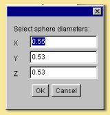
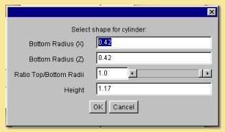
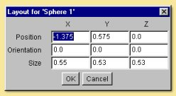
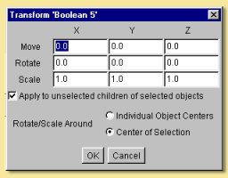
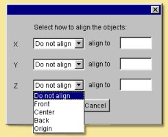
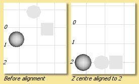
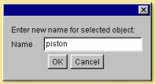

Editing Objects
***************

Once any of the objects described previously have been created, they may be edited at any time. To select an object,
either click on it in one of the view windows or in the Object List. To select multiple objects, hold down while
clicking on the relevant objects in the view windows or the Object List or define a marquee selection by holding down
the mouse button while dragging the mouse across the required images.

.. _edit object:

Edit Object
===========

The Edit Object tool is actioned by selecting Object -> Edit Object or by double clicking on the object in the Object
List. This tool brings up an object-dependent dialogue box which allows varying amounts of editing. For a sphere or cube
primitive, a simple dialogue box allows the scaling in each axis to be altered. For a cylinder or cone object, there is
the ability to alter the relative scaling of the base as well as the top/bottom radius ratio and the height.

The relevant editing windows for :ref:`curves<curves>`, :ref:`spline meshes<splines>`,
:ref:`triangle meshes<triangle_meshes>`, and :ref:`tubes<tubes>` were discussed previously.  The editing options for
lights and cameras will be discussed in later chapters.

.. _object layout:

Object layout
=============

If you select an object and click on Object -> Object Layout, a dialogue like this example will be displayed giving
information on the object's position, orientation and scaling.

Any of the shown fields can be altered allowing accurate definition of the object's position, orientation and size.
Simply click in the relevant box, type in the new value and click on 'OK' to action the change.

.. _transforming objects:

Transforming Objects
====================

Clicking an object and selecting **Edit -> Transform Object** allows the object to be translated, rotated or scaled by a
user-defined distance, angle or factor respectively. The following dialogue box is displayed:

By default, transformations are also performed on children of the selected object and this can be turned off from this
dialogue box. It is also possible to perform the rotation of a collection of objects as if they were separate objects
(i.e. around Individual Object Centres) or, by default, around the centre of the collection.

Transformations can also be made using the icons on the left of the main screen layout.

|modelling/translate_icon.jpg| is object translation. Simply click on the icon and drag the object in any of the
viewports.  Double-clicking brings up a dialogue box to switch off/on translation of non-selected children objects.

|modelling/rotate_icon.jpg| is object rotation. Again click once on the icon and drag over the object to rotate it. The
rotation can be constrained to a particular axis by dragging the appropriate handle instead. Double-clicking brings up a
dialogue box to switch off/on translation of non-selected children objects and to change the rotation centre.

|modelling/scale.jpg| is object scaling. Clicking on this and then dragging a handle scales in the appropriate axis.
Pressing while dragging maintains the relative dimensions of the object, while pressing keeps the centre of the object
fixed. Both can be pressed simultaneously to maintain shape and centre. Double clicking brings up a dialogue box to
switch off/on translation of non-selected children objects and allows for the centres of objects to remain fixed or to
move in relation to the scaling.
Fine editing of object translation and rotation can also be achieved using the arrow keys. The currently selected
object(s) will be moved/rotated according to the arrow key pressed and the currently selected view window.

.. _align objects:

Align Objects
=============

This option from the Object menu allows selected objects to be aligned with each other. The dialogue box looks like
this:

Objects can be aligned in any axis and with respect to their front, centre, back or origin. In addition the objects can
be positioned at any particular point along the axis by entering a value in the 'align to' box. For example, selecting Z
centre align to 2 will move the centres of all selected objects to Z=2 as below:

.. _rename object:

Rename Object
=============

New objects in Art of Illusion are given a generic name based on the type of object. Copied objects retain the name of
the original object. In either case, it becomes far easier to give the objects a meaningful name. This is achieved by
simply clicking on the object and selecting Object -> Rename Object.

.. _copy object:

Copying Objects
===============

Any object can be copied including cameras and lights. The **Cut**, **Copy** and **Paste** commands are to be found on
the **Edit** menu. These commands work in the same way as many other programs in that **Cut** and **Copy** both make a
copy of all selected objects in the clipboard which can then be **Paste**d to produce an identical copy in the scene.
**Cut** results in the original object being deleted. Objects can also be copied from one scene to another scene in the
same way.

In addition to these commands, there is a special copying command **Edit -> Make Live Duplicates**. This produces an
identical copy of all selected objects in the same way as **Copy** but this time the new object is linked to the
original so that all future changes made to any of the linked objects are automatically applied to all 'live'
duplicates. If and when you want this relationship to stop, select the copy and click on **Edit -> Sever Duplicates**.

.. |modelling/scale.jpg| image:: modelling/scale.jpg
