Art of Illusion Basics
######################

.. _overview:

Overview
********

Art of Illusion (AoI) is a program for creating high quality, photorealistic (or non-photorealistic) still images and
animations (either in .mov format or as a sequence of still frames which can be joined together using other software to
make movie files). Images are produced by rendering scene files. These scene files need to contain some 3-D objects, at
least one light (or some form of global illumination) so that the objects can be seen and at least one camera, the view
from which provides the image. Complex scenes may contain many hundreds of objects and several lights. Files built for
animation may have several cameras between which the view is cut to make for an interesting animation sequence.

3-D objects come in 4 basic flavours: Primitives, spline meshes, triangle meshes and tubes, all of which are described
in detail later in this manual. Art of Illusion has highly flexible, but easy to use, editors for textures (surface
properties such as colour, bumpiness, shininess, transparency etc.) and materials (inner properties for simulating
glass, smoke etc.).  

Animation of objects within the scene is achieved with a keyframing system including support for skeletons using forward
and inverse kinematic animation. Textures can also be animated.

Rendering of the scene file is achieved with a fast raster engine or a high quality raytracer capable of producing
photorealistic images. Motion blur, depth of field, Global Illumination and caustic effects are supported.

In addition, Art of Illusion includes a scripting feature allowing the creation of new types of objects and tools
amongst virtually unlimited other possibilities via the Beanshell scripting language.

Plugins and scripts are also available that allow additional objects and tools - see the Scripts and Plugin Manager for
details of how to find and install these.  This manual only details the basic AoI program - please refer to developers
documentation for their own scripts and plugins.

A good place to start, unless you want to read the whole manual first, are the tutorials located at the Art of Illusion
web site (www.artofillusion.org). The hourglass tutorial gives an excellent introduction to using the program and useful
details on the texture/material support and meshes are also available in other tutorials.

.. _getting_started:

Getting Started
***************

.. _main_layout:

Main Screen Layout
==================

The screenshot below shows the main window:

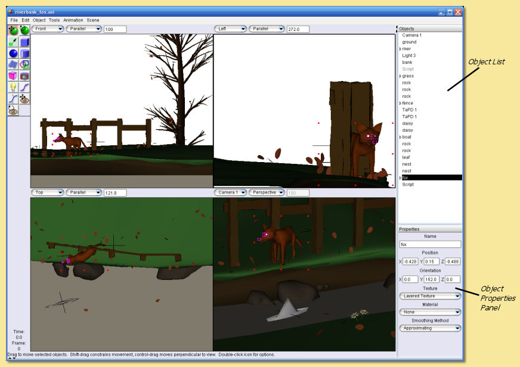

Note that since version 1.8, Art of Illusion uses a UI based on Java Swing. This means that the 'Look and Feel' of the
interface can be customised to a certain extent. There are many Look and Feels available as downloads from the internet
(e.g. www.javootoo.com). To set one to work with AoI, you need to create a simple Startup Script (see
:ref:`here<startup_scripts>` for details).  Also, since version 2.5, plugins can alter the display, icons etc.

.. _theme:

See the DisplayModelIcons and ElectricWaxTheme downloadable through the Scripts and Plugins Manager - these plugins will
transform the above into a display like this:

.. _panels:

The main window is divided into several area: the 4 interactive view windows, the Object List and the Object Properties
Panel, and the :ref:`tool icons<icons>`, each of which are described in detail below.  The animation score can also be
displayed - see the animation section for details.  The side panels are dockable so that the display can be configured
as required - simply drag the top bar of the Object List, the Properties Panel or the Score to move the panel to the
top, bottom or sides of the display.

.. _view_windows:

View Windows
============

The 4 windows in the main part of the screen show different views of the scene. By default, the two upper windows and
the lower left window show parallel or orthogonal views of the front, side and top respectively and the lower right
window shows a perspective view from the currently-selected camera. These views can be easily altered using the
drop-down menus at the top of each view window.

The window with 'focus' or the selected window is the one with the thicker outline (the upper left window in the example
screenshot above). This is relevant for any operations that work on single view windows. To change the selected window,
simply move the cursor to the required window and click.   All view windows can be panned, zoomed and rotated
independently using the camera controls: |basics/camera_buttons.jpg| or by using keyboard shortcuts:

Pan Controls:

* Click left on |basics/camera_pan.jpg| then drag in the view window whilst holding the left mouse button down.

* Hold down the right mouse button and drag in any view window.

Zoom/Magnification Controls:

* Select Pan mode by clicking on |basics/camera_pan.jpg| then hold down CTRL while dragging the right mouse button up
  (zoom out) or down (zoom in) or

.. _scrollWheel:

* Use the scroll wheel - scrolling down zooms in and scrolling up zooms out. Holding down ALT while using the scroll
  wheel zooms in/out faster.

* Magnification of parallel views can also be accomplished by entering an appropriate magnification level from the
  drop-down menu at the top of each view window.

Rotation Controls:

* Rotation of each view window is achieved by clicking on |basics/camera_rotate.jpg| and then dragging in the relevant
  view window whilst holding the left mouse button. Holding SHIFT while dragging constrains the rotation to a vertical
  axis and holding CTRL rotates the view about the axis perpendicular to the screen.

* Alternatively, rotation can be performed by holding down the ALT key while dragging with the mouse. The SHIFT and CTRL
  modifiers also work with this method.

* If any objects are selected, the centre of the rotation will be at the centre of that selection.

* Rotating any of the fixed-view windows (i.e. front, side and top) means that that view no longer shows that fixed view
  and thus the name for that view changes to 'other'. Selecting the appropriate view name from the drop-down list will
  restore the default view.

If there is more than one camera in the scene, it is possible to see the view from any of them by selecting the
appropriate one from the drop down list. Likewise, if you have any directional lights or spot lights in the scene, the
drop down list includes options to view the scene from their perspectives. This is useful for aiming lights.

If you find it easier to work with one large window, select Scene -> One View from the top menu bar and the currently
selected window will fill the workspace.

One other thing that you need to know is the orientation of the coordinate system used, as this varies between 3D
programs. Art of Illusion uses a right-handed coordinate system - when the positive x-axis points right and the positive
y-axis points up, the positive z-axis points out of the monitor. If you are facing front, the y-axis is up and down, x
is left and right and z is forward and backward. The axes for the default viewports are thus as follows:

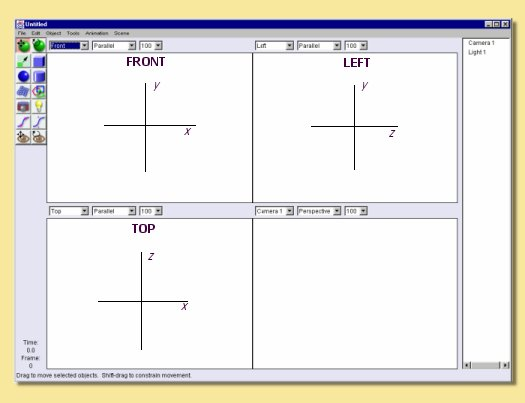

.. _framing:

Sometimes it is useful to be able to quickly visualise the whole scene or a selected object within the view windows.
This is achieved through Scene -> Frame Selection with Camera, which adjusts the zoom and centering of the non-camera
view windows so that the selected objects just fit within them, and **Scene -> Frame Scene with Camera** which similarly
fits the whole scene into the windows.

.. _display_mode:

Display Mode
============

There are 6 possible ways in which to view the scene in real time: **Wireframe** preview, **Shaded** preview, **Smooth**
preview, **Textured** preview, **Transparent** preview, and **Rendered** preview. The type of preview is selected from
the top menu bar Scene -> Display Mode -> Wireframe/Shaded/Smooth/Textured/Transparent/Rendered and affects the view
window with 'focus'. The difference between them is shown in the figure below:

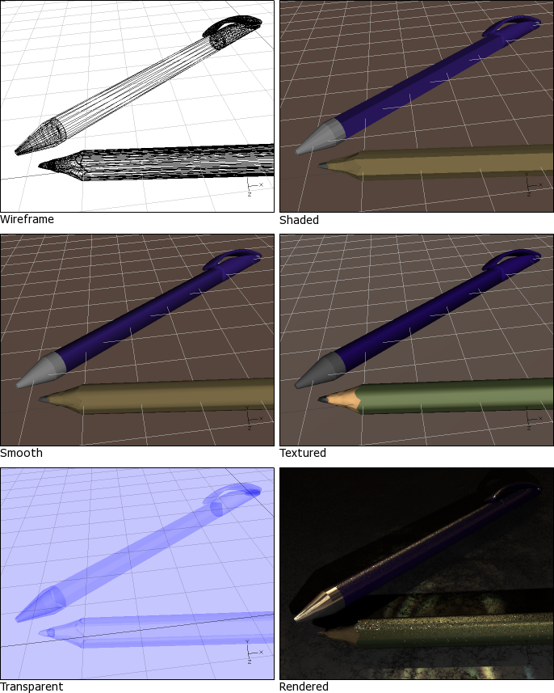

The choice of preview mode affects performance of real time camera movements with speed potentially decreasing from
Wireframe -> Shaded -> Smooth -> Textured -> Rendered. Depending on the specifications of the computer being used, this
will be more noticeable on complex scenes. The preview type can be set independently for each view window.

Note that Shaded and Smooth previews show colours which match, albeit in a simplistic way, the textures assigned to each
object. The Textured preview gives a closer representation of the actual textures, and Rendered preview shows exactly
what the objects will really look like. See textures_and_materials for more detail.

.. _icons:

Icons
=====

At the upper left of the screen are the icons for quick selection of common tools. They allow you create new objects and
to move, rotate and scale existing objects. Resting the cursor over the icons will bring up a tooltip to describe its
function.

The image on the right gives a brief description of each icon and the tools themselves are explained in more detail in
relevant sections of this manual.

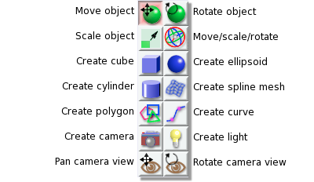

For each tool used, there is a line of text at the bottom of the screen which briefly describes its use.

With the Move tool and Rotate tool, objects can be moved one pixel at a time with the keyboard arrow keys and 10 pixels
at a time when the ALT key is used with the arrow keys.

The Move/Scale/Rotate tool provides a collection of controls for moving, scaling, and rotating the selected objects
without needing to change tools. It is :ref:`described in detail<gizmo>` in the section on editing meshes.

.. _main_space:

The Spacebar can be used to quickly switch between tools; pressing it will toggle selection between the default tool
(either Move or Move/Scale/Rotate, depending on your :ref:`preference<prefs>` settings) and the last tool used.

.. _object_list:

1.2.5 Object List and Properties Panel

Finally, on the right hand side of the main screen are the Object List (at the top bu default) and Object Properties
Panel (at the bottom by default).

Not surprisingly, the Object List is a list of all the objects, including cameras and lights, in the scene. Objects can
be selected from this list for editing simply by clicking on them. To select more than one object, hold down the key
while clicking or, to select a range, click on an object and click on another to select all the objects in between.

Some types of object (e.g. curves, splines and meshes) allow editing additional to the standard move, scale and rotate.
Double-clicking on objects in the Object List opens up the relevant editing tool (see editing_objects).

This list also allows the hierarchical arrangement of objects so that a number of objects can be 'children' of other
objects. Moving, scaling and rotating 'parent' objects can result in the children objects also being transformed
depending on the tool setting (see Transforming Objects). An object can be made a child of another object by clicking on
it and dragging it underneath the intended parent. An arrowed bar shows the position of the object in the list.
Indentation of this bar indicates that the object can become a child of the object above it in the list. Releasing the
mouse button causes this to happen and the parent object then has a down arrow displayed next to it to indicate this
hierarchy. Clicking on this arrow hides the children and the arrow changes to a right pointing arrow.

Arranging a parent-child hierarchy between objects can also be useful during animation.

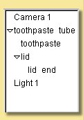

In the example on the left, the object hierarchy for a toothpaste tube scene is given. In this case, 'toothpaste' and
'lid' are children of 'toothpaste tube' and 'lid end' is a child of 'lid'. Transformations made to 'toothpaste tube' can
be set so as to affect all the objects mentioned, whereas those applied to 'lid' can affect only 'lid' and 'lid end'.

If required, the Object List can be hidden from view by selecting Scene -> Hide Object List.

Right-clicking on objects in the Object List displays a menu of operations available for that object including various
editing tools, application of texture and materials and the ability to hide/show that object.  The options are also
available via a context menu which can be brought up by right clicking objects directly in the view windows.

The Object Properties Panel shows the various editable properties for the currently selected objects as shown in the
example below.

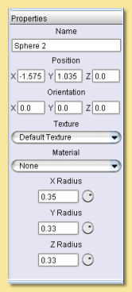

The properties that appear in this pane depend on the type of object(s) selected. In this example, the properties for a
sphere object are displayed and can be edited.

The Position and Orientation values can be entered directly and the texture and material can be set.

The X, Y and Z radii of the object can also be set directly in the relevant text fields or can be altered via the
control knobs to the right of each.  To operate these, move the cursor over the knob and hold down the left mouse button
while dragging left or right.  To effect larger changes in value, the ALT key can be depressed while dragging.

.. _hiding_objects:

Hiding/Showing Objects
======================

It is sometimes useful to be able to hide objects from view, for example in a complicated scene where some objects
overlay those you wish to work on. To hide objects, select them and click on Object -> Hide Selection. Alternatively
right click the selection in the Object List or the object itself in one of the view windows and choose Hide Selection.
 This will also hide them in the rendered image which is useful when you just want to test the rendering of certain
objects. Hidden objects are shown as grey in the Object List.

To show objects again, select them and click on Object -> Show Selection or right click the object(s) in the Object List
or in the view windows and select Show Selection.

.. _locking_objects:

Locking/Unlocking Objects
=========================

Another useful tool when you want to work on just a few objects is to lock other objects. When an object is locked, all
clicks on it in the view are ignored. It is still visible (unlike when you hide it), but in all other ways it behaves as
if it were not there. To hide objects, select them and click on Object -> Lock Selection. Alternatively right click the
selection in the Object List or the object itself in one of the view windows and choose Lock Selection.

To unlock objects again, select them in the Object List (because of course you can't select them in the view) and click
on Object -> Unlock Selection or right click the object(s) in the Object List and select Unlock Selection.

.. _grids:

Grids
=====

It is often helpful to be able to position objects accurately and switching on the grid will aid this. The grid is
activated via Scene -> Grids which brings up the following dialogue box:

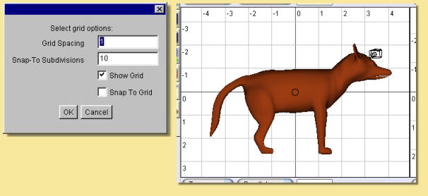

The grid spacing determines the spacing between the lines of the grid seen in each window. To actually see the grid, you
need to tick the **Show Grid** box. It is also possible to activate a **Snap to Grid** mode which forces objects to be
positioned at discrete locations rather than allowing complete freedom of movement. Tick the **Snap to Grid** box to
enable this and enter the relevant number of **Snap-to Subdivisions**. This is the number of uniformly distributed
allowable positions within each grid square. So, the higher this number, the more freedom of movement there is. In the
example on the left, objects will snap to every 1/10 of the grid spacing if the **Snap to Grid** box is ticked.

Switching on the grid will display the grid on all view windows. In addition, perspective views will display a ground
plane.

.. _coordaxes:

Coordinate Axes
===============

When navigating around the scene, it is sometimes possible lose track of your orientation. To aid you in this situation,
you can turn on Coordinate Axes via Scene -> Show Coordinate Axes. This displays 3 lines labelled x,y and z representing
the axes as seen below:

.. figure:: basics/coord_axes.jpg

If desired, the coordinates axes can be turned off via Scene -> Hide Coordinate Axes.

.. _file_menu:

File Menu
=========

The leftmost item on the top menu bar, **File** allows various file operations to be performed. Clicking on this will
bring up the File menu as shown below:

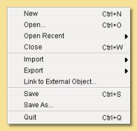

**New** opens up a new instance of Art of Illusion for creating a new scene. This blank scene contains by default a
camera and a directional light.

**Open** opens up an existing Art of Illusion scene file in a separate instance of AoI.

**Open Recent** shows a list of the last 10 scenes that were opened and lets you select one to open.

**Close** closes the current scene file. If this is the only instance of AoI open, then it will exit completely from
AoI.

.. _Import:

**Import** allows 3D models in formats other than AoI to be opened. The only supported file format is wavefront .OBJ and
the importer also allows OBJ materials to be imported. Simply select the OBJ file when prompted and the material file
will be automatically read and converted to an AoI texture. The model will automatically be scaled on import to better
fit AoI scale units.

.. _file_menu:

**Export** AoI can save 3D models/scenes in 3D formats other than AoI. Export can be made to either Wavefront OBJ, VRML
or Povray v3.5 files including partial support for textures. You can select whether to export the whole scene or just
the selected object and can specify the maximum surface error in the appropriate dialogue shown below. A lower value for
the error will result in a more complex and, therefore, larger export file.

OBJ and VRML exported 2D textures are saved as image maps of the size and quality specified in the relevant dialogues.

There are additional options for VRML and Povray as shown in the dialogues below:

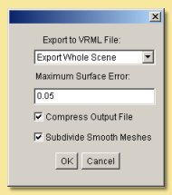

   VRML export option dialogue

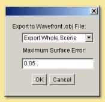

   OBJ export option dialogue

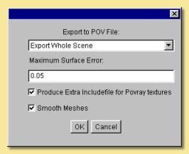

   Povray export option dialogue

.. _file_menu:

.. _ext_link:

Link to External Object

This is a way of using an object from another AoI file in the current scene via a dynamic link to that file. Using this
method, changes made to the source object automatically affect any files which have links to that object.  This allows,
for example, a character model to be created and kept in one file which can then be used in many other scenes  -
modifcations to the character can then be made to the original file which will then be applied automatically to any
scene files that have the link.

Selecting this option displays a dialogue, an example of which is shown on the right. This allows the selection of the
source file and the object within that file that is to be linked to.  You can choose the include the children of the
selected object as well.

.. _safesave:

**Save** saves the current file with the existing name or will prompt for a new name if the file has not been saved
previously. A 'safe save' method is used which ensures that the file is saved properly before the existing file is
overwritten.

**Save As** allows the file to be saved with a different name.

**Quit** closes down all currently open AoI files and shuts down AoI completely. You will be prompted to save any of the
files that have not yet been saved.

.. _edit_menu:

Edit Menu
=========

The **Edit** menu on the top menu bar contains some very useful selection and basic object manipulatiom tools.

The menu looks like this:

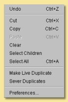

**Undo/Redo** undoes the last action or redoes the last undo, including selections.

**Cut** makes a copy of any currently selected objects in memory while deleting the originals.

**Copy** is like **Cut** but the original objects are retained.

**Paste** creates as new objects any that have been put in memory by **Cut** or **Copy** tools.

**Clear** deletes all currently selected objects.

**Select Children** selects all objects that are 'children' of currently selected objects.

**Select All** selects all the objects in the scene.

.. _edit_menu:

**Make Live Duplicate** makes a special copy of any currently selected object in that they are dynamically linked so
that any changes made to one are automatically made to all other live duplicates. Note that this method of copying uses
significantly less memory than making several normal copies via the copy/cut/paste tools.

**Sever Duplicates** ceases the association between live duplicates so that they become independent objects

.. _prefs:

**Preferences** allows various general parameters to be set up for future instances of AoI. (This item appears in the
Edit menu on Windows and Linux, but in the application menu on Mac OS X.) Selecting this option produces the following
dialogue:

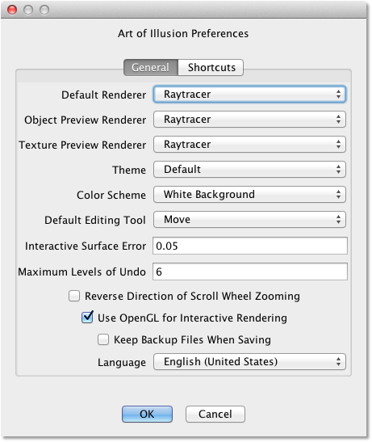

There are 2 tabs for preferences: General and Shortcuts.  The preferences under the General tab are described below:

The **Default Renderer** defines the default rendering engine used for rendering scenes.

The **Object Preview Renderer** defines the default renderer used when carrying out render previews in the spline mesh
and triangle mesh object editors.

The **Texture Preview Renderer** defines the default renderer used in the various texture dialogues.

The **Theme** defines the overall appearance of windows in AoI. A single default theme is included with the program.
Others can be downloaded with the :ref:`Scripts and Plugins Manager<SPManager>`. Each theme provides a selection of
**Color Schemes** to choose from.

The **Default Editing Tool** is the tool that should be selected in a window when it first appears. You can also press
the spacebar in a window to quickly toggle between the default tool and another selected tool.

The **Interactive Surface Error** defines the surface accuracy of objects displayed in the main window and the object
editors. The lower the value, the more acccurate the surface displayed is as shown below. Bear in mind, however, that a
low surface error will result in a poorer performance in terms of speed.

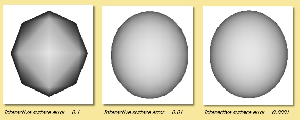

**Maximum Levels of Undo** defines how many of the last operations are stored by AoI and hence how many can be undone.
The greater this number is, the more steps can be undone, but the greater the memory requirement.

**Reverse Direction of Scroll Wheel Zooming** lets you control how zooming with the scroll wheel works. By default,
scrolling up zooms in. Selecting this option reverses that.

.. _OpenGL:

**Use OpenGL for Interactive Rendering** By default, Art of Illusion uses OpenGL, through the JOGL libraries, to speed
up the interactive displays in the main window and object editors. If there are problems with this, the option can be
switched off here to allow software rendering.

**Keep Backup Files When Saving** creates a backup of the last saved file when the file is saved with the same name. The
backup file has the additional extension .bak.

.. _language:

Lastly, the **Language** defines which language all the dialogues will be shown in. As of version 2.0, you can choose
from Danish, English(United States), French, German, Italian, Japanese, Portuguese, Spanish or Swedish.

The

.. _xtraShortcuts:

Shortcuts tab of the preferences dialogue is shown below.  This dialogue allows keyboard shortcuts, additional to those
described in section :ref:`1.2.12<shortcuts>`, to be set up.  The keys defined trigger scripts to carry out particular
tasks. New shortcuts can be added or existing ones can be edited.  This allows Beanshell scripts to be written in a
special dialogue to carry out the series of commands required.   

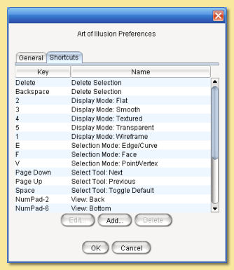

The default shortcuts are:

============  =========================
============  =========================
Delete        Delete Selection
1             Display Mode: Wireframe
2             Display Mode: Flat
3             Display Mode: Smooth
4             Display Mode: Textured
5             Display Mode: Transparent
E             Selection Mode: Edge/Curve
F             Selection Mode: Face
V             Selection Mode: Point/Vertex
Page Down     Select Tool: Next
Page Up       Select Tool: Previous
Space         Select Tool: Toggle Default
NumPad-0      View: Toggle Perspective
NumPad-1      View: Front
NumPad-2      View: Back
NumPad-3      View: Left
NumPad-4      View: Right
NumPad-5      View: Top
NumPad-6      View: Bottom
NumPad-7      View: Camera 1
NumPad-8      View: Camera 2
NumPad +      View: Zoom In
NumPad -      View: Zoom Out
============  =========================

.. _templates:

Using Template Images
=====================

Art of Illusion allows the background of the view windows to be set to an image. This is useful when modelling objects
that benefit from a reference image. To select an image to assign to the background, click in the view window you want
the template image to be displayed and then select **Scene -> Set Template Image**. This brings up a dialogue allowing
the choice of an image in either .jpg, .gif or .png format. After selecting the image, it will be displayed as the
background of the selected view window.

To hide the image, select **Scene -> Hide Template** and to show it again select Scene -> Show Template . These actions
can also be carried out to hide/show template images in the :ref:`spline<splines>` and triangle mesh editors.

.. _shortcuts:

Keyboard Shortcuts
==================

To speed up workflow, many of the tools and functions have hard-coded keyboard shortcuts. These are summarised below:

File Functions:

======   ===================================
======   ===================================
Ctrl+N   Create a new AoI file
Ctrl+O   Open an existing AoI file
Ctrl+W   Close the current AoI file
Ctrl+S   Save the current AoI file with the same name
Ctrl+Q   Quit Art of Illusion
======   ===================================

Edit Functions:

======   ===================================
======   ===================================
Crtl+Z   Undo/Redo last action
Ctrl+X   Cut the selected object(s) to the clipboard
Ctrl+C   Copy the selected object(s) to the clipboard
Ctrl+V   Paste the object(s) from the clipboard into the file
Ctrl+A   Select all the objects in the scene
Delete   Clear selected object(s)
======   ===================================

Object Functions:

======   ===================================
======   ===================================
Ctrl+E   Edit Object
Ctrl+L   Edit the object layout
Ctrl+T   Open the Transform Object Dialogue
Ctrl+U   Set Texture for currently selected object(s)
Ctrl+M   Set Material for currently selected object(s)
======   ===================================

Arrow keys can be used to move/rotate selected object(s) in the plane of the currently selected view window if the
Move/Rotate Icons are on. Holding Ctrl while pressing the up/down keys moves/rotates in the other axis. Holding ALT
while pressing the arrow keys moves/rotates the object by 10 pixels.

Animation Functions:

============   ===================================
============   ===================================
Ctrl+P         Preview Animation
Ctrl+]         Move forward one frame
Ctrl+[         Move backward one frame
Ctrl+J         Jump to time ...
Ctrl+D         Edit selected keyframe
Ctrl+K         Keyframe selected track(s)
Ctrl+Shift+K   Keyframe modified tracks
Ctrl+Shift+A   Select all tracks of selected objects
============   ===================================

Scene Functions:

============   ===================================
============   ===================================
Ctrl+R         Open the Render dialogue window
Ctrl+Shift+R   Render immediately with current settings
Ctrl+B         Toggle between one view mode and four view mode
Ctrl+G         Open Grid dialogue window
Ctrl+F         Frame selection with camera
Ctrl+Shift+F   Frame scene with camera
Ctrl+Shift+U   Open Textures dialogue window
Ctrl+Shift+M   Open Materials dialogue window
============   ===================================

Mesh Editor Functions:

======   ===================================
======   ===================================
Ctrl+Z   Undo/redo last action
Ctrl+A   Select all vertices/edges/faces
Ctrl+X   Extend selection
Ctrl+F   Toggle freehand selection mode
Ctrl+W   Display as quads
Ctrl+M   Open Mesh Tension dialogue
Ctrl+E   Edit selected point(s)
Ctrl+T   Transform selected point(s)
Ctrl+B   Bevel/Extrude selection
Ctrl+P   Open texture parameters dialogue
Ctrl+S   Set smoothness for selected vertices/edges
Ctrl+R   Render preview
Ctrl+D   Open Edit Bone dialogue
Ctrl+G   Open Grid dialogue
======   ===================================

Arrow keys can be used to move selected points one pixel at a time in the plane of the view if the Move Icon is
selected. Holding Ctrl while pressing the up/down keys moves in the other axis. Holding ALT while pressing the arrow
keys moves the points by 10 pixels.

There is also the ability to set up additional keyboard shortcuts via  Edit -> Preferences -> Shortcuts tab.

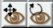

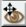

.. |basics/camera_rotate.jpg| image:: basics/camera_rotate.jpg