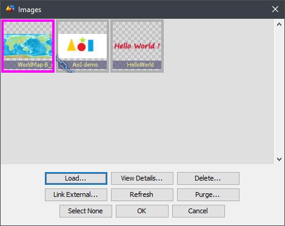
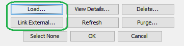
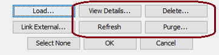
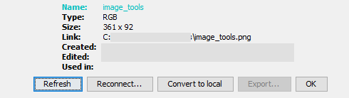
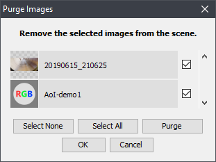

Image Resources
###############

The Image Management Dialog
***************************
In Art of Illusion you can use images to generate textures. To manage the images select  **Scene** |arrR| **Images...**

Image-mapped textures and procedural editors also open this dialog to handle images.

.. note:: Stretching the dialog will enlarge the icons.

The icon symbols
================

.. |selectedtxt| replace:: **Colored frame:** Currently selected for an action.
   *- The selection color is defined in the current color theme.*
   
.. |usedimg| image:: managing_images/used.png
   
.. |usedtxt| replace:: **Paper clip:** A texture or material is using the image.
   |*- Images that are in use cannot be deleted.*
  

   
.. |linkedtxt| replace:: **Chain:** This image is linked from an external file.
   *- You can keep editing the file and **Refresh** to see the latest changes*
 

   
.. |brokentxt| replace:: **Broken chain:** The linked image file could not be read.
   *- The icon shows, what kind of an image is missing.*
   *- Try **View Details &rarr; Reconnect** to find the image*

.. comment   I tried to use list-table here, but I did not look right
             This is closer and is shows with single linebreaks, but 
             unfortunately it add the colon after every image.
   
:|selectedimg|: **Colored frame:** Currently selected for an action.

                *- The selection color is defined in the current color theme.*

:|usedimg|:     **Paper clip:** A texture or a material is using the image.

                *- Images that are in use cannot be deleted.*
  
:|linkedimg|:   **Chain:** This image is linked from an external file.

                *- You can keep editing the image and* **Refresh** *for saved changes.*

:|brokenimg|:   **Broken chain:** The linked image file could not be read.

                *- The icon shows what kind of an image is missing.*

                *- Try* **View Details...** |arrR| **Reconnect** *to find the image*

Using images
============

To pick an image for your texture, click an image icon to select it and click **OK**. 

Importing images
****************

You have two options for importing images: You can **load** them into the scene as local images or you can **link** them as external files.

**A loaded image** will be saved with the scene. It will be kept safe from any changes to the original image but it can not be edited or replaced. 

- The images are stored in lossless formats, .png, .hdr or .svg.
- Transparency is supported where possible.
- Loaded images *can* be exported.

**A linked image** stays as an independent image file. You can edit the image afterwards or even change the image that the link is referring to. The link is saved in both relative and absoulte forms: If you move the scene to a differen location on your hard drive, you can either move an entire folder structure including your images or you can keep the images in a stationary library. 

Linked images are marked by a piece of chain on lower left corner of the image icon. If the image file is not found, the chain icon appears broken and the displayed default icon will show what type of an image is missing. To reconnect the link to a lost image, first click the icon to select it and then click **View Details...** |arrR| **Reconnect**. 

Tools to manage the images
**************************

**Refresh:** Reload linked images. Use this if you have edited a linked image during the current AOI session.

**Delete:** Remove the selected image or link.

**View Details:** Open a dialog to handle the currently selected image

Here you can:

- Find some some meta data on the image (size, name, type, creation date ....)
- Rename the image locally. *(Click the name field!)*
- Reload a linked image. *(Useful if you have just edited the image!)*
- Reconnet a link. You can use this to fix a broken link or to change the image.
- Convert a linked image local.
- Export a local image into a new file.

.. note:: **Hint:**

 - It can be handy to use a Linked image while you are still refining it.
 - Convert to local when finished for simpler storage, or to share your .aoi file with others.

**Purge:** Delete unused images. 

The Purge dialog will list all unused images and links for potential removal. You can select individually which ones to remove before performing the action. Purge does not delete images that are currently in use.

