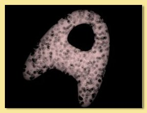

.. _materials:

Materials
*********

Materials define the interior qualities of the object and can be used to create a wide variety of effects including
smoke, fire, fur, refracting substances like glass and plastic, and materials with subsurface scattering like wax, milk,
skin etc.

A material can only be applied to a closed object. Also bear in mind that for the material to be actually visible, the
surface texture of the object needs to be at least partially transparent. Under some circumstances, the texture will
need to be completely transparent; this can be achieved by setting up a uniform texture and setting **Transparency** to
1.

There are two types of material in Art of Illusion: Uniform and Procedural. Materials are created from the same window
used to manage textures. To create a new material, click on **Scene -> Textures**, then select **Uniform material** or
**Procedural Material** from the **New...** menu.

.. _uniform_mat:

Uniform Materials
=================

As with textures, Uniform materials are applied equally over the whole interior. The dialogue box for this type of
material looks like this:

The preview view and object can be altered via a pop-up menu activated by right-clicking over the preview as with the
:ref:`Uniform Texture dialogue<uniform_tex>`.

**Emissive Color** is the colour of light given out by the material (light is actually emitted when rendering with
:ref:`Global Illumination<GI>`)

**Transparent Color** defines the colour that is transmitted through the material. Its intensity determines how
transparent the material is e.g. white is completely transparent and black is completely opaque. although the
overall level of transparency is controlled by the **Transparency** value.

**Density** is the degree of light attenuation in the material. The higher the value, the less the light is able
to penetrate through the material.

**Scattering** is the degree to which light is scattered.

**Scattering Color** sets the colour of the light that is scattered. **Scattering** needs to be non-zero for this
to have any effect.

**Eccentricity** defines the direction in which light is scattered (again **Scattering** must be non-zero) and has
values between -1 and +1. A value of 0 is isotropic scattering, i.e. light is scattered equally in all directions.
Negative values mean that the light is scattered forwards and positive values mean that the light is
back-scattered. As the magnitude of eccentricity tends to 1, the more directional the scattered light becomes. A
value of -1 means that all light is scattered straight ahead and +1 is scattered straight back.

**Index of Refraction** This determines the amount that light is bent within the material and is used to simulate glass,
plastic, water etc. The higher the value, the more light is refracted. Typical values are glass:1.55, water 1.33:

.. figure:: textures/mat_ior.jpg

**Casts Shadows** If checked, then the material will attenuate light to produce shadows. Otherwise it will not.

Materials with subsurface scattering properties can be simulated by using a partially transparent texture with a
scattering material and then rendering using :ref:`photon mapping<SSS>`.

.. _procedural_mat:

Procedural Materials
====================

As with procedural textures, procedural materials allow the specification of the various material properties described
above based on point by point calculations. So each point within the volume enclosed by the object's surface can take on
different material values and colours.

The procedural material editor looks like this:

.. figure:: textures/proc_mat_dial.png

Exactly the same material properties are listed down the right hand side as are available for uniform materials. The
menu along the left side allows modules to be added to the procedure, exactly as with procedural textures.

Clicking the **Properties** button displays the following dialogue:

.. figure:: textures/material_prop_menu.jpg

The **Index of Refraction** is as described for :ref:`uniform materials<uniform_mat>`.

**Integration Step Size** The mathematical technique for calculating the material property values works by
stepping through the volume. The size of the steps determines the accuracy of the result, smaller being more
accurate but also taking more time to integrate. If there are fine structures within the material, it will be
necessary to reduce this value accordingly.

**Antialiasing** As with textures, this controls the 'smoothing' of the material. Values greater than 1 smooth
more and less than 1 smooth less. Normally there should be no reason to alter this but it may be necessary if
artifacts occur.

With procedural materials there is more control over colour values. The colour scale module (**Color Functions -> Scale**)
can be used to scale colour Values (in HSV colour model) beyond the normal limit of 1 and so produce more emissive
materials. For example the material below uses a color scale module (currently scaled by 100) to brighten the colourmap
used to produce a fire-like material colour.

By varying the scaling factor, different levels of emissiveness can be obtained as shown below (rendered with Monte
Carlo :ref:`Global Illumination<GI>`):

.. figure:: textures/fireballs.jpg

The same principle can be applied to the other colours, i.e. scattering colour and transparent colour, to artificially
enhance the degree of scattering and transparency (some very odd effects can be produced for transparent colours with a
Value greater than 1 !)

**Example Procedural Materials**

Below are 3 example materials obtained using a small selection of the available modules. We describe below how each one
was created.

.. _ex_materials:

.. figure:: textures/mat_orange_fur.jpg

Here is the procedure for the first one:

This 'froth' material is based around the **cells** pattern which produces a random set of 'feature points'.
The second output of this is the distance of the point from the nearest feature point.  The **greater than**
function is used to produce a 1 if this is less than 0.3 and 0 otherwise; i.e. those point within a distance
of 0.3 result in a 1 and everywhere else is 0, resulting in circles of radius 0.3 around the feature points.
These are the 'bubbles' which need to have 0 density so the map is reversed by subtracting it from 1.  Now
we have zero value for the 'bubbles' and 1 everywhere else and this is fed into the density property. A slight
scaling/shifting is also applied to get a better look.

**Scattering** is set to a maximum of 1 so that light is all scattered.

**Transparency** is set to 0.01, i.e. almost opaque.

Finally, a uniform pink colour is set as the **Emissive Color** which gives the froth a basic pink colour.

Here is the procedure for the second material:

.. figure:: textures/mat_orange_fur_ex.jpg

This material is based on the **Grid** pattern to which a **spherical** transform is partly applied.
Note than the R output from the spherical output is not fed into the grid; rather a 0 value is the input
which stretches the grid pattern radially outwards.

The resulting grid pattern is then evaluated with the **greater than** function to pick out points within
a radius of 0.03, i.e thin 'spokes' (the Grid spacing is set at 0.1).  This is fed into the density function
so that the 'spokes' have a high density and everywhere else is zero.

**Transparency** is set to a very low (but non-zero) value to produce a virtually opaque material.

Finally, the R output of the **Spherical** transform is fed into a custom colour map to produce
a pattern whose colour varies with distance from the centre.

The **Integration Step Size** was reduced to 0.01 to allow more accurate rendering of the fine (0.03) spokes.

Here is the procedure for the third material:

.. figure:: textures/mat_cottonwool_ex.jpg

This is quite a simple material.

A **Turbulence** pattern is used to create the 'cloud' effect.  A **Linear** transform is used
to scale the pattern down and the result is scaled and fed into the density property box.

**Transparency** is set to a low (but non-zero) value so that the material is almost opaque.

**Scattering** is set to 0.5 which means that half the light is scattered isotropically (eccentricity
is left at the default of 0).

.. _assign_mat:

Assigning Materials to Objects
==============================

Materials can only be assigned to closed objects. To assign a material, select the object and click on **Object -> Set
Texture and Material**, then choose the **Material** tab:

.. figure:: textures/object_material_dial.png

On the left is a list of the currently defined materials. Click on one and the preview will update (note that this will
often be quite slow due to the complexity in rendering materials). Clicking and dragging in the preview window will
rotate the view. As with the :ref:`uniform texture dialogue<uniform_tex>`, right clicking on the preview displays a menu
from which the view and preview object can be changed.

Existing materials can be edited and new ones created by clicking on **Textures and Materials**.

To map (i.e. scale, position and orient) the material to the object click on **Edit Mapping** which will display the
material mapping dialogue shown below:

.. figure:: textures/material_mapping_dial.jpg

As with procedural 3D textures, there is only one mapping type available; Linear.

Enter appropriate values in the relevant boxes to alter the scaling, orientation and position of the material within the
object.

.. _Scale_Material:

As with :ref:`textures<Scale_Texture>`, the material can be scaled to the bounding box of the object.  If
**Scale Material to Object** is checked, then the material will rescale according to the size of the object.

The preview window shows the selected object with the mapped material and can be oriented by clicking and dragging
within this window. Alternatively, right clicking on the preview displays a menu from which the view can be changed.