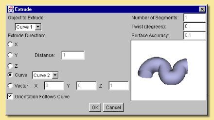

.. _modelling-tools:

Modelling Tools
***************

The tools described in this section are reached through the **Tools** menu on the top menu bar. All of the tools create
new objects, some create spline or triangle meshes which are then editable in the ways described in the previous
section.

.. _array:

Array
=====

This tool can create several objects as copies of any existing object. Clicking on an object in the Object List and
selecting **Array** from the **Tools** menu brings up the following dialogue box:

Copies can be made along a straight line (**Linear**) or along a pre-defined curve. In the **Linear** option, the number
of copies is specified and the direction along which to put the copied objects, i.e. x, y or z, by specifying a number
in the **Step X**, **Step Y** and **Step Z** boxes. This number is the spacing of the resulting objects which can either
be defined in terms of the object size (tick **Times X Size** or whichever direction you want) or in absolute units
(leave boxes unticked). For example, specifying 1 in the **Step X** box and ticking the **Times X Size** box will
produce copies running along the x-axis that will just be touching. Copies running along any vector can be defined by
specifying steps in more than one **Step X/Y/Z** box as shown below:

.. figure:: modelling/array_x_y_z.jpg

Using the **From Curve** option allows the copied objects to be created along a path defined by an existing curve
which can be selected from the pull down menu. Copies are spaced evenly along the curve and the number is either
explicitly specified or calculated from the specified **Step Size** (in units). The orientation of the copied objects
can either follow that of the curve or be fixed at that of the original (untick Orientation Follows Curve). In
addition, the original position and orientation can be used to form the basis for the position and orientation of the
copies.

In the example on the right, the Array tool has been used to create some wheel spokes. In this case a approximating
smoothing polygon was used to produce a circular path. The original cylinder was positioned as shown and its orientation
and position were used and 'Orientation Follows Curve' was ticked.

.. figure:: modelling/array_wheel.jpg

Note that the Array tool can be used on arrays. This example shows an array of an array of an array and shows how
quickly a large number of copies could be made.

The tick boxes at the bottom of the dialogue determine further options:

**Include Children** means that children of the object to be copied will be copied as well.

**Group** means that the objects created by the Array tool will be grouped together under a Null object parent.

**Skip First Copy** means that the first copy will not be made. This is useful if you want the original object to be one
of the array.

**Live Duplicates** means that the objects created by the Array tool are 'live', i.e. changes made thereafter to the
original object will be automatically applied to the copies.

.. _extrude:

Extrude
=======

This tool creates a spline mesh object by extending a curve along an axis or another curve. Take the example below. On
the left is a closed curve made using the approximating curve tool. Selecting **Extrude** from the **Tools** menu
produces the dialogue box shown below right:

.. figure:: modelling/extrude_ex1.jpg

.. figure:: modelling/extrude_ex2.jpg

The curve has been pulled along the z-axis in this example to produce a cylinder-like spline object. The resulting
object is displayed on the right of the Extrude dialogue box and can be rotated around by clicking and dragging over the
object in order to better visualise it. In this particular example, because the curve lies in the x-y plane, extruding
along either the x- or y-axis will produce a 2-D object and extruding along the z-axis creates an object with sides
perpendicular to the original curve. The length of extrusion can also be specified in the**Distance**box.

Extrusion in a different direction can be achieved by defining a vector in the Extrude dialogue as shown in the examples
below:

The extrude tool can also produce twisted extrusions by entering a **twist** angle in the appropriate box as shown
below:

The number of segments, i.e. divisions along the extrusion axis, can also be defined. Altering the **number of
segments** can make a difference to a twisted object:

.. figure:: modelling/ext_twist.jpg

It is also possible to extrude one curve along another. In this case, the extruded curve is pulled along the path
defined by the second curve. The example below illustrates this. Two curves were created in perpendicular planes (shown
in Front and Top views). Both curves need to be selected in the Object List, then click on Tools -> Extrude. This brings
up the same dialogue box as before. Now, however, the Extrude Direction -> **Curve** option becomes available. Clicking
this option and selecting Curve 2 produces the result shown top right. Extruding Curve 2 along Curve 1 produces the
object shown on bottom right.

.. figure:: modelling/curve_curve_ex1.jpg

.. figure:: modelling/curve_curve_ex3.jpg

The orientation of the extruded curve can also be specified to follow that of the curve it is extruded along by clicking
**Orientation Follows Curve**. This causes the extruded curve to be always perpendicular to the tangent of the path
curve rather than maintaining a static orientation along the path. The difference this makes is shown below:

      Orientation follows curve

      Static Orientation

The Extrude tool can also be used on open spline meshes and triangle meshes and, in both cases, a triangle mesh is the
result. In this example, a flat spline mesh was produced using the spline tool|modelling/spline_icon.jpg| .This was
edited to produce the shape shown and was then extruded using the Extrude tool.

When extruding meshes, the **surface accuracy** can be specified and, as with other tools, this determines the number of
points defining the resulting mesh.

.. figure:: modelling/extrude_spline_spline.jpg

The effect of altering the surface accuracy in this example is shown below:

.. figure:: modelling/extrude_surf_acc.jpg

.. _lathe:

Lathe
=====

The Lathe tool operates on a single curve. The operation sweeps the curve around a defined axis or vector and produces a
spline mesh. Highlighting a curve from the Object List and selecting Lathe from the Tool menu produces the following
dialogue box:

.. figure:: modelling/lathe_curve.jpg

      Curve used in lathe example

.. figure:: modelling/lathe_dialogue.jpg

The curve object can be lathed around the x, y or z axes or around the line joining the end of the curve. The angle of
sweep can be defined - anything less than 360 degrees produces an open surface. The **radius** is the distance between
the centre of the curve and the axis of sweep so a bigger **radius** in the example above would produce a bigger hole in
the middle of the torus. More typically, one might want to use the lathe tool to create something like a wine glass:

.. figure:: modelling/lathe_wineglass.jpg

In this case, you will need to play around with the **radius** to get the required shape.

The number of **segments** controls how many points are created in the resulting spline mesh as shown on the right.
Having more points means having more control on the resulting object.

Note that to create a vase/glass etc. with some actual thickness, you will need to create a closed curve like the
following:

.. figure:: modelling/lathe_vase_curve.jpg

.. figure:: modelling/lathe_vase.jpg

.. _skin:

Skin
====

This tool fits a 'skin' to a series of curves which define the cross section at that point. All the curves must have the
same number of points and must all be either open or closed, not a mixture of the two. The example below shows the
spline surface skin produced from 3 polygons. Note that, in order for the curves to have the same number of points it
was necessary to edit the triangle and square objects to make up the number of points to 5 (to match the pentagon). This
was done by double-clicking the curve, selecting 2 adjacent points and selecting **Curve -> Subdivide Selection.** This
was performed once for the square and twice for the triangle.

Highlighting all 3 curves in the **Object List** and selecting **Tools -> Skin** brings up the dialogue box on the
right:

The curve order can be rearranged as required by selecting on a curve in the left hand list and moving it up or down.
The direction in which the points are joined can also be reversed.

Clicking on OK produces the result below:

.. figure:: modelling/skin_dialogue.jpg

.. _boolean:

Boolean Modelling
=================

Boolean Modelling is a powerful way of making complicated geometry relatively simply by combining existing geometry in
one of 4 ways. The Boolean tool currently works on 2 objects, one of which must be solid. To combine the objects, select
both either from a view window or the **Object List** and click on **Tools -> Boolean Modelling.** A dialogue window
similar to those below appears allowing the selection of the type of Operation: Union, Intersection, First-Second and
Second-First. Union creates a new object which is the addition of the 2 objects, Intersection creates a new object of
the part of the objects that overlap and the other 2 are geometry subtractions. The images below show the effects of
each operation on 2 squashed spheres.

Clicking on OK produces a new object, the original objects still being retained and completely independent of the new
Boolean object. The objects making up the new Boolean object, however, remain editable by double-clicking the Boolean
object in the Object List or selecting the object and clicking Object -> Edit Object from the top menu. This brings up
the Boolean editor which allows transformations of the component objects and the re-selection, if required, of the
operator performed on them:

The icons on the left are the same as some on the main layout window. The Edit menu allows the Boolean operation to be
re-defined through**Edit -> Properties**. The Object menu allows transformations and editing similar to the main layout
screen Object Menu .

A more complicated example gives an idea of what the Boolean tool is capable of. We start off with a Boolean made from
a difference of two cylinders, one inside another (but taller). The Union image shows the 2 objects clearly. Selecting
the First-Second operation gives the desired effect.

Clicking OK gives the first stage of the turret. Now we add a cube scaled so that it extends beyond the newly-created
'crater' as below left. Copy and pasting ( or using the Array tool with a suitable curve) produces copies of this cube
around the top of the soon-to-be turret (bottom right). These cubes are Unioned successively with the Boolean tool until
they form one Boolean object (delete the original objects and the intermediate Booleans as you go).

.. figure:: modelling/turret_diff.jpg

.. figure:: modelling/turret2.jpg

Select the main turret boolean and the combined cube boolean and create a difference. Again the image on the left
shows the objects clearly. Selecting First-Second produces the turret we are after on the right. Clearly through
further use of the Boolean tool, a more complicated and realistic model can be built up.

Bear in mind also that, like other geometric objects, the resulting Boolean object can be converted to a triangle mesh
which allows more detailed refinements and the application of the various smoothing methods.

.. figure:: modelling/turret_union2.jpg

.. figure:: modelling/turret_diff2.jpg

.. _tube:

Tube
====

The Tube tool is applied to a curve and produces a :ref:`Tube Object<tubes>` which is basically a circular
cross-sectioned extrusion along the curve.

To create a Tube Object, select the curve in the Object List and choose **Tools -> Tube...**. This will display the Tube
dialogue window. The image below shows a curve object and the Tube dialogue produced:

The dialogue allows the **Tube Width** or diameter to be specified and this is used along the whole length of the tube.
Note, however, that the width can be set at any point along the tube in the Tube Object editor (see :ref:`Tube
Objects<tubes>`).

The **Cap Ends** option allows the tube to have either open ends or flat, capped ends. Once created, tube objects can
also have their ends joined together within the :ref:`editor<tubes>`.

.. _text:

Text
====

The Text tool creates objects that represent text in various ways. To use it, choose **Tools -> Text...**. This will
display the Text dialogue window.

.. figure:: modelling/text.png

The dialogue allows you to specify the **Text** to generate and the **Font** and style (**Bold** or **Italic**) to use.
You can then select any of four object types to create:

**Outline** creates a set of :ref:`Curve Objects<curves>` that trace the outline of the text.

**Tubes** is like Outline, but it creates :ref:`Tube Objects<tubes>` instead of curves. You can choose the **Thickness**
of the curves it generates.

**Surface** creates a 2-dimensional :ref:`Triangle Mesh<triangle_meshes>` representing the text.

**Solid** is similar to Surface, but the mesh is extruded to create a solid 3-dimensional object. You can select the
thickness of the extruded mesh.

   Outline

.. figure:: modelling/text_tubes.png

   Tubes

.. figure:: modelling/text_surface.png

   Surface

.. figure:: modelling/text_solid.png

   Solid

.. |modelling/spline_icon.jpg| image:: modelling/spline_icon.jpg
