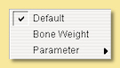
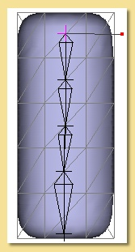
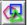
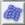

Object Types
************

.. _primitives:

Primitives
==========

There are 3 basic geometric primitives available in Art of Illusion: **cube**, **sphere** and **cylinder** objects,
which can either be created using the modelling tool icons in the upper left corner of the screen or via the top menu
bar as follows:

Using the modelling tool icons allows immediate creation of the primitive. Simply click on the relevant icon:

cube: |modelling/cube.jpg| sphere: |modelling/sphere.jpg| cylinder: |modelling/cylinder.jpg|

then click and drag on any viewport to define two of its initial dimensions. The 3rd dimension will have to be altered
if necessary using the scaling tool |modelling/scale.jpg| in one of the other viewports. Alternatively, holding shift
while dragging forces all 3 dimensions to be equal.

.. _cyl:

For cylinders, the top:bottom ratio can be set to form tapered cylinders (including cones) prior to drawing by
double-clicking on the cylinder icon. This ratio can also be edited after drawing (see
:ref:`editing_objects<edit_object>`).

.. figure:: modelling/cube_dial.jpg

Creating the primitive via the menu bar is achieved by selecting Object -> Create Primitive and then selecting the
appropriate shape. Cones can also be created directly using this method. This method brings up a dialogue box similar to
that on the left which allows the exact size, position and orientation of the object to be specified.

Primitives have limited use for creating realistic objects as such objects are rarely that simple in real life. However
they can be useful for cartoon-like scenes or for building up more complex models using Constructive Solid Geometry
(CSG) via the :ref:`Boolean tool<boolean>` like in the simple example on the right:

Primitives are also important as they can be the starting points for creating triangle meshes. See
:ref:`2.1.4<triangle_meshes>` below.

There is one other important primitive object: the **Null** object. Null objects do not show up on renders as they have
no geometry. Their main use in is grouping other geometrical objects together. For example you might want to create a
car out of a set of geometric objects representing the car body, wheels, windscreens etc. A neat way to keep all the
parts together would be to create a Null object and to group the geometric objects as children of that Null (see the
:ref:`Object List<object_list>` for more details). Nulls are represented as crosses in the viewports.

.. _curves:

Curves
======

These are one dimensional objects and thus are not directly visible when you render a scene. However, they can be used
in a variety of ways to create 3-D objects.

Curves are created by defining a series of points in any of the viewports. They can have one of two types of smoothing:
'Interpolating', for which the curve is forced to pass through the points and 'Approximating' where the curve does not
have to pass through all the points but is still controlled by them.

To create a curve, click on |modelling/inter_curve_icon.jpg|

Then click a series of locations on a viewport to define the points as shown on the right. Shift-click to create a sharp
corner.

To define the last point on the curve and thus end curve point definition, double click. If you wish to automatically
close the curve, press the control key and double click. Alternatively to end the curve without adding more points,
press Enter to end without closing or control-Enter to close the curve.

To control whether you are creating an interpolating or approximating curve, double click
|modelling/inter_curve_icon.jpg|. A window will appear where you can select the type of curve to create.

.. figure:: modelling/inter_curve.jpg

Closed curves can also be filled to create 2D objects by converting them to :ref:`triangle meshes<triangle_meshes>`.

Another way to create a curve is to use the polygon tool. A polygon is any flat shape with 3 or more sides. To create a
polygon curve, double click on |modelling/polygon.jpg| which brings up this dialogue box:

.. figure:: modelling/polygon_dialogue.jpg

You can specify how many sides the polygon has and the type of smoothing of the edges. Selecting 'angled' gives the
polygon straight edges, while choosing either 'interpolating' or 'approximating' creates rounded edges. Because
'approximating' smoothing does not require the curve to pass through all the points, this results in a smaller overall
shape for the 'approximating' polygon.

The figure on the right shows the differences between the 3 types of smoothing for a 3-sided polygon curve:

These were created by clicking once on the polygon tool icon and dragging a rectangular area on one of the viewports to
define its size.

Note: The Polygon tool can also be used to create 'filled polygon surfaces' which are triangle mesh objects. This is
achieved by holding while dragging.

**Editing Curves**

Once polygon edges or curves have been created, the points defining them can be edited by double-clicking on them in the
Object List. For example, double-clicking on the interpolated 3-sided polygon displays the editing window below:

.. figure:: modelling/editing_curve.jpg

Points are selected and deselected using the Select/Move tool. Multiple points can be selected by pressing before
clicking on each point. Points can also be selected using a marquee method by dragging a rectangular box over a group of
points. selects works for the marquee selection also. All points can be selected using the appropriate option from the
Edit menu.

To deselect points, simply click or click on them. Alternatively a group of points can be deselected by pressing and
dragging a rectangle over the required points.

Selected points can be moved using the Select/Move tool or rotated, skewed, scaled and tapered with the appropriate
tools shown on the left. Most of the tools activated from these icons are self-explanatory. Resting the cursor over the
icons will bring up a tooltip to describe its function. The operation of most can be modified by pressing or - see the
bottom of the editing window for details relevant to each tool.In general, handles around the selected point(s) can be
dragged to effect the operation. Pressing while dragging causes the operation to be a uniform one, whilst centres it.
The spacebar can be used to switch between tools quickly; pressing it toggles between the Select/Move tool and the last
tool used.

The view in the curve editor is controlled as in the main view windows, i.e. yhrough use of the camera move/rotate icons
or the keyboard shortcuts. See :ref:`here<view_windows>` for more details.

Additional editing is possible through the top menu bar.

This is the Edit Menu:

**Undo/Redo** - undoes the last action or redoes something you have just undone, including selections.

**Select All** - selects all points in curve.

**Extend Selection** - automatically selects adjacent points to those already selected.

**Invert Selection** - deselects all currently selected points and selects all currently deselected points.

**Freehand Selection** - enters a selection mode that allows you to trace a freehand path - all points enclosed by the
path are selected. This mode can be toggled on/off.

.. _curvetension:

**Curve Tension** - This controls the amount by which adjacent points (and possibly beyond) move with currently selected
points. Selecting this option produces the dialogue box on the right. The **Maximum Distance** is the number of points
each side of the currently selected point that are affected. The **Tension** is strength of the attractive effect so
that a 'very high' tension will move the affaected points significantly whereas a 'very low' tension will move them only
a little.

The Curve Menu looks like this:

.. figure:: modelling/curve_curve_menu.jpg

**Delete Selected Points** - deletes all selected points!

**Subdivide Selection** - A way of adding points to an existing curve, this tool adds a point between each pair of
currently selected points.

**Edit Points** - Allows you to explicitly define the coordinates of any point or group of points. A realtime preview of
the effect of values entered in the dialogue is shown on the actual curve - cancelling the dialogue causes the curve to
revert back to its original shape.

**Randomise Points** - translate points by a random number below a user-specified maximum in any or all 3 axes.

**Transform Points** - brings up the dialogue on the right to allow points to be moved, scaled or rotated accurately.
Can also transform about centre of selection or origin of object.

.. figure:: modelling/transform_points_dialogue.jpg

**Centre Curve** - moves the curve object so that its centre coincides with the origin (0,0,0).

Set Smoothness - If either interpolating or approximating smoothing is used, it is possible to specify the smoothness
of individual points. In the example on the right, a heart shape was created with the approximating curve tool. To
'sharpen' the curve in the right places, the points shown were selected and their **Smoothness** set to 0. This makes
them completely sharp but values between 0 and 1 can be used to obtain intermediate smoothnesses. A realtime preview of
the effect of smoothness values entered in the dialogue is shown on the actual curve - cancelling the dialogue causes
the curve to revert back to its original shape.

.. figure:: modelling/curve_smoothness.jpg

**Smoothing Method** - This is the method used to smooth the curve. The choices are None (straight lines between points),
Interpolating or Approximating.

**Open Ends** - if the curve is closed, i.e. a complete loop, this will break it and *vice versa*.

The View Menu looks like this:

.. figure:: modelling/curve_view_menu.jpg

Display Mode is irrelevant for curve objects.

**Show** allows the editor to view the **Curve** or the **Entire Scene** for the currently highlighted window. Only the
curve,however, can be edited.

**Coordinate System** can either be **Local** or **Scene**. In the former case, all objects are displayed in a
coordinate system that has the curve at the origin. The latter option displays objects as they are in the main view.

**One View/Four Views** toggles between having the four view display or a one view display of the currently selected
window

**Grids** allows a grid to be visualised and snapped to. See :ref:`here<grids>` for more details.

**Show/Hide Coordinate Axes** toggles display of the x,y and z axes as shown :ref:`here<coordaxes>`.

**Show/Hide Template** displays or hides the image selected as the background in the next menu option.

**Set Template Image...** allows an image (in .jpg, .png or .gif format) to be used as the background in the editor.
This is useful as a reference when modelling. Selecting this displays a dialogue to allow selection of the image which
can then be turned on/off with the previous menu entry.

.. _splines:

Spline Meshes
=============

Splines are smooth surfaces the shape of which are determined by control points and the type of smoothing applied.
 Splines can be created by applying the various modelling_tools to existing objects (usually curves) or directly by
clicking on |modelling/spline_icon.jpg|

Before doing that, you can select some of the spline properties by double-clicking on that same icon. This brings up the
dialogue box on the right:

The U and V size boxes determine the physical dimensions of the spline mesh 'sheet', i.e the number of control points in
each of the two dimensions.

The shape can be either flat, a cylinder or a torus. In the latter 2 cases, to understand the U and V dimensions it may
help to think of a rolled-up sheet. For a cylinder, U-size is the number of points around the circumference and V-size
is the number of points along its axis. Similarly for a torus, U is along the circumference and V-size is the number of
points around the cross-section.

The smoothing method can be either 'approximating' or 'interpolating'. See :ref:`Curves<curves>` for an explanation
of these terms.

The **Thickness** parameter is only relevant for the torus and controls the cross-sectional diameter as shown on the
right.

.. figure:: modelling/spline_dialogue.jpg

Once the spline has been created, it can be edited by double-clicking on the object in the Object List. This brings up
an editing window similar to this:

As in the main viewports, the orientation, scaling and type (parallel or perspective) of view can be controlled using
the familiar camera control icons/keyboard shortcuts and drop down menus at the top of the view. The type of shading can
also be altered by selecting Mesh -> Display Mode (see :ref:`Display Mode<display_mode>` for details on this)

The editing utility allows both *vertices* ('points') or *curves* to be edited. The editing mode is selected by clicking
on the appropriate button at bottom left. The icons on the left allow points and curves to be transformed in various
ways as identified on the diagram above. The points or curves to be transformed must be selected first by clicking on
individual points or curves. Multiple selections are achieved by holding down while successively clicking on further
points/curves. A marquee ('rubber band') selection is also possible and is performed by dragging the mouse while holding
the left mouse button to highlight a rectangle.  Note that for curves, you need to enclose the whole curve within the
selection marquee for this to work.  Pressing while clicking or dragging a marquee de-selects all currently selected
points/curves. There is also a freehand selection mode which is enabled through the Edit menu.  Having selected the
vertices/curves to edit, the tool is actioned by dragging on the red arrow handles that will appear.

Most of the tools activated from the icons are self-explanatory. Resting the cursor over the icons will bring up a
tooltip to describe its function. The operation of most can be modified by pressing or - see the bottom of the editing
window for details relevant to each tool. The tools available are a subset of those for triangle meshes; see
:ref:`here<mesh_tools>` for more details. The spacebar can be used to switch between tools quickly; pressing it toggles
between the Select/Move tool and the last tool used.

Skeletons are discussed in detail in :ref:`here<skeletons>`.

**MENUS**

Further useful tools are found on the top menu bar:

.. _spline_edit_menu:

The Edit menu looks like this:

**Undo/Redo** - undoes the last action or redoes something you have just undone, including selections.

**Select All** - selects all points or curves.

**Extend Selection** - expands selection by adding points/curves adjacent to those currently selected.

**Freehand Selection** - enters a selection mode that allows you to trace a freehand path - all points or curves enclosed
by the path are selected. This mode can be toggled on/off.

.. _mesh_tension:

**Mesh Tension** - introduces a neighbour attraction effect so that moving a point/curve also results in (lesser)
movement in the points/curves adjacent to it. The mesh tension dialogue box is shown on the right.

The **Maximum Distance** defines the number of points affected. For example setting this to 2 means that vertices within
2 points along all edges of the mesh will undergo some transformation the magnitude of which decreases with distance
from the selected point. The example on the far right illustrates this. The pink point is the selected vertex; the green
points are those that would be affected if Maximum Distance was set to 2.

The **Tension** defines the strength of the attractive effect so that a 'very high' tension will move adjacent points
significantly whereas a 'very low' tension will move them only a little.

.. figure:: modelling/mesh_tension_ex.jpg

The Mesh menu is shown below. Note that some items on this menu will not be available depending on which mode you are
working in. These are the options available in curve editing mode.

.. figure:: modelling/spline_curve_menu.jpg

Delete Selected Curves - deletes all selected curves

**Subdivide Selection**- this only works on a set of adjacent curves and creates a new curve between each adjacent curve
as shown below. This can help produce a smoother finish and in adding small details to a mesh.

.. figure:: modelling/spline_curve_subd_small.jpg

 

**Edit Points** allows you to specify absolute x, y and z co-ordinates for selected points and to specify skeleton
properties (see :ref:`Skeletons<skeletons>`). A realtime preview of the effect of values entered in the dialogue is
shown on the actual mesh - cancelling the dialogue causes the mesh to revert back to its original shape.

**Transform Points** allows you to move, rotate and scale selected points/curves by explicitly entering the values in the
x, y and z axes.

**Randomise Points** causes random variations in position within a user-defined tolerance. This is useful, for example,
in simulating imperfections found in real life.

**Texture Parameters** is discussed in detail in :ref:`Textures and Materials<textures>`.

**Centre Mesh** translates the mesh so that its centre lies at (0,0,0).

**Extract Selected Curve** creates a copy of the currently selected curve as a new object. Only works if a single curve
is selected.

**Set Smoothness** allows you to define how sharp the mesh is at the selected points/curves. In the example below, the
smoothness of 3 of the curves was changed from 1 to 0 on the right hand image, causing sharp creases. A realtime preview
of the effect of smoothness values entered in the dialogue is shown on the actual mesh - cancelling the dialogue causes
the mesh to revert back to its original shape.

.. figure:: modelling/spline_smoothness.jpg

**Smoothing method** is either interpolating or approximating. Both are a type of subdivision to create smooth surfaces
from a mesh of control points.

**Closed** determines which of the spline curves is closed, i.e. a complete loop. This can be set to U only, V only,
both or neither. In the example above, the U curves are closed forming a circular cross-section for the bowl.

**Invert Surface Normals** - in some circumstances faces do not display correctly as the surface normals have become
flipped. This remedies the problem.

**Render Preview** -produces a raytraced render of the mesh so that you can check that everything is going to look as it
should in the final render.

The View menu is like this:

**Display Mode** - switches between wireframe, shaded, smooth or transparent display for the currently highlighted view,
as in the main window.

The **Color Surface By** submenu allows the surface to be coloured according to bone weights (if the object has a
skeleton) or by texture parameters (if any have been set)

See the :ref:`section<color_by>` on triangle meshes for more details.

The **Show** submenu allows various items to be displayed or hidden on the view.

.. figure:: modelling/view_show_menu.jpg

See the :ref:`section<mesh_show>` on triangle meshes for more details.

**Coordinate System** - Here you can choose to work with the mesh in its Local coordinate system or in the Scene
coordinate system. This will affect the orientation and position of the mesh.

**Grids** - As in the main window, Grids can be shown and, if necessary, used to snap objects to.

**Show/Hide Coordinate Axes** toggles display of the x,y and z axes as shown :ref:`here<coordaxes>`.

**Show/Hide Template** displays or hides the image selected as the background in the next menu option.

**Set Template Image...** allows an image (in .jpg, .png or .gif format) to be used as the background in the editor.
This is useful as a reference when modelling. Selecting this displays a dialogue to allow selection of the image which
can then be turned on/off with the previous menu entry.

The Skeleton menu is described in detail :ref:`here<skeletons>`.

.. _triangle_meshes:

Triangle Meshes
===============

Triangle meshes are similar to spline meshes in that they are a way of creating complex surfaces. The surfaces, however,
are not defined by curves as in the case of splines, but through a mesh of triangular facets. The example below shows
the difference between a sphere surface represented by a spline mesh and by a triangular mesh:

.. figure:: modelling/spline_v_tri.jpg

The fact that the surface is composed of triangles means that triangle meshes are more versatile than spline meshes.
Meshes are either created directly from objects or by using :ref:`modelling tools<modelling_tools>` on existing mesh
objects.

To create a triangle mesh version of any existing geometric object, simply click on the object in the Object List and
select Object -> Convert to Triangle Mesh. Depending on the selected object, you may be prompted for a surface accuracy.
This is because most geometries contain curves which can only be approximated with a mesh and so you need to tell the
program how accurate to be. Basically, the lower the surface accuracy specified, the greater the number of triangles
making up the mesh. It is worth bearing in mind, however, that you do not necessarily need to specify a particularly
high accuracy as the smoothing options that the mesh is capable of will be able to produce smooth meshes from a
relatively few number of points/triangular faces. Converting a cube to a triangle mesh can be done exactly and so there
is no prompt for accuracy.

Double-clicking on a triangle mesh object brings up the triangle mesh editor as shown below. Meshes can be edited in
either point, edge or face mode by selecting the appropriate button from bottom left.

.. figure:: modelling/mesh_editor.jpg

As in the main viewports, the orientation, scaling and type (parallel or perspective) of view can be controlled using
the familiar camera control icons/keyboard shortcuts and drop down menus at the top of the view. The type of shading can
also be altered by selecting Mesh -> Display Mode (see :ref:`Display Mode<display_mode>` for details on this)

.. _mesh_tools:

MODELLING TOOLS

The icons on the left side are largely the same as for the spline mesh editor. There are additional tools for triangle
meshes, though, and each tool can be applied to points, edges or faces. Most of these tools are fairly self-explanatory.
Resting the cursor over the icons will bring up a tooltip to describe its function. The operation of most can be
modified by pressing or - see the bottom of the editing window for details relevant to each tool. The spacebar can be
used to switch between tools quickly; pressing it toggles between the Select/Move tool and the last tool used. Below is
more information on each tool.

.. figure:: modelling/move_icon.jpg

The move/select tool allows vertices, edges or faces to be selected and moved. Selected geometry is shown in pink and
will be affected by any tool then activated. Geometry is selected either by clicking directly on the point/edge/face or
by dragging a rectangular region or marquee around the geometry you want to select. A freehand tool is also available
via the **Edit** menu. Further geometry can be added to the selection by holding Shift while clicking on currently
unselected geometry. Geometry can be removed from the selection by Shift clicking already-selected points/edges/faces or
by Ctrl dragging a region over the part of the model that needs to be de-selected.

This tool also allows selected geometry to be moved by clicking on part of the selecting and dragging or by using the
arrow keys - pressing Ctrl with the up and down arrow keys moves selected geometry in and out of the screen plane.
Holding ALT while pressing the arrow keys moves the points by 10 pixels.

The remaining tools will be demonstrated as their effect on the selection shown on the left.

.. figure:: modelling/scale_point_icon.jpg

The mesh scale tool stretches or squashes the current selection by grabbing one of the handles and dragging. The scaling
operation can be controlled using the Shift and Ctrl keys; pressing Shift while dragging performs a uniform scale (i.e.
keeps the proportions of the selected geometry the same) and pressing Ctrl centres the scale. The image of the right is
the result of applying a scaling operation to the points selected; in this case both Shift and Ctrl keys were pressed.

This tool rotates the currently selected geometry as shown on the left. The choice of handle dictates the axis in which
the rotation is carried out. The centre of the rotation is shown by the red cross; this can be moved by pressing Ctrl
and clicking on the desired centre.

.. figure:: modelling/skew_icon.jpg

This tool deforms the selected geometry by performing a skew operation, i.e. geometry is shifted according to its
distance from the handle, as shown on the left. Pressing Shift while dragging performs a uniform skew and Ctrl performs
a centred skew operation.

The taper tool scales geometry depending on its distance from the handle used, as shown on the left. As with many of the
other tools, the operation can be modified to a uniform one by Shift-dragging and a centred one by Ctrl-dragging. The
result on the left was obtained by Ctrl-dragging the top handles inward.

This tool deforms geometry by moving vertices inward or outward along their normals. There are no handles for this tool;
the operation is performed by simply dragging up or down on the viewport. In some situations the result is often quite
similar to a centred uniform scale as seen on the left but, in other cases, the results are markedly different.

.. _gizmo:

The Compound Move/Scale/Rotate 'gizmo' tool |modelling/gizmo_icon.jpg| is a powerful way to carry out a range of
operations on selected geometry.  To use, select the icon and then select the points/edges/faces to be modified in the
usual way.  A 'gizmo' centred on the selection is displayed as shown below.

The 'gizmo' consists of 3 circles, each defining a rotation plane, 3 coordinate axis lines and a sphere at the centre.
Each axis has a letter (x, y or z) in a square and a diamond handle.

Free movement of the entire selection is performed by dragging the central sphere. Movement in a particular axis is
acheived by clicking and dragging left/right on the appropriate letter square.

Scaling in a particular direction is achieved by clicking and dragging on the appropriate diamond. Uniform scaling is
performed by holding shift whilst dragging.

Rotation is achieved by clicking on the appropriate circle and dragging in the required direction.

The entire 'gizmo' can be resized by holding the control key whilst dragging on any of the diamond handles.

.. figure:: modelling/gizmo.jpg

The axes of the 'gizmo' are initially shown as x, y and z but other coordinate axes can be set instead, as shown below,
by clicking W.  The left image is the x, y and z mode.  The centre image shows a 2D mode where u and v are horizontal
and vertical axes parallel to the screen.  The 3rd mode, shown in the right hand image, allows transformations along the
axis, N, normal to the selection and the 2 corresponding orthogonal axes P and Q.

.. figure:: modelling/gizmo2.jpg

.. _Bevel_tool:

The Bevel/Extrude tool |modelling/bevel_icon.jpg| is a very powerful way of extending the mesh geometry. This tool works
in exactly the same way as the Bevel/Extrude function accessible from the Mesh menu (see below) but in a more
interactive way. Bevel and extrude can be applied in a single operation to vertices, edges or faces and the resulting
geometry is left selected to allow further bevel/extrudes to be applied immediately. To use the tool, select the
geometry to be bevelled/extrude using the Move/Select tool. Then select the Bevel/Extrude tool and the mode of operation
(i.e. point/edge/face). Dragging up/down on the viewport extrudes the geometry and dragging left/right applies a bevel.
The operation can be constrained to a pure extrude by Shift dragging up/down and constrained to a pure bevel by Shift
clicking left/right. The images below show the results of applying this tool to some sample geometry in the different
modes. Note that for faces, double-clicking the icon displays a dialogue that allows faces to be extruded as separate
entities or on the selection as a whole.

.. _create_vert:

The Create Vertex tool |modelling/add_vert_icon.jpg| allows new geometry to be created in a number of ways depending on
which modelling mode is used, i.e.
points/edges/faces.

In **Point** mode, dragging on an existing vertex creates a new point which is attached to the original one as shown in
this figure:

.. figure:: modelling/create_v_point.jpg

In **Edge** mode, this tool allows you to create new vertices at a selected position on mesh simply by clicking at that
position. In the example below, moving to the position shown in 1 and clicking results in a new vertex (and additional
edges) as shown in 2. Similarly clicking at position 3 produces the new geometry shown in 4 etc.

In **Face** mode, you can create new vertices in the middle of faces by clicking at the appropriate location. In the
example on the right, a new vertex is created by clicking at the location shown in 1, as shown in 2. Similarly for 3 and
4.

**MENUS**

The top menu bar has additional tools to the spline editor to reflect the greater versatility of triangle meshes.

This is the Edit menu:

**Undo** - undoes last action, including selections. This changes to Redo if you have just undone something.

**Clear** - deletes selected points, edges or faces. Has the same effect has pressing .

**Select All** - selects all points, edges or faces.

**Extend Selection** - expands selection by adding points, edges or faces adjacent to those currently selected.

**Invert Selection** selects any currently deselected points and deselects any currently selected points.

 

.. _special_sel:

Select Special allows selection of geometry using several options from the below sub-menu:

.. figure:: modelling/mesh_special_sel_menu.jpg

**Boundary of Object** - if part of the mesh is open, you can select the boundary by selecting this option. See example
below:

**Boundary of Current Selection** - this tool selects the edges which outline the currently selected geometry as in the
example below:

.. figure:: modelling/mesh_sel_boundary_selection.jpg

**Edge Loop of Current Selection** - selects edges that are close to parallel and are joined to form an edge loop as below:

.. figure:: modelling/edge_loop_selection.jpg

**Edge Strip of Current Selection** - selects edges which are close to parallel but are separated by one edge. This is
often useful when followed by edge subdivision of the resulting selection to produce a new edge loop:

 

.. _tol_sel:

**Tolerant Selection Mode** - This alters the way the marquee selection tool works on edges and faces. If this is not
set, then only those edges/faces completely within the selection rectangle are selected. If Tolerant Selection in
enabled, any edges/faces having some part of them within the selection boundary will be selected as shown in the example
below:

**Freehand Selection** - enters a selection mode that allows you to trace a freehand path - all points or curves enclosed
by the path are selected. This mode can be toggled on/off.

.. _display_quads:

**Display as Quads** - this alters the way that the edges in the mesh are displayed. If 2 adjoining faces are oriented
in a similar direction, the edge between them is hidden so that the 2 triangular faces appear as a quadralateral. This
gives a neater looking mesh as shown below:

.. _project:

**Project Control Mesh Onto Surface** makes the control mesh sit on the surface of the model which can make adjustments
to mesh geometry have a more predictable effect on the surface. See example below:

.. _hide:

**Hide Selection** allows selected geometry to be hidden as shown on the right. This is useful when editing complex
meshes where visibility is can be a problem due to overlying geometry.

**Show All** shows all currently hidden geometry.

.. _hide:

**Mesh Tension** - similar to the spline mesh tool, this causes points around those currently selected to move with them.
See :ref:`here<mesh_tension>` for more details.

The Mesh menu is like this:

.. figure:: modelling/mesh_mesh_menu.jpg

Subdivide Selected Faces/Edges - In face/edge editing mode, any faces/edges selected will be subdivided. This is useful
for allowing extra detail to be added to particular parts of the mesh. This works differently for edges and faces even
if the original selection is the same as shown below:

Subdivision works differently depending on which smoothing method (see :ref:`below<smoothing>`) is used. In the example
below, for instance, the effect of subdividing all the edges of a cube before and after applying Approximating smoothing
is demonstrated. The resulting surface is different.

**Simplify Selection** - Reduces the number of points in a mesh to a specified surface accuracy. This can make
complicated meshes easier to work with and can sometimes make them smoother if the approximating smoothing method is
used.

**Edit Points** allows you to specify absolute x, y and z co-ordinates for selected points and to specify skeleton
properties (see :ref:`Skeletons<skeletons>`). A realtime preview of the effect of values entered in the dialogue is
shown on the actual mesh - cancelling the dialogue causes the mesh to revert back to its original shape.

**Transform Points** allows you to move, rotate and scale selected points within the current selection by explicitly
entering the values in the x, y and z axes.

**Randomise Points** causes random variations in position within a user-defined tolerance. This is useful, for example,
in simulating imperfections found in real life.

.. figure:: modelling/extrude.jpg

Bevel/Extrude Selection - This is a very useful tool for extending the geometry of existing meshes. This works like the
:ref:`Bevel/Extrude tool<Bevel_tool>` except that you can specify the values for Bevel and Extrude accurately. The
function works on points, edges or faces. In the case of faces, the whole selection or individual faces can be bevelled
or extruded. In all cases, you specify the length to extrude by and the width of any bevel. An example applied to faces
is demonstrated on the left: See the :ref:`Bevel/Extrude tool<Bevel_tool>` for other examples

**Texture parameters** - allows specific vertices to be identified with parameters in the texture. See :ref:`Textures and
Materials<tex_param>` for more details.

.. _optimize:

**Optimize Mesh** - re-orders the edges in the mesh to give a smoother-looking mesh. This works particularly well for
meshes which have acquired vertices with many edges when 'pinching' can occur.

**Center Mesh** - moves the centre of the mesh to the origin.

**Close Selected Boundary** - If a boundary has been selected using Edit -> Select Boundary as described above, it can
then be closed to reform a smooth surface. This is useful for repairing surfaces and closing the ends of spline meshes
converted to triangle meshes as demonstrated in the example below left:

This function can also be applied to partial boundaries. Simply select the partial boundary and apply this function as
demonstrated in the example below right:

.. figure:: modelling/close_boundary_ex2.jpg

**Join Selected Boundaries** - This will join 2 or more separate 'holes' or boundaries either by creating a tunnel
through a mesh or by forming a bridge between the boundaries as shown in these examples.

.. figure:: modelling/join_boundaries_tunnel.jpg

Partial boundaries can also be joined as demonstrated below:.

.. figure:: modelling/join_boundaries_partial.jpg

**Extract Selected Faces** - Allows you to create a new object of the currently selected faces.

**Extract Selected Curve** - Allows you to create a new object of the currently selected curve.

**Set Smoothness** - This is the similar to the spline mesh option. Note that only points and edges can have their
smoothness defined. A realtime preview of the effect of smoothness values entered in the dialogue is shown on the actual
mesh - cancelling the dialogue causes the mesh to revert back to its original shape. The example below illustrates the
extreme smoothness settings (which can range between 0 and 1) and their effect on the Move Outward tool. Approximating
smoothing has been used in this example but it also effects interpolating smoothing.

.. _smoothing:

**Smoothing Method** - There are 4 smoothing methods which vary the look of the object defined by a set of control
points. 'None' creates a faceted appearance, while 'Shading' gives an illusion of slight smoothing by altering surface
normals. 'Interpolating' and 'Approximating' actually change the geometry of the object and are very powerful
subdivision methods which are excellent for organic objects. The image on the right shows the difference between them
for a simple object which was created by converting a cube into a triangle mesh. Also remember that the smoothness of
individual points or edges can also be controlled using the Set Smoothness tool described above.

.. figure:: modelling/mesh_smoothings.jpg

**Invert Surface Normals** - in some circumstances faces do not display correctly as the surface normals have become
flipped. This remedies the problem.

The Skeleton menu is described in detail in the next section.

The View menu is like this:

.. _mesh_display:

**Display Mode** - switches between wireframe, shaded, smooth, textured or transparent display modes for the currently
highlighted view window (see examples below).

.. _color_by:

The **Color Surface By** submenu allows the surface to be coloured according to bone weights (if the object has a
:ref:`skeleton<skeletons>`) or by :ref:`texture parameters<tex_param>` (if any have been set).  In the examples below,
selecting a bone in the fox's leg shows in green the bone influence on the mesh surface. In this case, there is a smooth
transistion in weights and hence in shades of green, as opposed to the case below right in which the whole surface has
an IK Weight of 1 and is therefore shown as uniformly green.

 

.. _mesh_show:

The Show submenu allows various items to be displayed or hidden on the for the currently highlighted view as
demonstrated in the examples below:

.. figure:: modelling/view_show_menu.jpg

.. figure:: modelling/displays.jpg

**Coordinate System** - Here you can choose to work with the mesh in its Local coordinate system or in the Scene
coordinate system. This will affect the orientation and position of the mesh.

**Grids** - As in the :ref:`main window<grids>`, Grids can be shown and, if necessary, used to snap objects to.

**Show/Hide Coordinate Axes** toggles display of the x,y and z axes as shown :ref:`here<coordaxes>`.

**Show/Hide Template** displays or hides the image selected as the background in the next menu option.

**Set Template Image...** allows an image (in .jpg, .png or .gif format) to be used as the background in the editor.
This is useful as a reference when modelling. Selecting this displays a dialogue to allow selection of the image which
can then be turned on/off with the previous menu entry.

Render Preview produces a raytraced render of the mesh so that you can check that everything is going to look as it
should in the final render.

.. _skeletons:

Skeletons
=========

Skeletons are not objects in themselves but they are a very useful method of controlling the deformation of mesh
objects. Their greatest use is in animation and this is detailed :ref:`here<pose_tracks>`.

The basic premise of skeletons is that you create a chain of 'bones' which is attached to the mesh. Movement of the
bones is then achieved through 1 of 2 distinct methods:

**Forward Kinematics (FK)**: Clicking on a bone joint displays FK handles which allow the bone to be rotated, twisted or
stretched relative to its parent.

**Inverse Kinematics (IK)**: Various joints can be anchored or 'pinned'. Other joints can then be grabbed and moved to
the required position; other bones between that joint and any pinned joints will then move automatically through a
process called Inverse Kinematics to maintain the skeleton links.

In either case, as the bones move, the mesh will deform to keep up with them.

**CREATING A SKELETON**

To create a skeleton, enter the mesh editor by double-clicking a mesh object, and click on |modelling/skeleton_icon.jpg|

To define a new bone, click at the required place. The first bone defined is called the 'root'. Now click further along
the mesh. A new cross is created and the two are joined by a kite shaped 'bone'. This process can be repeated as often
as necessary as shown in the simple example on the right:

The shape of the kite is important; the thin end points towards the root end of the skeleton and the thicker end points
towards the extremity.

Once created, bones can be selected by clicking on the cross at their end. The currently selected 'joint' is shown in
pink. clicking somewhere while a joint is selected will add a new bone connecting the new location to that joint. To
start a separate bone chain, ensure that there are no bones currently selected by clicking on the editor window away
from any existing bones.

The 'base' joint is shown in green. Any existing joint can temporarily be made a 'base' by clicking it. This is a way of
restricting movements of the skeleton; any bones between the base and the root will remain fixed while bones further
towards the extremity will be able to move. Art of Illusion allows any number of bone joints to be anchored or 'pinned'
in this way.

.. figure:: modelling/skeleton_ex.jpg

This shows a more complicated example of an arm. The 'root' is defined at the shoulder joint, then there is a bone to
represent the upper arm ending at the elbow. From there is the bone from the elbow to the wrist and from the wrist to
the centre of the hand. Now it becomes more complicated; individual bone chains run from this central hand joint to each
of the digits (click back on the central hand joint to start each digit chain).

Note that the skeleton editor normally does a good job of positioning the depth of the skeleton as it is drawn over the
mesh. This will work best, however, is the mesh is kept in one plane.

BINDING THE SKELETON TO THE MESH

Having drawn the skeleton, it needs to be attached to the mesh. To do this, select all the points in the mesh and click
on Skeleton -> Bind Points to Skeleton . The following dialogue will be displayed:

The IK (Inverse Kinematics) Weight defines how the mesh will deform as the bones attached to it move. If the IK Weight
of a point was set to 1.0, then it would be affected only by the nearest bone. This can lead to problems where adjacent
points are nearest to different bones. In this case, one point would move with one bone and its neighbour would not. To
overcome this, Art of Illusion can make points be affected not only by the nearest bone but also by that bone's parent
(i.e. the next bone towards the root). When the skeleton is bound to the mesh using this dialogue, the program blends
these weights to make the surface move smoothly; points near the centre of the bone will have weights close to 1 whereas
points near joints will have lower weights. The IK Weight Blending value defined here sets the size of the region around
each joint that will use lower weights.

If the IK Weight Blending was set to 0, there would be no blending and that all points would be bound with an IK Weight
of 1 (e.g. a rigid robotic arm). A blending of 1 is the other extreme and would b useful for something like a flexible
garden hose.

The IK Weight Blending defined at this stage is a global control on all points attached to the skeleton. To define more
specific control on particular points, you can select the relevant points and select **Mesh -> Edit Points**. The lower
part of this dialogue allows you to select which bone you want the points to be controlled by and which IK weight to
apply as shown below:

.. figure:: modelling/skeleton_edit_IK_weight.jpg

Just to reiterate, the IK Weight is the relative effect of the nearest bone over its parent bone, so a value of 0.5
means that the point is affected equally by the nearest bone and its parent, a value of 0.8 means that the effect of the
nearest bone predominates over its parent. (80% vs 20%).

Note that only part of the mesh can be bound to the skeleton if required. When binding, simply select the points you
want to bind and click on Skeleton -> Bind Points to Skeleton . This is useful if you have altered the skeleton but have
already fine-tuned the IK weights on other parts of the skeleton. In this case binding all points would mean you would
have to start adjusting IK weights all over again. Instead just select those vertices around the altered bones and bind
those.

**EDITING THE SKELETON**

The bones in the skeleton can be moved using Forward Kinematics (FK) or Inverse Kinematics (IK). With FK, bones are
moved individually with their parent bone being fixed. FK movements can be conveniently effected via the FK handles
attached to the selected joint. The handles are shown as small red squares attached to the joint by a line, as shown
below. The number of handles available depends on the unlocked degrees of freedom and the FK handle setting. By default,
there are 2 unlocked degrees of freedom; X bend and Y bend and the FK handle setting is set to display unlocked degrees
of freedom only.

To allow alteration of the other degrees of freedom, the Edit Bone dialogue (see below) can be used to unlock the 2
other degrees of freedom: Twist and Length. Alternatively, the currently locked degrees of freedom can be made to
display, and allow alteration of, their FK handles. The FK handle setting, which allows this, is set by double-clicking
on the skeleton icon. This gives 3 options: (i) display of only unlocked degrees of freedom, (ii) No FK handles at all
or (iii) All FK handles. Note that unlocking the degrees of freedom via the Edit Bone dialogue means that they will
unlocked when manipulating bones via IK, unlike changing the FK display setting.

To move the bone, click on the appropriate handle. For X and Y bend handles, this displays a circle centred on the
parent joint which shows the possible range of motion (see figure below). Dragging the mouse left/right with the left
mouse depressed will rotate the bone and constrain the motion to that relevant degree of freedom.

The alternative method of moving bones is using Inverse Kinematics (IK). With IK, you can anchor or 'pin' any of the
bone joints by pressing and clicking on them - this will turn them green. To move the skeleton, click on any of the
unpinned joints and drag it; the IK solver in Art of Illusion will automatic calculate the position of the bones between
that joint and any pinned joints in order to maintain the skeleton links.

If, after creating and binding the skeleton, there is a need to reposition any of the bones without affecting the pose
of the object, then select Skeleton -> Temporarily Detach Skeleton . Once the skeleton is correctly positioned, then
select the Skeleton -> Temporarily Detach Skeleton to toggle this option off again. It may also be necessary to rebind
the skeleton at this stage to ensure that the vertices are assigned to the appropriate bones.

SETTING MOVEMENT RESTRICTIONS

By default, the bones' rotations are not restricted. As well as being physically unrealistic, this can soon lead to
problems when moving bones using IK . To avoid this, the movements of each bone can be limited. This is done by clicking
on the joint at the end of the bone and selecting Skeleton -> Edit Bone . This will display a dialogue similar to that
below:

.. figure:: modelling/edit_bone.jpg

At the top is the name of the bone and this can be changed to anything you like.

The next 2 properties that can be altered are the **X-bend** and **Y-bend**. These are rotations of the bone around the
parent joint (the one at the thin end of the kite) and can either be left and right or forward and backward. One will be
the X-bend and the other the Y-bend. As you change the values in these boxes, the skeleton be be updated in real time.
The circular device shown beside each type of angular motion can also be used to move bones. The black square handle on
the outer circle can be grabbed and moved around to alter the relevant degree of motion.

Rotation around either the X or Y direction can be completely disabled by checking the **Lock** box. Alternatively, the
maximum angles of bend in each direction can be restricted by checking the Restrict Total Range box and then entering
the extreme values in the 2 boxes below. This 'blacks out' the forbidden range of angles in the circular device. In
addition, you can set another range with the Restrict Comfort Range which is the range that the bone will normally
reside in and will only go outside when forced to. The circular device shows in grey the range of angles outside of the
Comfort Range. Finally there is the ability to set the **Stiffness** of the joint which is a way of making some joints
in the chain more easily bent than others.

Apart from be able to bend the joint, there is the ability to **Twist** it, i.e. spin it around its axis. The controls
on this are the same as the X and Y bends.

Finally there is the **Length** control which allows the bone to be stretched and compressed along its length. Again
there is the ability to control the total and confort ranges as well as the stiffness.

**THE SKELETON MENU**

Just to end off the section on skeletons we will look at the Skeleton Menu accessible from the top menu bar. It looks
like this:

Edit Bone displays the dialogue to set bone movement restrictions detailed above.

**Delete Bone** deletes the currently selected bone.

**Set Parent Bone** allows the bone hierarchy to be restructured. This is particularly useful for rearranging bone set
up after or before deleting bones. Take the example below:

Let's say I wanted to delete the bone between joints 2 and 3 in the top diagram. The parent joint of this bone is 2. If
I selected joint 3 and tried to delete it, I would have to delete all the children of that bone as well, i.e. all the
finger joints.

However it can be done as follows. First we change the parent of bone 4 from its current parent, i.e. 3, to 2. This is
done by selecting bone 4, clicking on Skeleton -> Set Parent and choosing Bone 2 from the list. The bone hierarchy
changes as shown in the centre diagram.

All we need to do now is select the unwanted bone and delete it.

.. figure:: modelling/skeleton_set_parent2.jpg

Bones can be inserted in a similar way - effectively we replace one existing bone with 2 or more. Click on the
bone to replace and set its parent bone to None - this will break the bone chain. Now select the bone onto which you
want to join the new bones and Ctrl click the new bones as usual. To join the last bone onto the end of the rest of the
bone chain, select the end of the chain and set its parent to the last new bone.
 

**Import Skeleton** allows the skeleton of another object in the scene to be imported into the current mesh.

**Bind Points to Skeleton** links the skeleton to the mesh so that moving bones will deform the mesh. See above for
details.

**Detach Points from Bone** detaches all points from the currently selected bone so that they are no longer bound to the
skeleton.

**Temporarily Detach Skeleton** switches off the link between the skeleton and the mesh so that changes in the skeleton
setup can be made without affecting the mesh.

.. _tubes:

Tube Objects
============

Tube objects are created by using the :ref:`Tube tool<tube>` on a curve. This produces an extruded surface that has a
circular cross-section. Tube objects can be edited by double-clicking them in the Object List or by clicking right and
selecting **Edit Object**. This displays the Tube Object editor as shown below:

This editor is very similar to the Spline and Triangle Mesh editors described above. There are less icon tools available
as these objects are inherently less flexible. Resting the cursor over the icons will bring up a tooltip to describe its
function. The spacebar can be used to switch between tools quickly; pressing it toggles between the Select/Move tool and
the last tool used. The Tube surface is controlled by a set of points connected by straight lines, effectively a curve.
This defines the shape of the tube centres. The diameter of the cross section can be specified at each point on the
curve.

The top menu bar is also similar to the other object editors:

The Edit menu looks like this:

.. figure:: modelling/tube_edit_menu.jpg

**Undo/Redo** - undoes the last action or redoes the last undo, including selections.

**Select All** - selects all the points in the curve.

**Extend Selection** - adds points immediately adjacent to all those currently selected to the selection.

**Invert Selection** - deselects currently selected points and selects currently deselected points.

**Freehand Selection Mode** - enters a selection mode that allows you to trace a freehand path - all points enclosed by
the path are selected. This mode can be toggled on/off. **Curve Tension** causes points adjacent to those selected to be
affected by the various transformation tools. See the :ref:`Curve section<curvetension>` for more details.

The Tube menu is like this:

.. figure:: modelling/tube_menu.jpg

Delete Selected Points deletes all selected points from the tube curve.

**Subdivide Selection** adds points between any adjacent selected points.

**Edit Points** brings up a dialoguw allowing the x, y and z coordinates of selected points to be explicitly specified.
A realtime preview of the effect of values entered in the dialogue is shown on the actual tube object - cancelling the
dialogue causes the tube to revert back to its original shape.

**Transform Points** allows selected points to be moved, rotated or scaled by specified values. Transformations can be
around the centre of the selection or the origin of the object.

**Randomise Points**- translate points by a random number below a user-specified maximum in any or all 3 axes.

**Texture parameters**- allows specific points to be identified with parameters in the texture. See :ref:`Textures and
Materials<tex_param>` for more details.

**Set Thickness** - sets the diameter of the tube at all selected points to the value specified. See the example on the
right:

**Center Tube** - moves the centre of the tube to the origin.

**Set Smoothness** - This refers to the smoothness of the tube itself rather than the curve. Low values represent sharp
bends and high values smooth bends. The smoothness can be set for any point along the tube. A realtime preview of the
effect of smoothness values entered in the dialogue is shown on the actual tube - cancelling the dialogue causes the
tube to revert back to its original shape.

**Smoothing Method** - As with meshes and curves, the smoothing method can be varied. Tube objects can have **None**,
**Interpolating**, in which the centre of the cross-section is forced to go through the control points, and
**Approximating** which is not so restrictive.

**Tube Ends** - This controls how the ends of the tube look. The options are **Open Ends** where the tube looks hollow,
**Closed Ends** where the 2 ends of the tube are joined together to form a continuous loop (see right) and **Flat Ends**
where the ends are 'sealed' to give the impression of a solid rod.

The View menu is like this:

.. figure:: modelling/curve_view_menu.jpg

Display Mode - switches between wireframe, shaded, smooth or transparent display for the currently highlighted view, as
in the main window.

The **Show** submenu allows various items to be displayed or hidden on the view as demonstrated :ref:`above<mesh_show>`:

**Coordinate System** - Here you can choose to work with the mesh in its Local coordinate system or in the Scene
coordinate system. This will affect the orientation and position of the mesh.

**Grids** - As in the :ref:`main window<grids>`, Grids can be shown and, if necessary, used to snap objects to.

**Show/Hide Coordinate Axes** toggles display of the x,y and z axes as shown :ref:`here<coordaxes>`.

**Show/Hide Template** displays or hides the image selected as the background in the next menu option.

**Set Template Image...** allows an image (in .jpg, .png or .gif format) to be used as the background in the editor.
This is useful as a reference when modelling. Selecting this displays a dialogue to allow selection of the image which
can then be turned on/off with the previous menu entry.

.. _ref_image:

Reference Image Planes
======================

Reference image planes (RIPs) are non-renderable objects that are used as a guide during modelling etc.  To insert an
RIP, select Object -> Create Primitive -> Reference Image.  This will bring up a file selection dialogue which enables
you to select an image.  Having selected the image, you will be prompted with the Object Layout dialogue allowing you to
specify the position, orientation and size of the image plane. Once created, the image shows up on the view windows
projected onto a plane object.  This object can be transformed in the same way as other objects - the only difference is
that it does not show up on the rendered image.  As with other objects, the image plane also shows up on any mesh
editing window as long as the View -> Show -> Entire Scene is selected.

As an example of use, consider modelling a car. It would be helpful to be able to see a reference image of the side view
of the car when you are viewing your model from the side.  Similarly for the front, back, top etc. This can be achieved
by creating RIPs of each view and orienting them appropriately in the scene as show in the image below.  Modelling in
transparent display mode (as shown) means that you can see the appropriate view in each viewport.

.. figure:: modelling/ref_images_ex.jpg

.. |modelling/cylinder.jpg| image:: modelling/cylinder.jpg

.. |modelling/gizmo_icon.jpg| image:: modelling/gizmo_icon.jpg

.. |modelling/skeleton_icon.jpg| image:: modelling/skeleton_icon.jpg

.. |modelling/add_vert_icon.jpg| image:: modelling/add_vert_icon.jpg