Rendering
#########

Rendering is the process which converts the scene of 3D objects and lights into a 2D image or collection of 2D images.
The 2D image that is obtained from rendering is calculated based on the positions and parameters of all relevant objects
in the scene. The program that performs these calculations is called a rendering engine and in Art of Illusion there are
2 available rendering engines: The Raster Engine and the Raytracer Engine. These are described in detail in Sections 6.3
and 6.4.

.. _cameras:

Cameras
*******

Cameras are what give us the viewpoint from which the rendered image is taken. A scene can have as many cameras as you
like and the camera whose viewport is required can be set through the render dialogues.

.. _camera_options:

Camera Options
==============

Before we look at the details of rendering, we should be aware of the options available for each camera in the scene.
Double-clicking on a camera in the object list or selecting **Object -> Edit Object** displays a dialogue box similar to
that below:

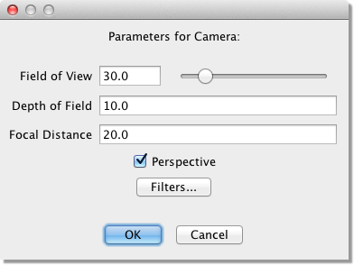

There are 3 parameters that can be set for each camera:

**Field of View** This is the vertical angle that the camera can 'see'. The field of view can range from 0 to 180
degrees. The horizontal field of view is determined by the aspect ratio of the image. Some interesting effects can be
created by varying this parameter. The examples below were created by varying the field of view and zooming in on the
object:

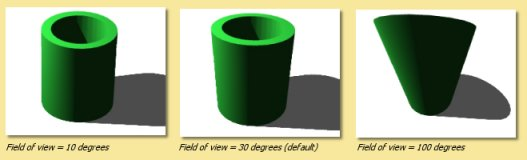

**Depth of Field** This is the distance either side of the focal distance that remains in focus. Anything outside this
range is out of focus. This has no effect unless a Depth of Field filter is added to the camera, or the **Depth of Field**
option is turned on in the rendering engine (currently, only the raytracer supports this).

**Focal Distance** This is the distance that is perfectly in focus. As with **Depth of Field** this only has an effect
if a Depth of Field filter is used, or the **Depth of Field** option is turned on in the rendering engine.

**Perspective** This option selects whether the image is rendered with a perspective or parallel projection.

Camera filters are dealt with in the next section.

.. _camera_filters:

Camera Filters
==============

Camera filters are a way of applying post processing to rendered images, i.e. they are 2D effects applied to the image
produced by the renderers. Camera filters are accessed through the :ref:`camera options dialogue<camera_options>`.
Clicking on the |rendering/filters_icon.jpg| button opens the camera filter dialogue as shown below:

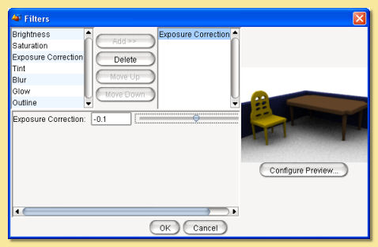

On the left is a list showing the camera filters that are available. Currently there are 9 filters to choose from. To
apply a filter, select it in the list and click on **Add>>**. This adds a filter of the selected type to the right hand
list. Filters in the list are applied to the image in a top down order. You can have as many filters as you like in the
list and their order can be altered using the **Move Up** and **Move Down** buttons. Filters can also be deleted via the
**Delete** button.

Selecting filters in the right hand list displays their adjustable parameters in the panel beneath. For example, the
**Glow** filter's parameters are **Radius**, **Intensity** and **Shape**.

On the right of the dialogue is a preview of the rendered image. The rendering parameters for this preview can be
selected by clicking on **Configure Preview** which brings up the a dialogue with most of the usual rendering options.

Most of the filters are fairly self-explanatory and a preview is available in the dialogue so that effects can be
fine-tuned.

The example below shows a sepia tone effect achieved using Saturation, Tint and Brightness filters.

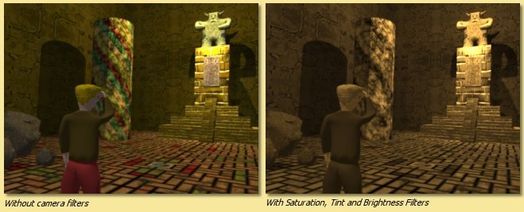

Another example below shows the use of the Outline filter (and the Blur filter). The Outline filter draws lines around
objects in the scene depending on their depth. There are 4 parameters for this filter; **Thickness** is the thickness of
the lines drawn, **Change Cutoff** and **Distance Cutoff** are the parameters that control how and when lines are drawn.
The **Color** is the colour of the lines drawn.

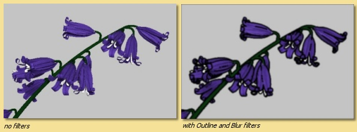

The Exposure Correction filter is a useful one for Global Illumination scenes as it applies a gamma correction to the
rendered image which can enhance darker areas as shown in the example below:

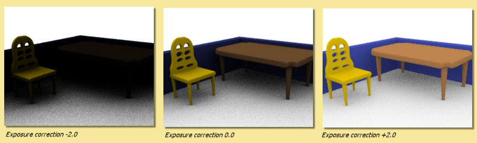

.. _noise_filter:

The Noise Reduction Filter is used to blur noisy parts of an image. The filter applies 'intelligent' smoothing to those
parts of the image that need it, while preserving the wanted image features. **Noise Reduction** controls how much
blurring is applied; the greater the number, the more smoothing. An example is shown below. All these images were
rendered with Min Rays 4, Max Rays 32 and different levels of filtering are applied. As seen, this filter can
effectively smooth out fine noise while retaining the key elements of the scene. Too much filtering, however, does start
to affect the desired features.

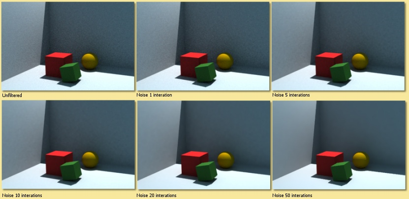

The Depth of Field filter blurs parts of the image based on how far from the camera they are. This is one way to create
a depth of field effect, where the camera is "focused" at a particular distance, while objects that are nearer or
further away are blurred and out of focus. (You can also create this effect by enabling the
:ref:`raytracer's<raytracer>` Depth of Field option. The raytracer creates a more physically accurate depth of field
effect, but is much slower than the filter.)

The parameters for each filter can also be animated. See the :ref:`Animation<camera_filter_anim>` chapter for more
details.

.. _environment:

Environment Settings
********************

Various environment options can be set up by selecting **Scene -> Environment** . This displays the following dialogue:

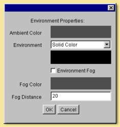

**Ambient Color** defines the colour and intensity of light falling on every surface, not coming from any particular
source but from every direction equally.

**Environment** This sets the background which can either be a colour or a texture. To select a colour, select Solid
Color from the drop down menu and click on the colour bar beneath this menu to select a colour. To set a texture, select
**Texture Diffuse** or **Texture Emissive** from the menu. Click on |rendering/env_set.jpg| to choose a texture to use.
The specified texture is mapped to a sphere of radius 1, and the colour of each point on the sphere (either the diffuse
or emissive color of the texture) determines the light coming from that direction. This is seen as a background to
rendered images and is also specularly reflected by shiny objects in the scene and (if :ref:`global
illumination<GI>` is enabled) diffusively reflected by other objects.

**Environment Fog** produces a uniform fog effect. The **Fog Color** defines the colour of the fog using the usual
colour chooser. The amount of light getting through to the camera from a point at a distance *r* from the camera is
given by e\ :sup:`-r/d` where *d* is the **Fog Distance**. Objects much closer to the camera than *d* will be relatively
unobscured by the fog. The best effects are obtained with the fog colour similar to the Environment colour.

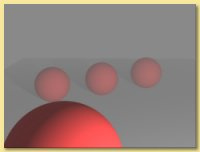

.. _raster:

Raster Engine
*************

The only advantage of the Raster Engine over the Raytracer is speed but you need to be aware that this rendering engine
does not have the ability to replicate shadows and reflections.

A raster renderer works by drawing triangles to the screen. Each object is broken up into triangular facets, a transform
is performed to calculate the position of each triangle on the image and the triangle is filled in. The colour of a
point on the triangle is determined by the texture at that point and the light striking the surface there. There are two
standard algorithms supported by Art of Illusion for calculating the latter: Gouraud Shading and Phong Shading.

Gouraud shading works by calculating the light striking each corner of the triangle and interpolating it to find an
estimate of the light at each pixel. Phong shading interpolates to estimate the surface normal at each point and uses
that to find the total light striking the surface at that point. Gouraud shading is faster but less accurate and is
particularly poor for shiny surfaces.

The Raster Engine is unable to render shadows or reflections so you will need to revert to the Raytracer in that
situation.

To render a scene with the Raster Engine, select **Scene -> Render Scene** and select **Raster** from the top right of
the dialogue that appears:

.. _raster_options:

5.3.1 Raster Rendering Options

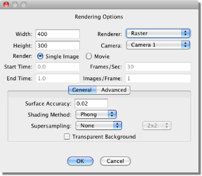

The **Width** and **Height** define the size (in pixels) of the 2D image created.

The **Camera** selected defines which view will be rendered.

You can select whether to render a **Single Image** or a **Movie**. The **Movie** option actually produces a series of
consecutively-numbered images which can be converted to a video format by many available graphics packages. See
:ref:`animation<animation>` for more details on rendering movies.

The next set of boxes, i.e. **Start Time**, **End Time**, **Frames/Sec** and **Images/Frame** are all related to
animation. Refer to that section for details.

**Surface Accuracy** defines how accurately geometry within the scene is rendered. The lower the value, the more
accurate. The value is actually the distance that the triangles that make up the surface have to be within the true
surface. Bear in mind, though, that the extra accuracy means additional render times. Here are some examples showing the
effect of varying the surface accuracy: It should never be necessary to set the surface accuracy below 0.005.

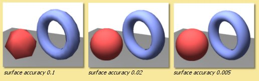

**Shading Method** is either Gouraud, Phong or Hybrid. Gouraug and Phong shading have been explained above. The Hybrid
options uses a combination of both; Gouraud for the diffuse reflections, and Phong for the specular reflections. This
gives results which are intermediate between the two methods for both speed and quality. A simple example is given
below:

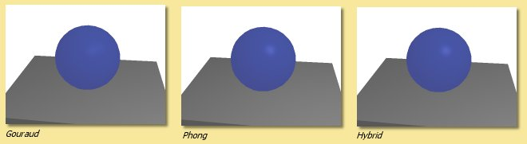

**Supersampling** is a method that produces smoother looking images by performing additional sampling either over the
whole geometry ('Everything') or for the 'edges' which are prone to jaggedness. The area that is supersampled can be
either 2x2 or 3x3 pixels.

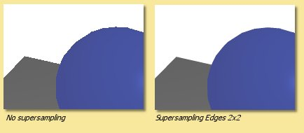

**Transparent Background** This produces an image with a background that is transparent, i.e. it adds an alpha channel
to the image (if saved in TIFF format). A 2D paint program should then allow a selection to be made using the alpha
channel.

The **Advanced** tab contains the following additional settings:

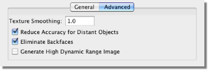

**Texture Smoothing** applies antialiasing to all textures in the scene to remove details smaller than a pixel to
overcome problems that can arise with under- or over-smoothing in the renderer or texture. A value of 1 is the default
amount of smoothing. Values greater than 1 do more smoothing and values less than 1 do less.

**Reduce Accuracy for Distant Objects** If this is checked then objects further away in the scene have a lower surface
accuracy than those that are near. This provides optimum performance with very little noticeable difference in quality
of output.

**Eliminate backfaces** The triangles drawn by the raster engine have a front and a back. Normally the backfaces are not
seen and the render can optimise performance by not drawing them. On some occasions, however, e.g. inside closed
objects, the backfaces will be seen and this option will need be to be unchecked.

.. _raster_hdri:

**Generate High Dynamic Image** If this is turned off, then the pixel colours in the rendered image(s) are a combination
of red, blue and green channels, each with a range of 0 - 255. This limits the range of intensities present in an image.
Switching this option on, produces floating point pixel data in the rendered image instead, which effectively allows an
infinite range of colours/intensities. This is only worth doing if the image format used to save the rendered image(s)
supports floating point, i.e. .hdr.

.. _raytracer:

Raytracing Engine
*****************

A raytracter "shoots rays" from the viewpoint into the scene. It decides what colour to make a pixel by tracing a
straight line from the camera location through the point on the image plane that corresponds to that pixel, and seeing
whether it hits any object. If it does, it then considers the point that got hit. It traces rays to each light source to
see if there is anything in the way. If the object is transparent, it uses the object's index of refraction to determine
a "transmitted ray direction", and traces a ray in that direction. If the object is shiny, it determines a "reflected
ray direction" and traces yet another ray in that direction. And if that ray in turn hits an object, it will trace yet
more rays.

To render a scene with the Raytracer Engine, select **Scene -> Render Scene** and select **Raytracer** from the top
right of the dialogue that appears:

.. _raytracer_options:

5.4.1 Raytracer Basic Rendering Options

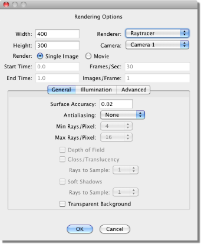

The **Width** and **Height** define the size (in pixels) of the 2D image created.

The **Camera** selected defines which view will be rendered.

You can select whether to render a **Single Image** or a **Movie**. The **Movie** option produces either a series of
consecutively-numbered images (which can be converted to a video format by many available graphics packages) or a
Quicktime movie. See :ref:`animation<animation>` for more details on rendering movies.

The next set of boxes, i.e. **Start Time**, **End Time**, **Frames/Sec** and **Images/Frame** are all related to
animation. Refer to that section for details.

**Surface Accuracy** defines how accurately geometry within the scene is rendered. The lower the value, the more
accurate. Bear in mind, though, that the extra accuracy means additional render times. Here are some examples showing
the effect of varying the surface accuracy:

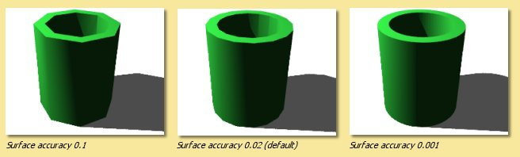

.. _raytraceAA:

**Antialiasing** Aliasing is the effect which causes sloping and curved edges to look 'jagged' and thin lines to become
'broken'. This is basically due to undersampling of rays at each pixel. Antialiasing is a technique to smooth out these
artefacts and relies on performing extra sampling generally and at areas of the image which are particularly prone to
aliasing. Art of Illusion allows 2 levels of antialiasing: Medium and Maximum. Maximum antialiasing usually produces
better looking results than Medium, so it is preferred in most cases. In rare cases, it may cause very fine details to
look too blurry, and in that case you can switch to Medium. You also can alter the number of rays used for antialiasing.
Art of Illlusion uses an adaptive sampling technique, increasing the number of rays in areas which require it. The
minimum and maximum number of rays can be fixed at between 4 and 1024. Increasing the Min Rays/Pixel and the Max
Rays/Pixel lower down in the dialogue will improve the result. The amount of antialiasing, and thus the required number
of rays, will depend very much on the image. Bear in mind, though, that the more rays/pixel, the longer the rendering
time. The example below shows an example of the 2 levels of antialiasing each with different Min/Max ray settings.

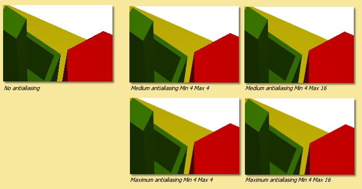

In most situations, Min-4, Max-16 should give good enough antialiasing. The additional rays are needed for effects such
as soft shadows, depth of field or glossiness/translucency as used. The minimum can generally be set much less than the
maximum.

**Depth of Field** Switching on this option brings into play the focal distance and depth of field of the camera to make
for truly photorealistic effects. Only geometry within the range focal distance +/- depth of field will be in focus. The
further away from this area an object is, the more it is blurred. The focal length and depth of view for each camera is
controlled by the :ref:`camera options<camera_options>`. The example below shows some examples of the same scene with
different camera parameters:

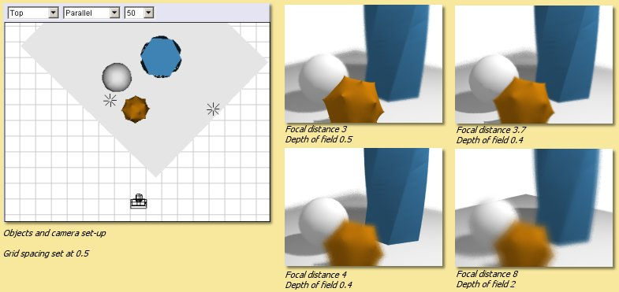

**Gloss/Translucency** Gloss is the term for blurred reflections caused by **Roughness** in the texture of the object.
Translucency is the variation that occurs in transmitted light through a transparent object due to **Cloudiness** in the
texture of the object. See :ref:`Uniform Textures<uniform_tex>` for more details. The image below shows an example of
**Gloss** on a slightly bumpy metallic surface. Note that more rays are required for higher **Roughness** to get a
smooth result:

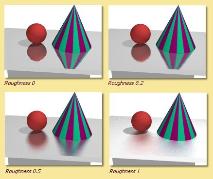

**Soft Shadows** Switching this option on allows more realistic shadows with soft edges to be created. Such shadows are
due to the finite size of the light source which is ordinarily assumed to be a point source. Altering the size of the
light (radius for a point light or spot light, angular radius for a directional light) makes the shadows softer as shown
below. Note that more rays are required as the radius of the light source increases to get a smooth result:

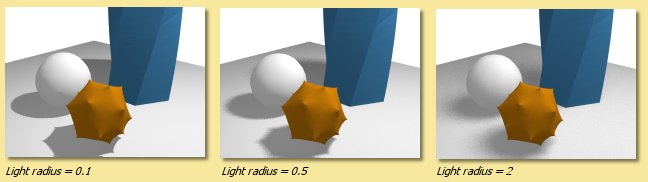

With either gloss/translucency or soft shadows, there are two ways you can increase the number of rays used to sample
the effect. First, you can increase the number of 'primary rays' sent through each pixel by increasing the Max
Rays/Pixel setting. Second, you can tell the raytracer to use multiple rays for sampling just the effect you are
interested in by adjusting the **Rays to Sample** setting. The latter approach can be faster, since it only generates
extra rays for that one effect. On the other hand, it is not adaptive (the way primary rays are), so those extra rays
are always generated even when they are not needed (such as when rendering soft shadows in a part of the image far from
any objects that cast shadows). That means it can also be slower. You need to experiment with these settings to see
which combination gives the fastest rendering for a particular scene.

**Transparent Background** This produces an image with a background that is transparent, i.e. it adds an alpha channel
to the image (if saved in .tif or .png format). A 2D paint program should then allow a selection to be made using the
alpha channel.

.. _illumination:

Illumination - Global Illumination, Caustics and Subsurface Scattering
**********************************************************************

The Illumination tab provides additional settings for global illumination, caustics, and subsurface scattering:

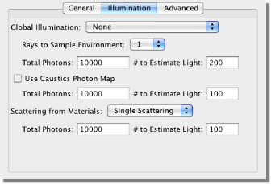

.. _GI:

Global Illumination

**Global illumination** (GI) is a method of simulating light scattered from surfaces. In practice this means that
surfaces in close proximity will bounce light off each other. In the example below, there is a spot light pointing at
the sphere in the box. Below left is the scene rendered without GI and with a point light above the objects; there is no
red light scattered from the sphere as would be expected in reality. In the middle, where GI is turned on, there is a
red tinge to the wall of the box from the scattered light. The amount of scattered light depends on the :ref:`Ambient
Color<environment>` setting and the diffuse colour of the object from which the light is scattered.

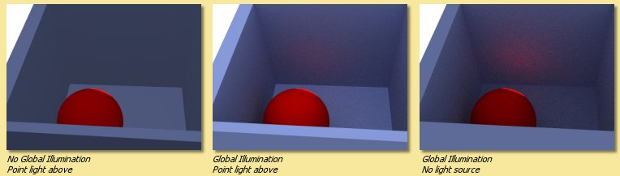

Using GI, it is also possible to use the :ref:`environment background <environment>` as a light source as shown below.

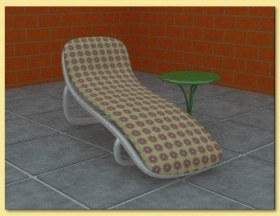

   This technique is very effective for simulating the lighting produced on an overcast day (as in this example) or an
   interior scene with large overhead light sources.

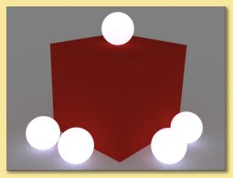

   Also, using GI, emissive textures really do give out light. The light emitted can be increased by using the colour
   **Scale** module to scale the object's emissive colour. See :ref:`here<colour_scale>` for details.

.. _hdr_ex:

Global illumination can produce some realistic and impressive effects when used in conjunction with image-based
lighting. This is achieved by setting an image to the background texture and using that as the light source. This is
even more effective when high dynamic range or radiance (.hdr) images are used.

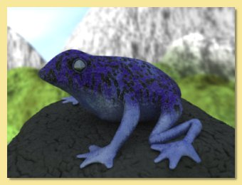

Using GI effectively requires the balance of several factors. In general: keep diffuse colours darker than normal, use
an Ambient Color of near black, brighten light sources (if used) and use many rays/pixel to produce a smoother-looking
image.

There are 4 methods in Art of Illusion for calculating GI as shown on the options list above: Monte Carlo, Ambient
Occlusion, Photon Mapping or Hybrid.

.. _MC:

The **Monte Carlo** method adds scattered (or diffusely reflected) rays to the raytracing algorithm. These rays are
emitted in random directions and, by using enough rays/pixel, they average out to give the total light coming in from
things other than regular light sources. The smoothness of the resulting image is controlled by the number of rays set
in the Raytracer Dialogue or, more efficiently, by the **Rays to Sample Environment** setting in the Illumination
dialogue. In either case, the more rays used, the smoother the resulting image. The difference is that increasing the
number of Min/Max Rays in the Raytracer Dialogue will increase the number of rays used throughout the whole rendering
process, whereas using **Rays to Sample Environment** will only increase the number of rays used to evaluate GI,
resulting in a faster render for the same amount of GI noise.

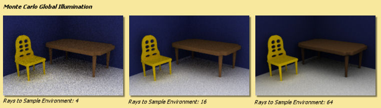

When using background images for image based lighting, the smoothing applied to the image is also important (see
:ref:`Extra Smoothing for Global Illumination<GI_smoothing>`).

.. _AO:

**Ambient Occlusion** is a simplified version of the Monte Carlo GI algorithm. Whereas Monte Carlo will continue to
follow and perform calculations for all rays that have been scattered and re-scattered until they leave the scene,
Ambient Occlusion doesn't calculate diffuse inter-reflections, with the result that colour bleeding does not occur.
However Ambient Occlusion does allow scenes to be illuminated by the Environment and by emissive objects as shown in the
Monte Carlo vs. Ambient Occlusion images shown below: Ambient Occlusion is also faster.

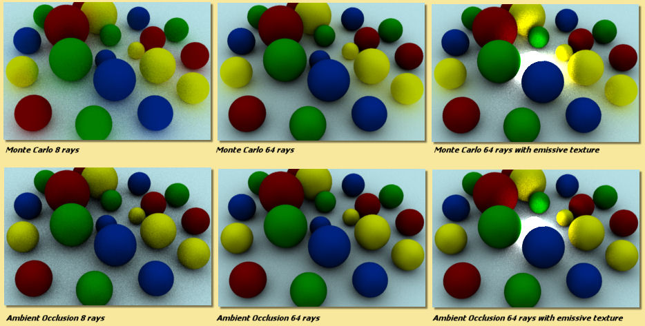

.. _photon_mapping:

**Photon Mapping (Direct)** is another way of calculating GI. In this method, a GI photon map is built up from the paths
of individual photons emitted by each light source (and objects with emissive textures). The number of photons traced
out in total is set by the **Total Photons** in the Illumination dialogue. As you would expect, the more photons used,
the more accurate the photon map. However increasing this value uses more memory and takes longer to render.

The photon map is then used to calculate the light at each point in the scene. More specifically, to reduce noise, the
light at each point is calculated from a weighted (according to distance from the point) average of a certain number of
photons around that point. The number of photons used in this calculation is set via the **# To Estimate Light** value
in the Illumination dialogue. Increasing this value reduces noise but may cause blurring of the photon map. That's
because, in order to get the required number of photons, it is necessary to sample over a larger distance from the
point. Artifacts can also be caused, especially at sharp corners. These adverse effects can be reduced somewhat by
increasing the **Total Photons**.

The image below shows the variation in image quality achieved by varying the 2 photon parameters. As can be seen,
increasing the Total Photons gives a sharper, more accurate map whereas increasing the **# To Estimate Light** reduces
noise but increases blurring.

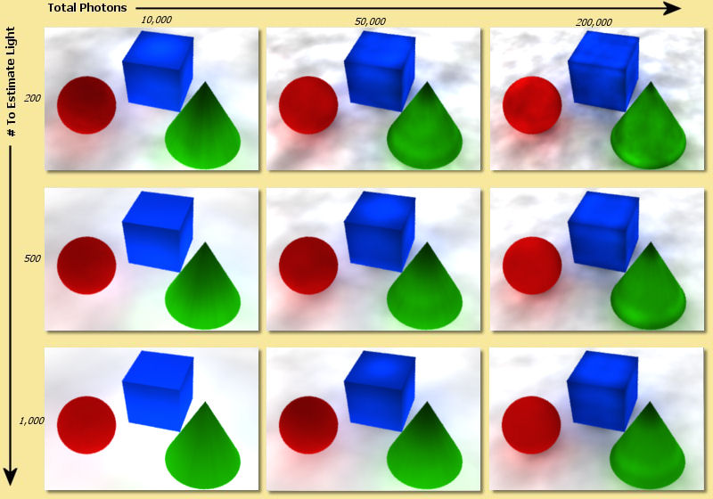

The final method of Global Illumination is the **Photon Mapping (Final Gather)** method. This is a combination of Monte
Carlo and Photon Mapping. The Monte Carlo method is used for rays before they have been diffusely reflected. Photon
mapping is used for rays that have been diffusely reflected. In this method the photon map is only 'seen' by diffusely
scattered rays which means that the accuracy of the map is less important than the Photon Mapping method. This can be
seen below; the images are relatively insensitive to the variation in number of photons:

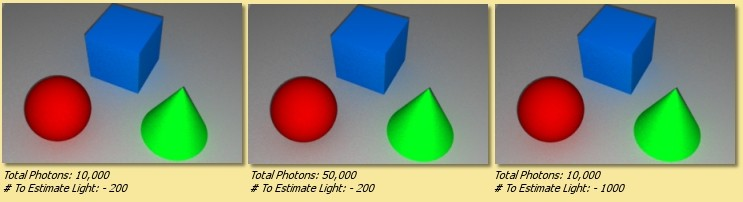

.. _caustics:

Caustics

If this is option is enabled in the Illumination dialogue, then another photon map is calculated which contains only
photons which have been either specularly reflected or refracted at least once. This enables realistic caustic effects
where light is focussed producing bright patterns and spots. As with the photon mapping for Global Illumination, the
**Total Photons** and **# To Estimate Light** can be set. The image below shows some examples. Increasing the **Total
Photons** (down left column of images) makes the caustics more accurate. Increasing the **# To Estimate Light** (down
right column of images) initially reduces noise but begins to blur the image if set too high.

.. figure:: rendering/caustics.jpg

.. _SSS:

Scattering From Materials

If you have objects that have scattering materials set to them, light should scatter within the object. The method used
to calculate that scattered light is set here. There are 3 options for scattering within materials: Single Scattering or
Photon Mapping or Both.

**Single Scattering:**

A simplistic approach is taken which reduces calculation times at the cost of reduced accuracy and less realistic
effects. As a ray propagates through a scattering material, at each point it sends out a ray to each light source to
find out if it's blocked. This works well for materials that only scatter a little bit, e.g. light through a dusty room
as below. In this example, a cube was created to fill the room and set to a completely transparent Texture and the
Material shown below left. This material is set to be semi-transparent and to have a high amount of scattering by
scaling the Scattering Color.

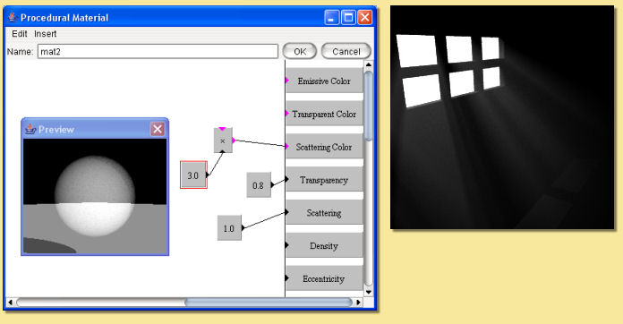

**Photon Mapping:** This method simulates subsurface scattering, which is essential for creating realistic materials
like wax, skin, milk, marble etc. The method builds a photon map by shooting photons at all the objects with scattering
materials, letting them bounce around inside, and seeing where they end up.

This is slower than the Single Scattering method, unless there are a lot of light sources, in which case it can actually
be faster. Also, it's not as good for cases like the sunbeam in a dusty room, because the edges of the sunbeam won't be
as sharply defined. The photon settings will affect the accuracy and smoothness of the result as shown in the example
below. This is an attempt to simulate wax using the Texture and Material shown. The scene consists of a simple object
lit by a point light inside a transparent but emissive sphere (the emissive quality of the sphere is only being used as
a visual effect rather than a light emitting texture - the only light in the scene is the point light inside the
sphere). With Single Scattering, the unrealistic result shown below centre right is obtained. Using Photon Mapping with
various photon settings, the results are far better.

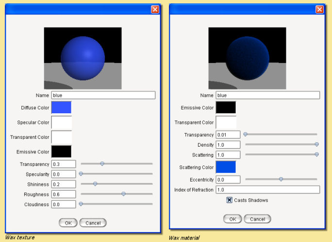

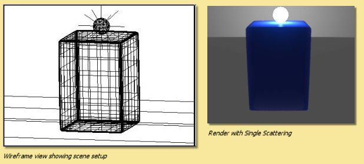

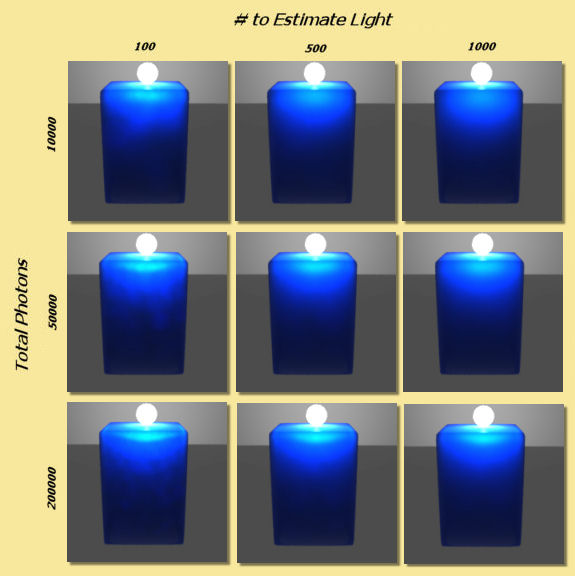

**Both** uses a combination of standard raytracing for single scattering and photon mapping for multiple scattering. In
theory, this should give the best results but will be the slowest method.

.. _advanced_options:

Advanced Settings
=================

The **Advanced** tab contains the following options:

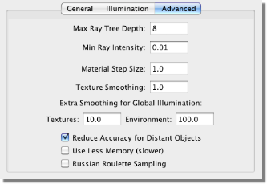

To understand some of the options available here, we need to consider the raytracing process. The engine sends a ray
from the camera through each pixel in the image and looks for interactions with objects along the way. If it hits a
shiny or transparent object, it sends out more rays which, in turn, may lead to further rays etc. This produces a 'tree'
of rays resulting from the single initial ray which could go on for ever.

In order to stop the process at a sensible point, there are 2 parameters: **Max Ray Tree Depth** which is the number of
levels produced from the initial ray, and **Min Ray Intensity** which stops the process once the intensity of the rays
becomes small enough as to have a negligible contribution to the final colour of the pixel. These parameters, then, are
ways of balancing the rendering time and rendering quality.

You will need to increase the **Max Ray Tree Depth** if there are a large number of reflections or transparent objects.
In the example below, a red cylinder is placed between 2 parallel mirrors which should produce an infinite number of
reflections. In this situation, the **Max Ray Tree Depth** needs to be increased as shown.

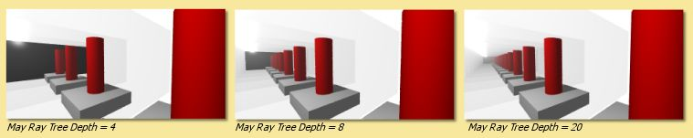

**Material Step Size** This is a control on integration step size on all materials in a scene. The step size for each
material is determined by the program but can be overridden here. Small values lead to long rendering times but may be
necessary for very fine materials. Large values result in faster renders but may also create blurring of materials.

**Texture Smoothing** applies antialiasing to all textures in the scene to remove details smaller than a pixel to
overcome problems that can arise with under- or over-smoothing in the renderer or texture. A value of 1 is the default
amount of smoothing. Values greater than 1 do more smoothing and values less than 1 do less.

.. _GI_smoothing:

**Extra Smoothing for Global Illumination** provides additional smoothing for the inherently noisier global illumination
process. The need for smoothing will depend on the intensity range in any images used in textures/environment maps. The
smoothing is only applied after rays have been diffusively reflected at least once. Environment maps can have a higher
degree of smoothing as rays emanate from the environment sphere, which is physically distant from objects in the scene.
This distance means that each point on a surface will 'see' large areas of the environment map and, thus, additional
smoothing will have little effect. HDRI images will in general need more smoothing (up to 1000 or more) to reduce noise
in the final render because of the additional intensity range. The examples below show the effect of this smoothing for
an HDRI environment map - note that as well as smoothing the rendered image generally, the colours differ markedly as
the environment map blurs.

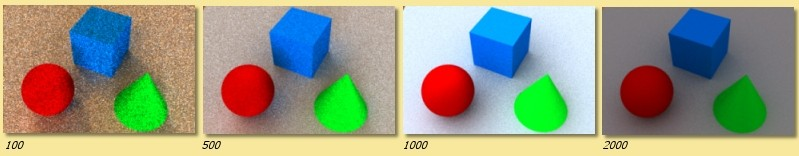

**Reduce Accuracy for Distant Objects** If this is checked then objects further away in the scene have a lower surface
accuracy than those that are near. This provides optimum performance with very little noticeable difference in quality
of output.

**Use Less Memory** This option changes how the raytracer represents your scene internally to make it use less memory.
This is useful when rendering very complex scenes that otherwise would cause you to run out of memory. It does make
rendering take slightly longer in most cases, so you should only use it for very complicated scenes.

.. _russian:

**Russian Roulette Sampling** is a different way of tracing transmitted or reflected rays. Instead of scaling the
intensity of all such rays, it scales the probability of a ray being created at all. For example, consider a texture
that has a specularity of 0.2: the default ray tracing process would scale the intensity of all specularly reflected
rays by 0.2. Russian Roulette sampling, on the other hand, will produce specularly reflected rays of intensity 1.0 but
only 20% of the time. This has the advantage of not spending time rendering rays that only contribute a small amount to
the final colour of a pixel. In practice, Russian Roulette sampling is generally faster but produces noisier images. Its
main advantage is in producing faster render previews particularly when using Global Illumination. For final renders, it
is probably best to switch this off.

The images below show the difference between the quality and render time of the standard raytracer compared with the
Russian Roulette sampling for a Global Illumination render:

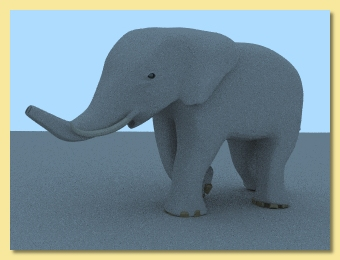

   Standard raytracer - render time 12m 46s

   Russian Roulette Sampling - render time 10m 01s

.. _save_image:

Saving Rendered Images
**********************

When the image has rendered, 'Done Rendering' will be displayed at the top of the image window and you will be given the
option to **Save** the images. Clicking on |animation/save_button.jpg| will produce the following dialogue:

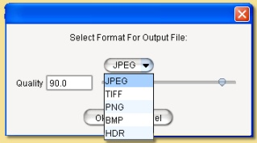

Here you can select the image format to be saved, either JPEG (.jpg), TIFF (.tif), PNG (.png), Windows bitmap (.bmp), or
Radiance or High Dynamic Range Image (.hdr) files. If you have transparent background, then you will need to save as a
.tif or .png file to retain this information to use, for example, in a 2D graphics package.

The **Quality** defines the amount of compression of the image when saved in JPEG format. A higher **Quality** value
means a better looking image at the cost of file size.

Clicking OK displays a further dialogue for the filename.

A **Filter** button also appears in the window when the image finishes rendering. Click it to modify the set of filters
applied to the camera. This is very useful when you render an image, only to find that the filters didn't produce
exactly the effect you wanted. You can modify them, see the effect immediately, and save the image once you are happy
with it, all without needing to re-render the image.

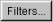

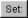

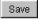
