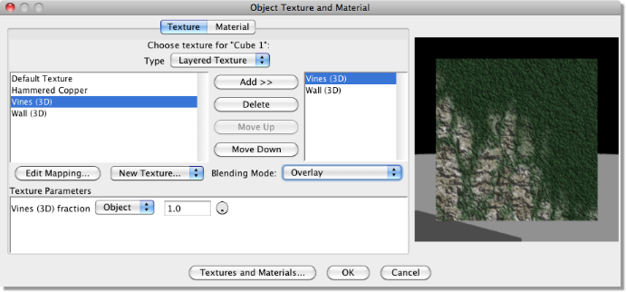

.. _assign_tex:

Assigning Textures to Objects
#############################

Simple Textures
===============

Once textures have been created, they need to be assigned to the relevant object. To do this, select the object(s) from
the Object List and click on **Object -> Set Texture and Material**. This displays a dialogue similar to that below:

On the left of this dialogue is a list of defined textures. Clicking on one shows the result as applied to a sphere as
in the texture creation tools. As with the :ref:`uniform texture dialogue<uniform_tex>`, double-clicking on the preview
displays a menu from which the view and preview object can be changed. The preview can be zoomed (CTRL drag with RMB)
and panned (drag with RMB).

Beneath this is a box titled '**Texture Parameters**' - see the :ref:`next section<tex_param>` for more information on
this.

Also note that there is a **Type** selection box at the top of the dialogue. This allows both simple textures and
layered textures. :ref:`Layered textures<layered_tex>` will be discussed later.

You also can create new textures and access the **Textures and Materials** dialogue from here.

For uniform textures, all that is needed is to select the appropriate texture and click OK. For the other texture types,
however, we can control the way in which the texture is applied to the object's surface. To edit the way the texture is
applied to the particular object, click on **Edit Mapping**.The following dialogue is then displayed:

This dialogue displays the actual object that you wish to map the texture to. The object can be rotated in the preview
window, to allow better all-over visualisation, by clicking and dragging with LMB within the preview window. The preview
can be zoomed (CTRL drag up/down with RMB) and panned (drag with RMB) and can be resized by dragging out the sides of
the whole dialogue window. The view can be be changed by double-clicking on the preview and selecting the required view
from the pop-up menu.

The type of mapping can be selected from the drop down menu just below the preview image (see below for details).

Below this are a set of boxes to allow the scaling, orientation and position to be altered to better fit the object. The
parameters available for editing depend on the type of mapping which is described below:

**Types of Mapping**

For procedural 3D textures, there is only one choice: **Linear**. This is because 3D textures are 'solid' and the object
to which they are assigned will look as though it has been carved out of it.

For image maps and procedural 2D textures, the texture is wrapped around the object and this can be done in various
ways. In this case, the type of mapping is either **Projection**, **Cylindrical**, **Spherical**, or **UV**.

**Projection** applies the texture as though it is cast by a slide projector onto the object. This will work well for
flat objects but will result in distortions where there is sharp curvature such as in the example below. In this
example, the texturelooks OK until it wraps around the side where the texture appears to stretch. Altering the
projection to **Cylindrical** gives a better result for this object and **Spherical** also gives a reasonable result:

The type of mapping that is best depends on the geometry of the object. Cylindrical and Spherical mapping work by
wrapping the texture around the object such that the texture would perfectly fit around a cylinder or sphere
respectively. So if objects are geometrically similar to cylinders and spheres, these types of mapping will work
reasonably well.

In most cases, however, objects are not flat or perfectly cylindrical or spherical. That's where **UV** mapping comes
in. UV mapping allows complete control of the placement of texture coordinates on mesh objects allowing textures to be
mapped exactly as required. See :ref:`later<uv_map>` for details.

**Altering Mapping Parameters**

Having selected the type of mapping, we can now make the texture fit the object by altering the mapping parameters.

For procedural 3D textures for which we have the **Linear** mapping, we can alter the Scale, Centre and Rotation as
shown in the texture mapping dialogue above. The **Scale** alters the size of the texture, the **Centre** controls its
position and the **Rotation** affects its orientation. Each of these parameters can be specified for the x,y and z axes.
As in the main layout, **y** is up and down, **x** is left and right and **z** is forwards and backwards.

.. _Scale_Texture:

There is another option available - **Scale Texture to Object** - which also allows the texture to be automatically scaled
to the object as shown in the example below.  If this option is enabled, then the scale and centre set in this dialogue
are relative to the size of the object (actually its bounding box) with 0 being one edge of object and 1 being the other
edge.  This automatically updates the texture mapping as the object is scaled.

In this example of applying a texture to a mesh object, the 'lizard skin' texture has been scaled by 0.5 in each
dimension to reduce the size of the lizard's scales.

A rotation of 45 degrees around the z-axis has also been applied resulting in stripes that slope down obliquely.

.. figure:: textures/linear_proj_change.jpg

.. _bind:

If the object is a mesh, then a further option is available: **Bind Texture Coordinates to Surface**. If checked, the
texture will transform with the mesh as it undergoes any mesh transformations or deformations. If left unchecked, then
the mesh will 'move' through the texture as it transforms. This is illustrated below. The object is a sphere converted
to a triangle mesh and the procedural 3D texture used is shown on the original object. A simple scaling is applied to
the object in the mesh editor both with and without binding on. The object with no binding scales through the texture
while the one with binding shows the texture scaling with the mesh.

.. figure:: textures/tex_binding.jpg

The final option on the dialogue is whether to apply the texture to both sides of the surface or to one side only. The
difference is only evident on an open surface. In the example below is a spline mesh bent back on itself. Applying the
texture to both sides means that the whole object is visible whereas applying it to the front or back sides only makes
the opposite side appear invisible.

One important use of being able to map to one side only is with :ref:`layered textures<layered_tex>` where you could
choose to have different textures mapped to :ref:`different sides<layered_sides>`.

For procedural 2D and image mapped textures, the options for mapping are projection, cylindrical and spherical. The
mapping parameters available for editing depend on the type of mapping.

For **Projection** mapping, the parameters are shown in the dialogue below. Scaling and centering can only be
performed for x and y axes since the texture is a 2D 'sheet' projected onto the object. Rotation, however, can be
performed in all 3 axes.

.. figure:: textures/proj_mapping.jpg

An example transformation is shown below.

.. figure:: textures/proj_map2.jpg

:ref:`Bind Texture Coordinates<bind>` to Surface is again available for mesh objects. :ref:`Scale Texture to Object<scale_texture>`
is also available for projection mapping.

The **Cylindrical** mapping parameters are shown below. The texture is the same as the above example. This time,
however, we have a different set of parameters:

**Width**, which is specified in degrees, is the scaling around the cylindrical axis. 360 degrees means that the texture
is wrapped exactly once around the axis. A smaller angle results in the texture being scaled down and vice versa.

**Height** is the scaling in the long axis of the cylinder. A smaller value results in a compression of the texture is
that axis.

The **Offset** controls the centering of the texture.

**Rotation** around the x,y and z axes can also be specified.

An example mapping is given below.

.. figure:: textures/cylindrical_map2.jpg

:ref:`Bind Texture Coordinates to Surface<bind>` is again available for mesh objects

The **Spherical** mapping parameters are shown below.

**Width**, which is specified in degrees, is the scaling around the horizontal spherical axis. 360 degrees means that
the texture is wrapped exactly once around the axis. A smaller angle results in the texture being scaled down and vice
versa.

**Height** is the scaling around the vertical spherical axis also specified in degrees.

**Offset** controls the centering of the texture and is again specified in degrees.

**Rotation** around the x,y and z axes can also be specified.

An example mapping is given below.

:ref:`Bind Texture Coordinates to Surface<bind>` is again available for mesh objects.

.. _uv_map:

UV Mapping
==========

Although UV mapping is another way in which 2D textures can be wrapped around objects as above, it warrants it own
section due to its versatility.

Essentially UV mapping allows you to control how the texture is scaled, rotated etc. over the mesh's surface (UV mapping
only works with meshes). It works by assigning texture coordinates (UV coordinates) to each mesh vertex. U and V are the
symbols used to represent the horizontal and vertical axes of the texture.

The first stage in UV mapping in Art of Illusion is to attempt to map the texture in the conventional way using
projection, cylindrical or spherical mapping and adjusting the scaling, centering and orientation. Once the mapping is
as close as possible to that required, select UV from the drop down **Mapping** menu. This takes you to a new dialogue.
Click on **Edit UV Coordinates** to display the main UV mapping dialogue similar to that below. The dialogue is a little
complicated so we'll look at it in detail.

In the top right corner is the mesh itself shown with a Smooth preview surface. This view can be panned, rotated and
zoomed in the same way as in the mesh editor and vertices can also be selected (but not moved) in the normal way.

Below right shows the mesh with the texture mapped to it. As with the normal texture mapping preview, this can be
rotated by dragging within the window.

The left side of the dialogue shows the texture itself. You can choose to display various components of the texture,
e.g. diffuse colour, specular values, emissive colour, to aid the mapping process via the **Displayed Component** drop
down menu. You can also choose to display low, medium or high resolution versions of the texture via the **Resolution**
drop down menu. This does not actually change the texture in any way; it just affects the way it is displayed - low
resolutions will display quicker than high resolutions.

The previews can be also resized by dragging out the sides of the whole dialogue window.

.. _UV_move:

Below these menus is some information showing the range of the texture being displayed. The **Displayed Coordinate
Range** shows the range of U and V coordinates currently being displayed in the texture view. If you need to see further
out, adjust the range by increasing the U and V values. To zoom in, reduce the values. Alternatively you can pan and
zoom the texture view by clicking on the camera pan icon |basics/camera_pan.jpg| (hold down CTRL while dragging to zoom)
or by dragging with the right mouse button depressed (again with CTRL to zoom).

To alter the texture mapping in a particular position on the mesh's surface, select the vertex/vertices at that position
on the mesh view. This will result in the corresponding texture coordinates being marked on the texture view as small
crosses; a cross for each mesh vertex (see below left). The crosses can themselves then be selected by clicking on the
select/move icon (top left icon), selecting the crosses by clicking on them (shift-click to add to selection, ctrl-click
to deselect, click-drag to select all points within a rectangular marquee). If you have single points selected in the
texture view, then their UV position is displayed (and can be edited) in the dialogue under **Selected Vertex
Coordinates**. If more than one cross is selected, then only U or V coordinates that are shared by all will be
displayed. Selected crosses can then be moved, scaled, rotated, skewed etc. using the icons at the top. Altering their
positions will result in the texture being moved over the mesh's surface and the texture preview will show these changes
in real time.

In the example above, we're trying to map a snakeskin texture to a head. There are a few problem areas - the image above
left shows stretching of the texture around the side of the head. Selecting some vertices in part of this area brings up
their corresponding texture coordinates on the texture view. In this case, we want to scale the texture coordinates to
compensate for the stretching. The UV coordinates before and after are shown above left and right respectively. This has
improved the texture mapping.

Below shows another problem area - around the side of the neck, again, the texture is stretched. Again, select the
vertices on the mesh view, and stretch the corresponding texture parameters to begin to solve the problem (below right).

.. figure:: textures/uvex2.jpg

.. _UV_face:

The final point to note is the **Map Each Face Independently** option. Switching this on will switch the mesh view to
face mode. The vertices that make up each face can be mapped in UV space as before except that the vertices in effect
'belong' to that face - if you select an adjacent face (which shares vertex mesh positions), its vertices can be mapped
completely independently even though they are spatially at the same position. This allows discrete changes in UV mapping
over the surface.

.. _layered_tex:

Using Layered Textures
======================

Art of Illusion allows multiple textures to be applied to the same surface through the use of layered textures. To
create a layered texture, select the object, click on **Object -> Set Texture and Material** and choose
**Layered Texture** from the **Type** drop-down menu at the top of the dialogue box. A dialogue similar to that shown
below will be displayed:

At the left of the dialogue is a list of all the textures that have been created in the scene. To add one of these to
the layered texture, select it from this list and click on **Add**. This adds the texture to the list in the centre.
This list shows the texture layers and their order is important. The topmost layer in this list is the surface layer,
the 2nd one is the next layer down and etc. The order can be changed by selecting textures and clicking on **Move Up**.

Each layer can be one of 3 **Blending Modes** selected from the drop-down menu on the right:

**Blend** means that a weighted average texture is created of that texture and the textures below it. The weighting is
defined by the fraction bar to the left of the preview. If this was set to 0.7, for example, then the resulting texture
would be 70% that one and 30% of the one below. All texture properties, e.g, diffuse colour, specularity, transparency
etc., are averaged in this way.

**Overlay** In this case, the current texture is laid over the ones below with any transparent areas allowing the
textures below to show through and opaque areas will not. Again a weighting fraction can be applied which results in
partial transparency.

**Overlay, Bumps Add** is a special version of the overlay mode where bump and displacement maps sum through all the
layers rather than being averaged or eliminated by layers above.

Note that layered textures can also be applied per-vertex, per-face or per-face-vertex via :ref:`texture
parameters<tex_param>` by selecting the appropriate mapping mode from the drop-down menu next to the fraction bar. See
:ref:`here<tex_par_layered>` for more details.

.. _layered_sides:

Layered textures can also be used to set different textures to each side of an object.  In the example below, 2 textures
have been created - one of a photograph and the other of some text.  By creating a layered texture for a flat spline
mesh object and adding both textures, each can then be mapped via Edit Mapping and the **Front Faces Only** and 
**Back Faces Only** options selected for each.  The result is a two-sided sheet:

.. figure:: textures/layered_sides_ex.png

.. _tex_param:

Using Texture Parameters
========================

Texture parameters allow textures to be controlled depending on their position on a mesh surface. A texture parameter is
a numerical value defined in a procedural texture. The value of this parameter is set within the mesh editor so that
certain parts of a 3D model can have different values set. The best way to illustrate this is to look at an example.
This example assigns a texture to a pencil object. Here is the procedural 3D texture:

The preview doesn't look very exciting but this cannot represent the actual texture because it will vary with position
on the mesh surface to which we assign it. To create a texture parameter, select **Insert -> Values -> Texture Parameter**.
Double-clicking on the module brings up a dialogue similar to that below:

.. figure:: textures/tex_param_prop.jpg

You can specify the name and the minimum, maximum and default values for the parameter.

There are 3 texture parameters in this texture; **pencil_part** which is going to be used to select the colour depending
on the position on the pencil's surface, **wood_part** which will be set to 1 for the wood part only to which it adds a
noise pattern and **Shiny** which is going to control the specularity of the mesh.

Select the object and click on **Object -> Set Texture** to display the dialogue box:

Notice that the texture parameters defined in the texture are now listed in the Texture Parameters box.

The values of each of these parameters on the surface of the mesh can be set in a number of ways:

**Per-Object** - this sets the same value for the whole object. However different objects can have different values set
for each parameter.

**Per-Vertex** - meaning that the values vary according to which vertices are assigned which values. The surface between
vertices will show a gradual change between values (see right top).

**Per-Face** - meaning that certain faces can have different parameter values. In this case, there is a discrete change
in parameter values at the boundary of one face with another which is set to a different parameter value (right middle).

**Per-Face-Vertex** - this is similar to per-face mapping except that the vertices making up each face can be
individually assigned parameter values so there is gradual blending within the face (right bottom).

It is also quite possible to have a mixture of parameter mapping methods.

For this example, all 3 of the texture parameters have been set to be per vertex. Click on OK to assign the texture to
the object.

Now to assign the values to the mesh. Double-click on the object in the Object List to bring up the mesh editor:

This shows the tip of the pencil object with the vertices of the 'lead' selected in the normal way. To assign the values
of each texture parameter to these vertices, select **Mesh -> Texture Parameters** to display the dialogue shown within
the main window on the left:

**Pencil_part** has been set to 1 which gives a grey diffuse colour.

**Wood_part** has been set to 0 since this is not the wood part.

**Shiny** is set to 0.2 to give a specularity of 0.2 to be slightly reflective.

Assigning appropriate values to the other vertices produces the result shown below:

.. figure:: textures/pencil_ex.jpg

There is clearly great flexibility in the control of textures using texture parameters. One important use of texture
parameters is variation of textures through animation of texture parameter tracks. See
:ref:`this section<anim_textures>` for more details.

.. _tex_par_layered:

Blending fractions for :ref:`layered textures<layered_tex>` are also texture parameters and thus can be set per-vertex,
per-face or per-face-vertex and animated in the same way as any other parameter. Below is an example showing the use of
texture parameters with layered textures. Here a layered texture is used to texture the sides of a cube. A cube is
created and converted to a triangle mesh. Textures for each side of the cube are created as normal; here I have used 3
different sorts of textures for illustration: a uniform one ('green shiny'), a procedural 2D one ('grid') and a 3D one
('noise bump').

A layered texture is created for the mesh cube by right clicking on the object in the **Object List -> Set Texture** and
then selecting Layered Texture at the top of the dialogue that appears.

Now we can add the textures we want to map to the cube. The Blending Mode is set to 'Blend' for each texture in this
case. Note that I have added another texture ('grey') that will be the background texture for the cube - any parts of
the geometry that are not mapped with any other texture will take on the grey texture. This is ensured by setting the
mapping mode for this texture to 'Object'. Because it is going to form the base layer, it is positioned at the bottom of
the layered texture list. The other textures are set to be per-face or per-vertex as shown below:

You may need to correctly orient and scale the textures via the **Edit Mapping** button to ensure that the textures for
each face will be correctly aligned.

When done, click OK to leave the dialogue. To actually set the parameters, enter the Mesh Editor by double-clicking the
cube in the Object List. The 'grid' and 'green shiny' textures can be set by selecting faces and then selecting **Mesh
-> Texture Parameters**. The parameter values can then be entered in the dialogue that appears. The 'noise bump' texture
is set per-vertex so you will need to select vertices rather than faces before selecting **Mesh -> Texture Parameters**.
In this example, I chose a single vertex in the centre of the side of the cube as shown below:

.. figure:: textures/lay_tex_param_mesh_edit.jpg

.. figure:: textures/lay_tex_param_ex.jpg

.. |basics/camera_pan.jpg| image:: basics/camera_pan.jpg