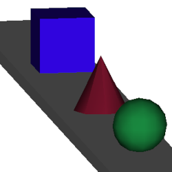

Viewpoint Mangement
###################

While working on your 3D scene or model, you will probably want to
move the view around to look at things from multiple perspectives.
You may also want to move a camera to properly frame a scene for
rendering.

This section explains the tools available, and the 4 modes that
affect their operation.

.. _view_controls_basic:

Basic View Controls
*******************

The view can be rotated by using the |rotate view| tool. It can be moved
by using the |move view| tool. Both of these tools are affected by the
rotation mode_ of the current view, discussed in greater detail below.

.. |rotate view| image:: basics/camera_rotate.png

.. |move view| image:: basics/camera_pan.png

View Zoom/Z-depth is controled primarily via the scrollwheel. It is
also affected by the mode. If your mouse does not have a scrollwheel,
you can use `Ctrl + Right Drag`.

For more advanced users: when you really get into the modeling flow,
you probably don't want to keep changing tools just to move the camera.
All view control functions are accessible through mouse + hotkeys_, explained
in more detail below.


Each view has several attached widgets that control and display the
status of the view:


.. _preset_view:

Preset View Targets
~~~~~~~~~~~~~~~~~~~


These are defined view locations and orientations that can be accessed
directly by clicking on them in the menu. The six cardinal directions
(Top, Bottom, Left, Right, Front & Back) are fairly self-explanitory,
but the other targets deserve a little explanation:

*Other*
  This is simply a status marker to indicate that you are not currently
  using one of the preset targets. It usually means that you started at
  one of the cardinal directions, and then moved the view.

  This option is generally not something you would select from the list

*Camera 1(2, 3, &tc, &tc..)*
  View the scene through the specified :ref:`camera<cameras>`.

  If you use the view pan and rotate controls while viewing through a
  camera, you actually move the camera! This is very handy for framing
  a scene for rendering stills, or for setting up keyframes for
  :ref:`position<pos_track>` and :ref:`rotation<rot_track>` tracks for
  the camera.

  .. note:: - When viewing through a camera, the Projection_ is locked
              to **Perspective.**
            - Unlike other targets, the Field of View is managed by the
              specific camera

*Light 1*
  This is not a bug or mistake! You can view the scene from the
  perspective of :ref:`Directional Lights<directional>` and 
  :ref:`Spot Lights<spotLights>`.

  Why would you want to?

  Experience has shown us that it can be very tricky to properly align
  such lights from an independent viewpoint. Much like the cameras,
  moving the view while using a light as a target *moves the light.*

.. _projection:

Projection Type
~~~~~~~~~~~~~~~





====================== ====================================================
  |proj-parallel|       Parallel

                        Orthographic Projection. All distances are
                        represented at the same scale, regardless of depth
                        in the scene. No foreshortening effects. This is
                        how a scene would be represented for plotting in
                        technical drawings.

                        In this example, all three primitives are the same
                        size: 1 unit in each dimension.

                        .. note:: In this projection, the zoom field
                                  represents scale in pixels per scene
                                  unit

  |proj-projection|     Perspective
 
                        More visually realistic projection, including
                        foreshortening effects.

                        This represents the scene as seen by an actual
                        observer. When viewing the scene through a camera,
                        the camera's Field Of View is used. From other
                        viewpoints, a generic set of camera specifications
                        is used.

                        .. note:: In this projection, the zoom field
                                  represents the distance, in scene units,
                                  to the viewpoint rotation center.


====================== ====================================================


Advanced View Settings
**********************

This section discusses Hotkey/Mouse shortcuts for a more ergonomic
workflow, as well as the four view control Modes_ that fine-tune the
control experience.

.. _hotkeys:

Mouse Combinations
~~~~~~~~~~~~~~~~~~

All view movements can be accessed through a standard mouse. A three
button mouse works best, but there are key combos that support a one
or two button mouse. (As long as your window manager does not trap the
hotkey!) The supported key combos are as follows:

*Right Button*
  Meta + Primary mouse button (most common on OSX)

*Middle Button*
  Alt + Primary mouse button

*Scroll Wheel*
  Ctrl + Right Drag (up and down)


We've tried to make the combinations as smooth and intuitive as
possible - just try them. You might never go back to the view tools!


.. _MouseControls:

+-------------+--------------+--------------+------------+-------------+
|Mouse Action |  Tray_ Mode  | Space_ Mode  | Fly_ Mode  | Drive_ Mode |
+=============+==============+==============+============+=============+
|Center Click |  Center view on click location. Set working depth to   |
|in view      |  surface of nearest object. If no object at this       |
|             |  location, keep current working depth.                 |
+-------------+--------------+--------------+------------+-------------+
|Center Click |  Fit object to active view. Set working depth to       |
|in           |  center of object.                                     |
|Object List  |                                                        |
+-------------+--------------+--------------+------------+-------------+
|Center Drag  | Rotate around screen center | Rotate around current    |
|             | at working depth            | view location (pan)      |
+-------------+--------------+--------------+------------+-------------+
|Ctrl Center  |              | Tilt View around Z-axis   |             |
|Drag         |              | (Barrel Roll)             |             |
+-------------+--------------+--------------+------------+-------------+
|Ctrl + Shift | Rotate around current       | Rotate around screen     |
|Center Drag  | view location (pan)         | center at working depth  |
|             |                             |                          |
+-------------+--------------+--------------+------------+-------------+
|Right Drag   |  Move View in Screen space - Left, Right, Up, Down     |
|             |                                                        |
+-------------+--------------+--------------+------------+-------------+
|Scroll Wheel |  Move closer/further from   | Move along view axis     |
|             |  the rotation center.       | (See `Scroll Cues`_ for  |
|             |                             | some of the fine points) |
+-------------+--------------+--------------+------------+-------------+
|Alt Scroll   |  Precision Z-movement (Slower)                         |
+-------------+--------------+--------------+------------+-------------+


.. _mode:

Modes
~~~~~


These modes affect how the camera responds to rotate, move, and
zoom commands.

Why so many ways to move a camera?
``````````````````````````````````
  Some tasks in AOI lend themselves to different camera control
  approaches. Broadly, there are two basic types of camera activity:

  *Modeling*
    Focuses on a specific object, or part of the object. You may 
    need to get a different view, but the object should
    stay in the center of the view.

    The Tray_ and Space_ modes are designed to service this use case.

  *Travel*
    Focuses on the movement of the camera through the scene, such
    as setting a camera path for an animation sequence.

    The Fly_ and Drive_ modes are designed for this, as they mimic
    real-life camera dollys


.. _tray:

Tray or Turntable
`````````````````

This is the default control mode. The viewpoint rotates around a point
in space. You can pick the rotation point using center-click in either
the view or the object list (See the
`mouse control table <mousecontrols_>`_)

Zoom or Z-axis movement moves the view closer to or further away from 
the rotation point. It does *not* move the rotation point, nor can you
zoom in *past* the rotation point.

In these images, the blue cube has been selected as the rotation point:


======================= ===================================================
  |tray1|                  The green and red pipes represent the paths
                           that the viewpoint will follow if the view is
                           rotated

  |tray2|                  In the second image, the viewpoint has been
                           moved up. Notice that the view camera is still
                           pointing directly at the rotation center.

                           Left & Right pan are along a plane
                           perpendicular to the Y-axis.
======================= ===================================================

.. note:: The green path always ends at points directly above and below
        the rotation center, reckoned along the Y-axis.

.. note:: The viewpoint cannot "Barrel roll" in this mode. The upper
          endpoint of the green path will always be straight "up" in
          the view


.. _Space:

Space or Gimbaled Sphere
````````````````````````

This mode is a little less constrained than Tray_ mode. It also rotates
around a selected center point. Choosing this center points works
exacly like tray mode.

Zoom/Z-axis Likewise works the same as Tray_ mode.

.. tip::
  It's a little bit easier to lose track of your orientation when using
  space mode. If this happens, you can change the mode back to Tray_
  temporarily. The view will be turned right-side-up, while still
  pointing at the same location.


   
.. |spacetext1| replace:: Rotation in the vertical path does not have
   stopping points.
   


.. |spacetext2| replace:: Left & Right rotation are relative to the
   current view direction.


.. |spacetext3| replace:: Space mode can barrel roll! (see the `mouse
   control table. <mousecontrols_>`_) Up & Down rotation are relative
   to the current view direction.

+------------------------+------------------------+------------------------+
|                        |                        |                        |
| |space1|               | |space2|               | |space3|               |
|                        |                        |                        |
+------------------------+------------------------+------------------------+
|                        |                        |                        |
| |spacetext1|           | |spacetext2|           | |spacetext3|           |
|                        |                        |                        |
+------------------------+------------------------+------------------------+

